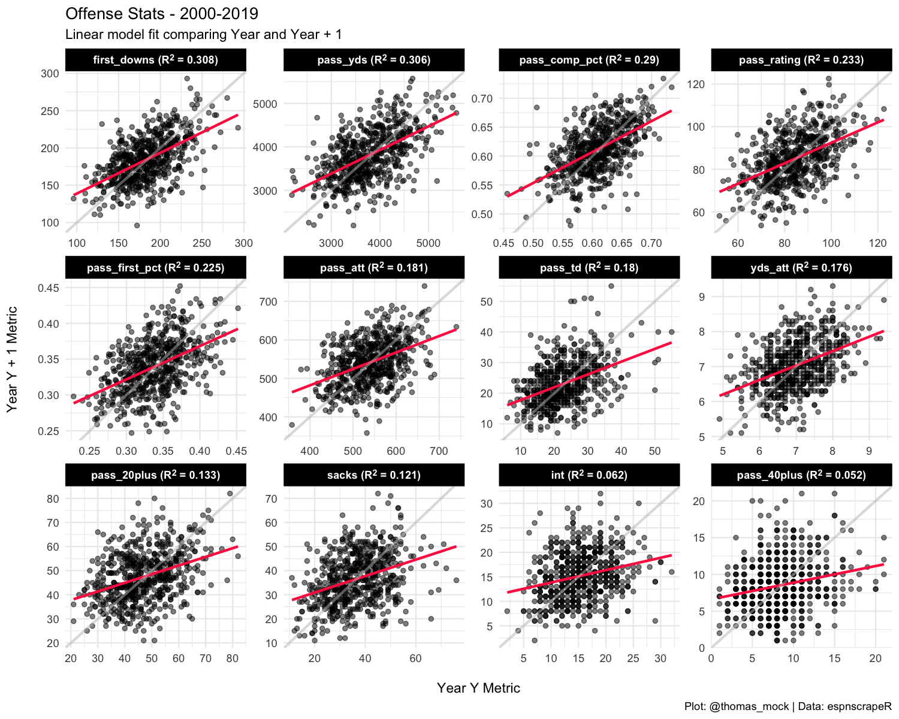

```{r setup, include=FALSE}
knitr::opts_chunk$set(echo = TRUE)
library(tidyverse)
library(espnscrapeR)
library(broom)
library(glue)
library(ggtext) # for formatted text in ggplot
```

# Many Models

The `tidymodels` package advocates for a nest-map-unnest workflow for running many models at once. While this typically is used for some type of group as seen in the [`tidymodels` docs](https://www.tidymodels.org/learn/statistics/tidy-analysis/#regression-models), we can also do it for running many models at once from a wide dataset.

Our goal is to get all of the measures into a `long` form tibble so that we can fit all of the models at once, and plot it all at once.

## Basic Example

This basic example is borrowed directly from the [`tidymodels` docs](https://www.tidymodels.org/learn/statistics/tidy-analysis/#regression-models).

First you nest the data by a grouping variable to get list-columns of each split data/tibble.

```{r nest mtcars}
mtcars <- as_tibble(mtcars)  # to play nicely with list-cols

nest_mtcars <- mtcars %>%
  nest(data = c(-am)) 

nest_mtcars
```

Now you can apply a `lm()` call w/ `purrr::map()` to each dataset, and then `broom::tidy()` the model output!

```{r tidy mtcars}
nest_mtcars %>% 
  mutate(
    fit = map(data, ~ lm(wt ~ mpg + qsec + gear, data = .x)),  # S3 list-col
    tidied = map(fit, tidy)
  ) %>% 
  unnest(tidied) %>% 
  select(-data, -fit)
```

Now each of the model metrics for automatic vs manual transmissions (0 vs 1) is easy to work with! We'll use a similar approach (nest-map-unnest) albeit with a slightly different data structure for our following analysis.

# NFL Example

We'll be performing a similar analysis to what Josh Hermsmeyer's did in his [538 article](https://fivethirtyeight.com/features/why-the-nfl-cant-rely-on-defense/). The raw code for his analysis is available on his [GitHub](https://github.com/friscojosh/defensive-metric-stability). Essentially he evaluated how stable metrics were year-over-year, by comparing:  

- `Metric in Year N`  
- `Metric in Year N + 1`  

We're skipping most of the `nflscrapR` aggregation (see the [link](https://github.com/friscojosh/defensive-metric-stability) for full script), the portion we can change a bit to make our lives easier is the repeated modeling.

Rather than having to generate a model for every metric one-by-one, we can generate the models for ALL the metrics in the datase at once, while still running the model just for each metric by the following year's metric.

```{r 538 model, eval = FALSE}
### QB Hits model  ------------------------------------------------------------

qb_hits_model <- lm(data = team_defense_joined, qb_hit.y ~ qb_hit.x)

qb_hits_stability <- glance(qb_hits_model) %>%
   mutate(metric = "QB Hits",
          r.squared = round(r.squared, 3)) %>%
   select(metric, r.squared)
```

# Get the data

So let's load our libraries and get to modeling!

```{r, eval = F}
library(tidyverse) # all the things
library(espnscrapeR) # NFL data summaries
library(broom) # tidy modeling
library(glue) # nice string creation
library(ggtext) # for formatted text in ggplot
```

First we'll get all the data from the 2000-2019 seasons for NFL offenses via `espnscrapeR::scrape_team_stats_nfl()`.

```{r scrape data, cache = TRUE}
# Get data from espnscrapeR
all_off <- 2000:2019 %>% 
  map_dfr(scrape_team_stats_nfl)

glimpse(all_off)
```


## Pivot the data longer

Because we are looking to run all the models at once, we'll need to take the data structure from wide to longer, so we can `nest()` the datasets by metric and run the model on each metric pair. By `pivot`ing to long format we get our team-level data by season and metric with the corresponding value of each season.

```{r pivot longer}
long_off_stats <- all_off %>% 
  select(team, pass_att:sacks, season,-pass_long, -pass_comp) %>% 
  mutate(season2 = season + 1) %>% 
  pivot_longer(
    cols = c(-team, -season, -season2), 
    names_to = "metric", 
    values_to = "value")

long_off_stats
```

## Join the data

Next we need to join the data back into itself to get the matched value 1 (year) with value 2 (year + 1). The join renames `value` on the left-hand side (`value.x`) and the right-hand side (`value.y`). Technically we don't need season or season 2 anymore, but I've kept them so we can do a quick visual check on the data. The numbers look good and are aligned properly!

```{r joinyears}
join_years <- long_off_stats %>% 
    inner_join(long_off_stats, by = c("season2" = "season", "team", "metric")) %>% 
    select(everything(), -season2.y)

join_years
```

## Nest the Data

We now need to nest the data, leaving `metric` out so that it is used as the group/label data. Now each of the metrics are separated into their own respective nested datasets!

```{r nestdata}
nest_off_data <- join_years %>% 
    nest(data = c(-metric))

nest_off_data 
```

## Fit the models

Now let's `fit` the models and tidy the outputs with `broom::glance()`. We now have the raw fit and the tidy output as list-column tibbles! We're really just interested in r.squared for this example, so we'll `unnest()` the data in the next step to get that out by metric.

```{r fitmodel}
tidy_off_models <- nest_off_data %>% 
    mutate(
      fit = map(data, ~ lm(value.y ~ value.x, data = .x)),
      tidy_output = map(fit, glance)
    )

tidy_off_models
```

## Unnest the model metrics

Now we have a few options - we can use `unnest_wider()` to get ALL the model metrics, but again that's overkill for our example.

```{r unnest metrics}
tidy_off_models %>% 
    unnest_wider(tidy_output)
```

Instead we'll use `tidyr::hoist()` which pulls specific columns from nested data. In this case, we are extracting just the r.squared values for each respective metric and then arranging by r.squared. Full details of `unnest` vs `hoist` can be found at [`tidyr` site](https://tidyr.tidyverse.org/reference/hoist.html).

```{r hoist metric}
off_lm_output <- tidy_off_models %>% 
    hoist(tidy_output, r.squared = "r.squared") %>% 
    arrange(desc(r.squared))

off_lm_output
```

### Get just the good bits

So we just want the r.squared and metric values, plus a label we can use for `ggplot` down the road. Boom we have the final output!


```{r pure metrics}
off_stability <- off_lm_output %>% 
  select(metric, r.squared) %>% 
  mutate(metric_label = glue::glue("{metric} (R^2 = {round(r.squared, 3)})"))

off_stability
```

# TLDR

Now that may have seemed like a lot of code, mainly because we broke down an example. Let's look at it all together now. We rearranged the dataset, nested, ran 9 models, and got our outputs in one pipe with just a few lines of code!

```{r, eval = FALSE}
(off_stability <- long_off_stats %>% 
    inner_join(long_off_stats, by = c("season2" = "season", "team", "metric")) %>% 
    select(everything(), -season2.y) %>% 
    nest(data = c(-metric)) %>% 
    mutate(
      fit = map(data, ~ lm(value.y ~ value.x, data = .x)),
      glanced = map(fit, glance)
    ) %>% 
    hoist(glanced, r.squared = "r.squared") %>% 
    arrange(desc(r.squared)) %>% 
    mutate(metric_label = glue::glue("{metric} (R^2 = {round(r.squared, 3)})")))
```

# Plot it

Now there's another advantage to getting data into this longer format!

We can combine our labels that we generated with `glue` and the long-form data to plot ALL of the raw metrics at once with one `ggplot`. Note I have added an example line in light grey (slope = 1 for perfect fit) and a red-line for the `lm` for each dataset. That's all for this example, but hopefully that opened your eyes to a nest-map-unnest workflow even for relatively simple models!

I'd definitely recommend trying out the rest of the `tidymodels` ecosystem for your more advanced machine learning and statistical analyses. You can learn all about it at the [tidymodels.org site](https://www.tidymodels.org/learn/).

```{r plot ex, eval = FALSE}
(off_plot <- long_off_stats %>% 
    inner_join(long_off_stats, by = c("season2" = "season", "team", "metric")) %>% 
    mutate(metric = factor(metric,
                           levels = pull(off_stability, metric),
                           labels = pull(off_stability, metric_label))) %>% 
    ggplot(aes(x = value.x, y = value.y)) +
    geom_point(color = "black", alpha = 0.5) +
    geom_smooth(method = "lm", color = "#ff2b4f", se = FALSE) +
   scale_x_continuous(breaks = scales::pretty_breaks(n = 5)) +
   scale_y_continuous(breaks = scales::pretty_breaks(n = 5)) +
   geom_abline(intercept = 0, slope = 1, color = "grey", size = 1, alpha = 0.5) +
    facet_wrap(~metric, scales = "free") +
    labs(x = "\nYear Y Metric", 
         y = "Year Y + 1 Metric\n",
         title = "Offense Stats - 2000-2019",
         subtitle = "Linear model fit comparing Year and Year + 1",
         caption = "Plot: @thomas_mock | Data: espnscrapeR")  +
    theme_minimal() +
    theme(strip.background = element_rect(fill = "black"),
          strip.text = element_textbox(face = "bold", color = "white")))

# optional output
# ggsave("off_stability_plot.png", off_plot, height = 8, width = 10, dpi = 150)
```
```{r include_img,layout="l-body-outset", echo=FALSE}

```


