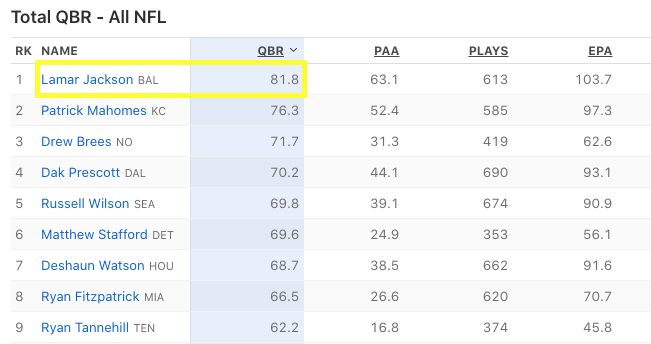

```{r setup, include=FALSE}
knitr::opts_chunk$set(echo = TRUE)
library(tidyverse)
library(jsonlite)

# link to the API output as a JSON file
url_json <- "https://site.web.api.espn.com/apis/fitt/v3/sports/football/nfl/qbr?region=us&lang=en&qbrType=seasons&seasontype=2&isqualified=true&sort=schedAdjQBR%3Adesc&season=2019"

# get the raw json into R
raw_json <- jsonlite::fromJSON(url_json)
```

# Don't bury the lede

While many R programmers are comfortable with lists, vectors, dataframes, tibbles - `JSON` has long been a source of pain and/or fear for many.

Because this is going to be a bit of a journey, I don't want to bury the lede. I've got the final code below, which is just a few lines, and a major helper package for examining nested lists such as JSON. Most of this post is about some approaches to exploring `JSON` outputs and deeply nested lists. Additionally the `tidyverse` team even has an article on various approaches to "rectangling" nested data/`JSON` [here](https://tidyr.tidyverse.org/articles/rectangle.html).

We're using another NFL example this week, namely we are collecting data from ESPN's Quarterback Rating (QBR) API endpoint. The output website that this API feeds is available [here](https://www.espn.com/nfl/qbr/_/season/2019/seasontype/2) and the API endpoint itself is available [here](https://site.web.api.espn.com/apis/fitt/v3/sports/football/nfl/qbr?region=us&lang=en&qbrType=seasons&seasontype=2&isqualified=true&sort=schedAdjQBR%3Adesc&season=2019).


## The lede

First off, the `listviewer` package is fantastic! It lets you explore `JSON` in its natural state before it gets converted over to a format that R likes to work with (list on list on list). We can use this to interactively explore the data before we start coding away.

Because we're looking at the 2019 season, I know that Lamar Jackson is the top QB in the dataset, and we can guess at some of the other columns by going to the actual [webpage this API is building](https://www.espn.com/nfl/qbr/_/season/2019/seasontype/2). From that we can assume there are columns for player name, team name, QBR, PAA, PLAYS, etc.



I'll let you do this interactively because that's how'd you use in RStudio, and try searching for:  
- Lamar Jackson -- important for finding the QB names  
- Ravens  
- QBR  
- 81.8 -- this one is important as a data point  

In the interactive `jsonedit()` viewer below:  

```{r}
# interactive list or JSON viewer
# note that you can change the view to raw JSON or the more 
# interactive `View` option
listviewer::jsonedit(raw_json, height = "800px", mode = "view")
```

Now as you're searching notice that it provides the depth/level you're in. The only awkward part is like JavaScript it indexes from 0... so as usual note that `index == 0` is `index == 1` in R. 

For example:

If you search for `81.8` and click on the `81.8` cell, you'll get the following location:

`object > athletes > categories > 0 > totals > 0 > 0`  

which is equivalent to the following in R:  

`raw_json$athletes$categories[[1]]$totals[[1]][[1]]` 

The `listviewer` strategy can allow you to explore interactively, while the code below is more of moving through the `JSON` object in R.

### The code

This utilizes `purrr` to get at the various components, but I'll also show how to do this with mostly base R.

```{r}
library(tidyverse)
library(jsonlite)

# link to the API output as a JSON file
url_json <- "https://site.web.api.espn.com/apis/fitt/v3/sports/football/nfl/qbr?region=us&lang=en&qbrType=seasons&seasontype=2&isqualified=true&sort=schedAdjQBR%3Adesc&season=2019"

# get the raw json into R
raw_json <- jsonlite::fromJSON(url_json)

# get names of the QBR categories
category_names <- pluck(raw_json, "categories", "labels", 1)

# Get the QBR stats by each player (row_n = player)
get_qbr_data <- function(row_n) {
  purrr::pluck(raw_json, "athletes", "categories", row_n, "totals", 1) %>% 
    as.double() %>% 
    set_names(nm = category_names)
}

# create the dataframe and tidy it up
pluck(raw_json, "athletes", "athlete") %>%
  as_tibble() %>%
  select(displayName, teamName:teamShortName) %>%
  mutate(data = map(row_number(), get_qbr_data)) %>% 
  unnest_wider(data)
```


Now that you have explored the raw data via `jsonedit` and you see where we are going with this, we can actually try playing around with it in R.

# [It's Turtles all the way down](https://en.wikipedia.org/wiki/Turtles_all_the_way_down)


At it's heart `JSON` is essentially nested lists of lists of strings, vectors, or other objects.

While there are many reasons WHY `JSON` is actually a great format for things like... surprise JavaScript! It isn't the easiest to work with in R for interactive coding as the trusty old dataframe/tibble.

My goal today is to show you a few techniques from `tidyr` that can make quick work of most cleanly structured `JSON`, although there are weird examples out in the wild of `JSON` formats that are not as straightforward.

# Raw Data and Libraries

Today we need the `tidyverse` and [`jsonlite`](https://github.com/jeroen/jsonlite/) packages. We can read in the `JSON` via `jsonlite::fromJSON()` on the raw url string.

```{r}
library(tidyverse)
library(jsonlite)

url_json <- "https://site.web.api.espn.com/apis/fitt/v3/sports/football/nfl/qbr?region=us&lang=en&qbrType=seasons&seasontype=2&isqualified=true&sort=schedAdjQBR%3Adesc&season=2019"

raw_json <- jsonlite::fromJSON(url_json)
```

# Viewing JSON

I highly recommend that you DON'T blindy call `str()` on `JSON` objects - you'll get several pages of `stuff` output to your console.

<aside> Feel free to try it, as an example exercise, but you've been warned. </aside>

I will almost always default to starting with a tool like `listviewer::jsonedit()` that you get a feel for what the structure looks like. Alternatively, you can use of the examples below to work your way through `JSON` files more programatically in just R.

Per my friend [Josiah Parry](https://twitter.com/JosiahParry/status/1262369767236796417?s=20), `str()` has a `max.level` argument - this is very helpful for `JSON` as it lets you slowly expand the depth of what you're looking at!

## Level 1

```{r}
str(raw_json, max.level = 1)
```

We can see that the `JSON` file at depth 1 has info about the pages returned, athletes in our dataset, what season it is, glossary of terms, categories, and current values.

However some of those lists are actually reporting as lists of lists and lists of dataframes, so let's try one level deeper.

## Level 2

Now we can see that pagination is just character strings of length 1 after two levels, however athletes has: two objects, a dataframe called `athlete` with 30 rows, and a list called `categories` is a list of length 30 (which aligns with the length of the athlete dataframe).

This is probably the most interesting data to us, as we're looking for about 30-32 QBs from this API endpoint. Now, how do we actually get at these list objects?

```{r}
str(raw_json, max.level = 2)
```

## Get at the list

Because the `JSON` file is parsed into R as nested lists, we can access various parts of it through base R with either the `$` or with `[[` + name. Let's try this by trying to access:  
- `raw_json` to `athletes` and looking at it's structure, again using the `max.level` argument to prevent extra printing.


```{r}
raw_json$athletes %>% str(max.level = 1)

# this does the same thing!
raw_json[["athletes"]] %>% str(max.level = 1)
```

### Access the dataframe

We can get to the dataframe itself by going one list deeper and we now see a traditional output of `str()` when called on a dataframe!

```{r}
# json -> list --> dataframe 
raw_json$athletes$athlete %>% str(max.level = 1)
```

Now there's still some sticky situations here, namely that some of the columns are list columns or even listed dataframes themselves. We'll deal with that a little bit later.

### Access the lists

We can change our 3rd call to `categories` instead of `athlete` to check out the other object of length 30. We see it is actually 30 1x4 dataframes!

```{r}
# json -> list --> dataframe 
raw_json$athletes$categories %>% str(max.level = 1)
```

We could check out the first dataframe like so, but we see that this dataframe actually has additional list columns, and the name/display columns are not very helpful. I'm much more interested in the totals and ranks columns as they have length 10.

```{r}
# json -> list -> dataframe -> dataframe w/ list columns!
raw_json$athletes$categories[[1]]
```

So let's check out the 3rd column and what is in it. Now if you're like me, this is starting to feel a bit hairy! We're 6 levels deep into one object and this is just 1 output of a total of 30!

Stick with me for one more example and then we'll get into `purrr`!

```{r}
raw_json$athletes$categories[[1]][3][[1]]
```

So we know:  
- The QB names and teams (`raw_json$athletes$athlete`)  
- Their stats are in a different part of the `JSON` file (`aw_json$athletes$categories`)  

If you wanted to you could combine the `athlete` dataframe with their stats with a `for loop`. There are additional way of optimizing this (potentially convert to matrix and then to data.frame), but I just want to show that it's possible and fairly readable! An example with `lapply` is below as well. Note that since we're not pre-allocating our data.frame, this is likely the slowest method. It's ok for our 30 iteration example, but is likely not the best strategy for large `JSON` files.

```{r}
df_interest <- raw_json$athletes$athlete[c("displayName", "teamName", "teamShortName")]

length_df <- nrow(df_interest)

pbp_out <- data.frame()

category_names <- raw_json[["categories"]][["labels"]][[1]]

for (i in 1:length_df){
  # grab each QBs stats and convert to a vector of type double
  raw_vec <- as.double(raw_json$athletes$categories[[i]]$totals[[1]])
  
  # split each stat into it's own list with the proper name
  split_vec <- split(raw_vec, category_names)
  
  # convert the list into a dataframe 
  pbp_df_loop <- cbind.data.frame(split_vec)
  
  # combine the 30 QB's stats into the empty data.frame
  pbp_out <- rbind(pbp_out, pbp_df_loop)
}

# combine our loop-created df w/ the QB names/team
final_loop_df <- cbind(df_interest, pbp_out)

# take a peek at the result!
glimpse(final_loop_df)
```

Let's try this again, but with a function and iterating that function with `lapply`.

```{r}
# extract the core name dataframe
df_interest <- raw_json$athletes$athlete[c("displayName", "teamName", "teamShortName")]

# how many rows?
length_df <- nrow(df_interest)

# category names again
category_names <- raw_json[["categories"]][["labels"]][[1]]

# create a function to apply
qbr_stat_fun <- function(qb_num){
  # grab each QBs stats and convert to a vector of type double
  raw_vec <- as.double(raw_json$athletes$categories[[qb_num]]$totals[[1]])
  
  # split each stat into it's own list with the proper name
  split_vec <- split(raw_vec, category_names)
  
  # return the lists
  split_vec
}

# use apply to generate list of lists
list_qbr_stats <- lapply(1:length_df, qbr_stat_fun)

# Combine the lists into a dataframe
list_pbp_df <- do.call("rbind.data.frame", list_qbr_stats)

# cbind the names with the stats
cbind(df_interest, list_pbp_df) %>% glimpse()
```

Now, I typically don't suggest using a `for loop` as per [Advanced R](https://adv-r.hadley.nz/control-flow.html#loops) this approach can be prone to some common pitfalls which can lead to performance deficits or side effects. Similarily, the `apply` family of functions are very powerful but for [some folks](https://jennybc.github.io/purrr-tutorial/bk01_base-functions.html) they find that it doesn't quite fit with their mental model or is inconsistent in the expected output. 

As an alternative to loops and/or `apply`, we can use `purrr`, AND `purrr` can also help us a lot with actually parsing through the `JSON` itself! I also think that other `tidyverse` tools like `tidyr` for `unnest_wider` and `unpack`/`hoist` are useful here as alternative strategies!

# Enter `purrr`

`purrr` is usually thought of for using functional programming as alternatives to `for loops` and for the concept of "Iteration without repetition". Overviews of `purrr` are covered a bit deeper in [R4DS](https://r4ds.had.co.nz/iteration.html) and in one of my previous [blog posts](https://themockup.blog/posts/2018-12-11-functional-progamming-in-r-with-purrr/).

## `purrr::pluck()`

The first function from `purrr` we'll use is `pluck`, which provides a consistent and generalized form of `[[`. This allows you to quickly move through lists and nested lists.

Let's get back to our QB dataframe with `pluck`! There are still a lot of columns we don't need, but we'll get rid of those when we put all the data together.

```{r}
raw_json %>% 
  # equivalent to raw_json[["athletes"]][["athlete"]]
  purrr::pluck("athletes", "athlete") %>% 
  glimpse()
```

What about that pesky headshot column that reports as a list dataframe? We can just add an additional depth argument with `"headshot"` and see that it gives us a URL to the QB's photo and a repeat of the QB's name. We'll use this a bit later to get the URL only.

```{r}
raw_json %>% 
  # equivalent to raw_json[["athletes"]][["athlete"]][["headshot"]]
  purrr::pluck("athletes", "athlete", "headshot") %>% 
  glimpse()
```

## `purrr::map`

So `pluck` allows us to quickly get to the data of interest, but what about replacing our `for loop` to get at the vectors for each of the QB's individual stats? `map()` can help us accomplish this!

### Define a function

Again, `purrr` is used for functional programming, so we need to define a function to iterate with. We'll define this as `get_qbr_data()` and test it out! It gets us a nicely extracted named numeric vector. The names are useful as when we go to `unnest_wider()` the dataset it will automatically assign the column names for us. 

```{r}
# get names of the QBR categories with pluck
category_names <- pluck(raw_json, "categories", "labels", 1)

category_names

# Get the QBR stats by each player (row_n = row number of player in the df)
get_qbr_data <- function(row_n) {
  purrr::pluck(raw_json, "athletes", "categories", row_n, "totals", 1) %>% 
    # convert from character to double
    as.double() %>% 
    # assign names from category
    set_names(nm = category_names)
}

# test the function
get_qbr_data(1)
```

Note, while this looks like a 1x10 dataframe, it's still just a vector with name attributes.

```{r}
# What type?
get_qbr_data(1) %>% str()
```

# Put it all together

We can use our defined function, `purrr::pluck()` and `purrr::map` to build our final dataframe!

Let's start by extracting the core dataframe with player name, team name, and for extra fun, the headshot which is a listed dataframe column!

```{r}
# create the dataframe and tidy it up
pbp_df <- pluck(raw_json, "athletes", "athlete") %>%
  # convert to tibble
  as_tibble() %>%
  # select columns of interest
  select(displayName, teamName:teamShortName, headshot)

# print it
pbp_df
```

Now we can use our `get_qbr_data()` to do just that and grab the data from the `categories`/`totals` portion of the JSON. Almost done, and the dataframe is already looking great. All that is left is dealing with that pesky headshot column!

```{r}
# Take our pbp_df
wide_pbp_df <- pbp_df %>%
  # and then map across it to get the QBR data
  mutate(data = map(row_number(), get_qbr_data)) %>% 
  # and then unnest the list column we created
  unnest_wider(data)

wide_pbp_df %>% 
  glimpse()
```

We can use `pluck` one more time to get the `href` column from within `headshot`, which allows us to extract just the URL and not the repeated player name from that list-dataframe column (`headshot`). `unpack()` is also really nice normally but since the `headshot` dataframe has a duplicate column, it requires additional dropping of columns.

```{r}
final_pluck <- wide_pbp_df %>% 
  # we can pluck just the `href` column
  mutate(headshot = pluck(headshot, "href"))

final_unpack <- wide_pbp_df %>% 
  unpack(headshot) %>% 
  # unpack includes the alt column as well
  select(everything(), headshot = href, -alt)

final_base <- wide_pbp_df %>% 
  # we can use traditional base R column selection
  mutate(headshot = headshot[["href"]])

final_join <- wide_pbp_df %>% 
  # could also do a join
  left_join(wide_pbp_df$headshot, by = c("displayName" = "alt")) %>% 
  # but have to drop and do additional cleanup
  select(-headshot, displayName:teamShortName, headshot = href, TQBR:SAC)

# all are the same!
c(all.equal(final_pluck, final_unpack),
  all.equal(final_pluck, final_base),
  all.equal(final_pluck, final_join))

glimpse(final_pluck)
```

So that's it! A few different approaches to get to the same result, some of the ways to interact with nested JSON, and doing it all with either mostly base or `tidyverse`. So the next time you interact with JSON, I hope you feel better equipped to work with it!

# TLDR

```{r}
library(tidyverse)
library(jsonlite)

# link to the API output as a JSON file
url_json <- "https://site.web.api.espn.com/apis/fitt/v3/sports/football/nfl/qbr?region=us&lang=en&qbrType=seasons&seasontype=2&isqualified=true&sort=schedAdjQBR%3Adesc&season=2019"

# get the raw json into R
raw_json <- jsonlite::fromJSON(url_json)

# get names of the QBR categories
category_names <- pluck(raw_json, "categories", "labels", 1)

# Get the QBR stats by each player (row_n = player)
get_qbr_data <- function(row_n) {
  purrr::pluck(raw_json, "athletes", "categories", row_n, "totals", 1) %>% 
    as.double() %>% 
    set_names(nm = category_names)
}

# create the dataframe and tidy it up
pluck(raw_json, "athletes", "athlete") %>%
  as_tibble() %>%
  select(displayName, teamName:teamShortName, headshot) %>%
  mutate(data = map(row_number(), get_qbr_data)) %>% 
  unnest_wider(data) %>% 
  mutate(headshot = pluck(headshot, "href")) %>% 
  glimpse()
```