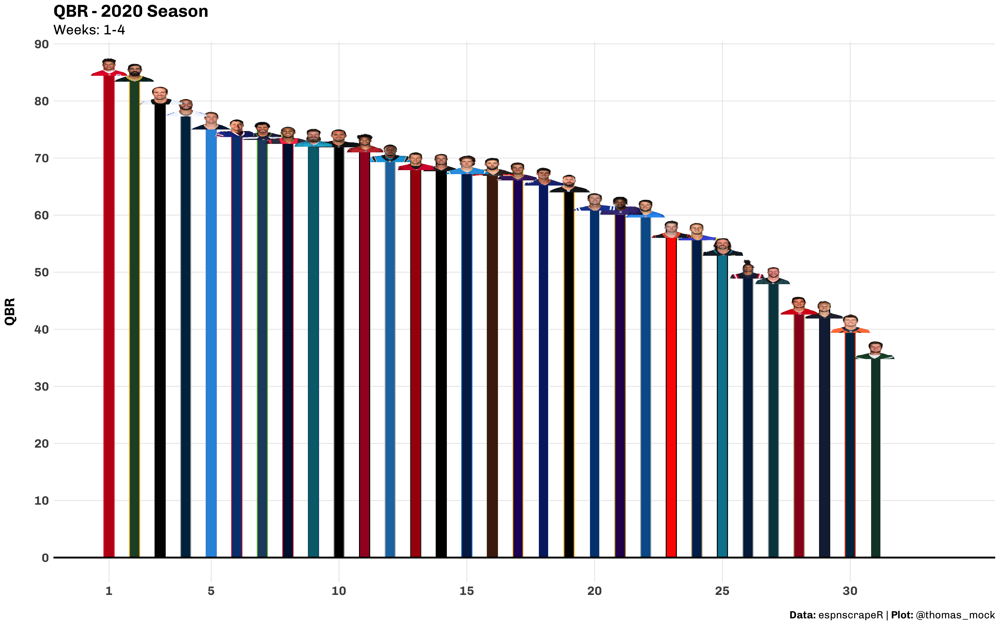
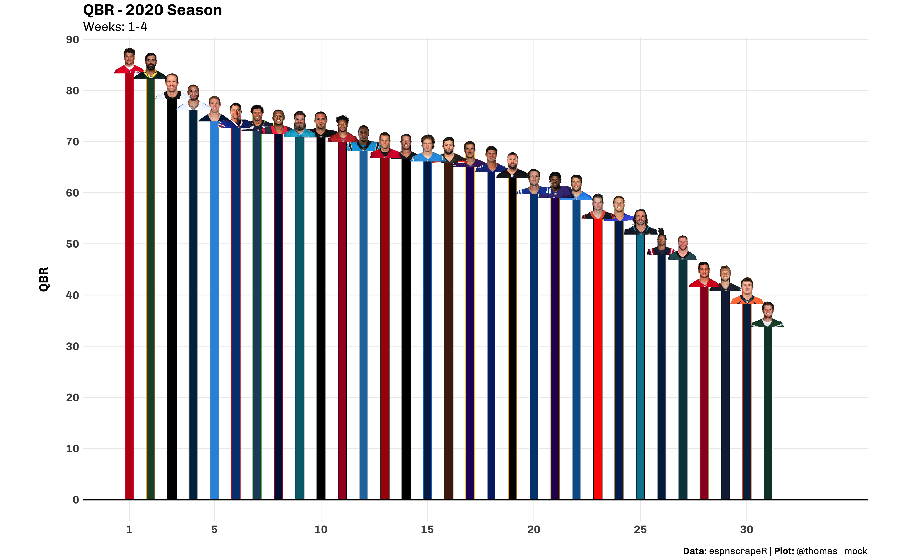
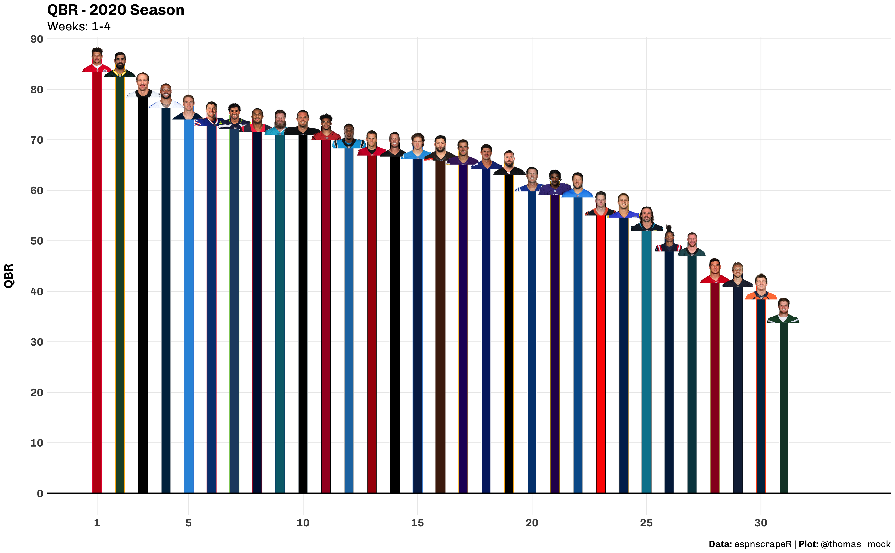
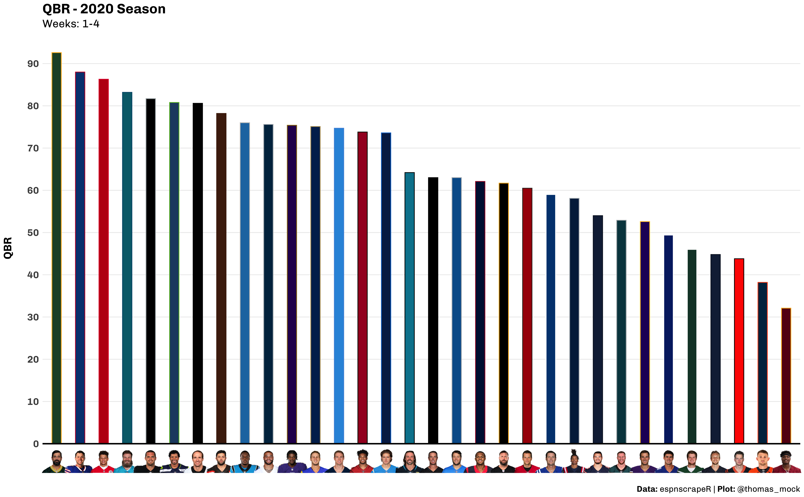

```{r setup, include=FALSE}
knitr::opts_chunk$set(echo = FALSE)
library(tidyverse)
library(espnscrapeR)
library(ggtext)
library(ggimage)
library(tictoc)
library(gt)
library(glue)
library(systemfonts)
```

### QBR Data

We'll gather the QBR data through week 4 via `espnscrapeR`. We're also adapting a function from [Emil Hvitfeldt](https://www.hvitfeldt.me/blog/real-emojis-in-ggplot2/) to create `` tags for use by `ggtext` down the line.

```{r, echo = TRUE}
# Get QBR data
qbr_data <- espnscrapeR::get_nfl_qbr(2020)

# Get NFL team data
team_data <- espnscrapeR::get_nfl_teams()

all_data <- qbr_data %>% 
  left_join(team_data, by = c("team"  = "team_short_name"))

link_to_img <- function(x, width = 50) {
  glue::glue("")
}

```

A quick bar plot of the ranked performance by each QB. We've explicilty added colors for each player's team, and already formatted it for a nice display with some `theme` changes.

<details>
<summary><strong>Basic Plot Code</strong></summary>

```{r, echo = TRUE, layout="l-body-outset", dpi = 500, fig.dim=c(16.18, 10)}
basic_plot <- all_data %>% 
  mutate(label = link_to_img(headshot_href),
         rank = as.integer(rank)) %>% 
  ggplot() +
  geom_col(
    aes(
      x = rank, y = qbr_total,
      fill = team_color, color = alternate_color
      ),
    width = 0.4
    ) + 
  scale_color_identity(aesthetics =  c("fill", "color")) +
  geom_hline(yintercept = 0, color = "black", size = 1) +
  theme_minimal() +
  scale_x_continuous(breaks = c(1, seq(5, 30, by = 5)), limits = c(0.5, 34)) +
  scale_y_continuous(breaks = scales::pretty_breaks(n = 10)) +
  labs(x = NULL,
       y = "QBR\n",
       title = "QBR - 2020 Season",
       subtitle = "Weeks: 1-4",
       caption = "<br>**Data:** espnscrapeR | **Plot:** @thomas_mock") +
  theme(
    text = element_text(family = "Chivo"),
    panel.grid.minor = element_blank(),
    plot.title = element_text(face = "bold", size = 20),
    plot.subtitle = element_text(size = 16),
    plot.caption = element_markdown(size = 12),
    axis.text = element_text(size = 14, face = "bold"),
    axis.title.y = element_text(size = 16, face = "bold")
    )
```

</details>

```{r, layout="l-body-outset", dpi = 500, fig.dim=c(16.18, 10)}
basic_plot
```


That's a fine plot, but unless we're very knowledgeable about team colors you probably can't decide which player/team belongs to each column. Now, we could approach it a different way, and rather than plotting ranks we can flip the graph where QBR is on the X, and player name is on the Y, now explicitly sorting by rank.

<details>
<summary><strong>Sideways Plot Code</strong></summary>

```{r, echo = TRUE}
side_plot <- all_data %>% 
  mutate(label = link_to_img(headshot_href),
         rank = as.integer(rank)) %>% 
  ggplot() +
  geom_col(
    aes(
      x = qbr_total, y = fct_reorder(name, qbr_total),
      fill = team_color, color = alternate_color
      ),
    width = 0.4
    ) + 
  scale_color_identity(aesthetics =  c("fill", "color")) +
  geom_vline(xintercept = 0, color = "black", size = 1) +
  theme_minimal() +
  scale_x_continuous(breaks = scales::pretty_breaks(n = 10)) +
  labs(x = "\nQBR",
       y = NULL,
       title = "QBR - 2020 Season",
       subtitle = "Weeks: 1-4",
       caption = "<br>**Data:** espnscrapeR | **Plot:** @thomas_mock") +
  theme(
    text = element_text(family = "Chivo"),
    panel.grid.minor = element_blank(),
    panel.grid.major.y = element_blank(),
    plot.title = element_text(face = "bold", size = 20),
    plot.subtitle = element_text(size = 16),
    plot.caption = element_markdown(size = 12),
    axis.text = element_text(size = 14, face = "bold"),
    axis.title.x = element_text(size = 16, face = "bold"),
    axis.text.y = element_text(margin = margin(r = -25, unit = "pt")),
    axis.ticks.y = element_blank()
    )
```

</details>

```{r, layout="l-body-outset", dpi = 500, fig.dim=c(16.18, 10)}
side_plot
```


Again that's a useful plot, but we often want to include some more *pizzazz* by including team logos or player headshots. Below we'll cover a few of the ways to do this, and some of the barriers or pain points we'll run into along the way!

---

### `ggimage`

First we have `ggimage` + end of column labels. I also want to note that I'm explicitly showing the code here, and using `tictoc` to display how long saving these images will take. In general, displaying embedded images is a bit slower than an equivalent basic `ggplot`. Since I want to show what the images will look like after export, I'm also using `knitr::include_graphics()` to include the actual exported PNG in this RMarkdown-based website. I've also included `tictoc` for how long each code-section took to save so you can see that each method is about 5-8 seconds.

**NOTE: I realise this graphic is distorted, it's an intentional display of a problem you may run into**

```{r, echo = TRUE}
tic()
qb_col_img <- basic_plot +
  geom_image(
    aes(
      x = rank, y = qbr_total,
      image = headshot_href
      )
    )

# Not displaying the image directly, 
# but reading in the exported img after
# qb_col_img

# saving it as a rectangle
ggsave(
  "qbr-ggimage.png", qb_col_img, 
  height = 10, width = 16, dpi = "retina"
  )

toc()
```

```{r, layout="l-screen-inset"}

```


You'll notice that since we have a rectangle-shaped graph, the images have been distorted to be wider than they should. Now if you want the images to come out without being distorted, you need to specify the specific aspect ratio you're using. Just in case you haven't heard of an aspect ratio, I'll also provide a definition *as the ratio of width to height*. 

---

### `ggimage` and Aspect Ratio

Note that `geom_image()` has the following parameters:

```
geom_image(
  mapping = NULL,
  data = NULL,
  stat = "identity",
  position = "identity",
  inherit.aes = TRUE,
  na.rm = FALSE,
  by = "width",
  nudge_x = 0,
  ...
)
```

There isn't an explicit option for aspect ratio, but it exists as `asp`. So if we consider ahead of time the dimensions of the plot we want to make, we can define the aspect ratio at the plot level and at the `ggsave` level. Per some experiments on Windows specifically, we also need to include aspect ratio in the `theme()` call as well, and make sure this again aligns with your `ggsave()` call.

```{r, echo = TRUE}
# Define an aspect ratio to use throughout
# This value is the golden ratio
# which provides a wider than tall rectangle
asp_ratio <- 1.618 

tic()
qb_col_img_asp <- basic_plot +
  # note we can also control the size of the image according to it's width
  geom_image(
    aes(
      x = rank, y = qbr_total,
      image = headshot_href
      ), 
    # Set size, and aspect ratio
    size = 0.05, by = "width", asp = asp_ratio
    ) +
  # Second step
  theme(aspect.ratio = 1/asp_ratio)

# include aspect ratio in ggsave
ggsave(
  "qbr-img-asp.png", qb_col_img_asp, 
  # make the width equivalent to the aspect.ratio
  height = 10, width = 10 * asp_ratio, dpi = "retina"
  )
toc()
```

```{r, layout="l-screen-inset"}

```


While this may seem like a bit of work, it's a good habit to think explicitly about what size or ratio you want to save your plots out as (it can inform how big to make your text amongst other things).

However, there's an even easier way thanks to `ggtext`!

---

### `ggtext` + column end labels.

Next we have `ggtext` + column labels. Here `ggtext::geom_richtext()` handles the proper scaling of the image without really any intervention from us! While `geom_richtext()` is very useful we're sort of using it out of its normal context. The overall purpose of `ggtext` is to provide *"improved text rendering support for `ggplot2`"*. The [`ggtext` site](https://wilkelab.org/ggtext/) has all the capabilities and function details. In short, `ggtext` provides a limited subset of `markdown`/`HTML`/`CSS` syntax as an interface to changing text in `ggplot2`.

Thus, to achieve our goal of embedding images, we can create an [`img` HTML tag](https://www.w3schools.com/tags/tag_img.asp) to embed an image rather than just format text. Note that again, while this looks like a HTML call it works anywhere you want to use `ggplot2`. Credit to [Emil Hvitfeldt](https://www.hvitfeldt.me/blog/real-emojis-in-ggplot2/) for the idea of using an `img` tag and the function we're adapting to embed images.

```{r, echo = TRUE}
# Don't forget, we already created an img label column with HTML
link_to_img <- function(x, width = 50) {
  glue::glue("")
}

```

```{r, echo = TRUE}
tic()
qb_col_text <- basic_plot + 
    geom_richtext(
      aes(x = rank, y = qbr_total, label = label), 
      size = 1,
      fill = NA, label.color = NA, # remove background and outline
      label.padding = grid::unit(rep(0, 4), "pt") # remove padding
      )

ggsave("qbr-ggtext.png", qb_col_text, height = 10, width = 10 * asp_ratio, dpi = "retina")
toc()
```

```{r, layout="l-screen-inset"}

```

---

### `ggtext` + Axis Labels

Now we could also change the images on the x-axis w/ the code below, and note that we're mainly taking the same code, but changing the core `aes()` call to have `x = label` and `axis.text.x = ggtext::element_markdown()` - full details shown below.

```{r, eval = FALSE, echo = TRUE}
# Here are the parts we're changing

# change x-axis to be the label we've created
aes(x = fct_reorder(label, qbr_total, .desc = TRUE))

# and changing the theme to include element_markdown()
theme(
  axis.ticks.x = element_blank(),
  # add element_markdown to axis.text.x
  # this will parse the labels to add img
  axis.text.x = element_markdown(margin = margin(t = -25, unit = "pt"))
  )
```

Here's the full code of the call with again some highlighted portions where we've changed code.

```{r, echo = TRUE}
tic()
axis_plot <- basic_plot <- all_data %>% 
  mutate(label = link_to_img(headshot_href),
         rank = as.integer(rank)) %>% 
  ggplot() +
  geom_col(
    aes(
      ## CHANGE IS HERE ##
      # apply label to x axis labels
      x = fct_reorder(label, qbr_total, .desc = TRUE), 
      y = qbr_total,
      fill = team_color, color = alternate_color
      ),
    width = 0.4
    ) + 
  scale_color_identity(aesthetics =  c("fill", "color")) +
  geom_hline(yintercept = 0, color = "black", size = 1) +
  theme_minimal() +
  scale_y_continuous(breaks = scales::pretty_breaks(n = 10)) +
  labs(x = NULL,
       y = "QBR\n",
       title = "QBR - 2020 Season",
       subtitle = "Weeks: 1-4",
       caption = "<br>**Data:** espnscrapeR | **Plot:** @thomas_mock") +
  theme(
    text = element_text(family = "Chivo"),
    panel.grid.minor = element_blank(),
    panel.grid.major.x = element_blank(),
    plot.title = element_text(face = "bold", size = 20),
    plot.subtitle = element_text(size = 16),
    plot.caption = element_markdown(size = 12),
    axis.text = element_text(size = 14, face = "bold"),
    axis.title.y = element_text(size = 16, face = "bold")
    ) +
  theme(
    axis.ticks.x = element_blank(),
    # add element_markdown to axis.text.x
    # this will parse the labels to add img
    # we're also decreasing the margin so that the logos/heads are close 
    # to the columns
    axis.text.x = element_markdown(margin = margin(t = -25, unit = "pt"))
    )

# axis_plot

ggsave(
  "qbr-axis-img.png", axis_plot, 
  height = 10, width = 10 * asp_ratio, dpi = "retina"
  )
toc()
```


```{r, layout="l-screen-inset"}

```

---

### `ggtext` Negatives

OK wow, so why not just use `ggtext` all the time!?

Cons:  

- It's **verrrrrrry** slow to draw in the RStudio plot-viewer, like on the order of a few minutes with 33 embedded images, however it will still save to `png` in a few seconds  
- Can't adjust size in `ggplot` - has to be done ahead of time w/ HTML syntax in our custom function  

I'm fine with these tradeoffs, as you can still `ggsave` it in a few seconds and you don't have to worry about the scaling.

---

### What about a table?

So a slight hot-take is that since we're showing values that we're inherently asking people to look up and compare individual values (ie find your QB of interest vs the field), this should be a table!

Per [Stephen Few:](https://themockup.blog/posts/2020-09-04-10-table-rules-in-r/#stephen-few)  

> Tables: Display used to look up and **compare individual values**.  

> Graph: Used to display the **relationship among whole sets of values** and their overall shape.  

Now sure, we're showing a shape of the graphic, but really this is a way to show how far ahead (or behind) one player is behind another which is comparing individual values. That being said, I think it's totally fine to use this a graphic, it's attractive, people seem to enjoy them, and everyone has the free will to make their own graph/table decisions!

Below is an example of a table that occupies roughly the same space, tells the same story, uses the same headshots, but also adds more data in QB run vs pass EPA splits along with total plays.

<details>
<summary><strong>Table Data + Function</strong></summary>

```{r, echo = TRUE}
tab_data <- all_data %>% 
  mutate(RK = rank(desc(qbr_total)),
         RK = as.integer(RK)) %>% 
  select(RK, name, headshot_href, qbr_total, qb_plays, pass, run) 

tab_function <- function(data, ...){
  data %>% 
  gt() %>% 
  text_transform(
    locations = cells_body(vars(headshot_href)),
    fn = function(x){
      web_image(
        url = x,
        height = px(30)
      )
    }
  ) %>% 
  cols_label(
    headshot_href = "",
    name = "Name",
    qbr_total = "QBR",
    qb_plays = "Plays",
    run = "Run",
    pass = "Pass"
  ) %>% 
  data_color(
    columns = vars(qbr_total),
    colors = scales::col_numeric(
      palette = c("#af8dc3", "#f7f7f7", "#7fbf7b"),
      domain = c(25, 100)
    )
  ) %>% 
  tab_style(
    style = cell_text(weight = "bold"),
    locations = cells_body(
      columns = vars(RK, name)
    )
  ) %>% 
  tab_options(
    column_labels.background.color = "white",
    column_labels.font.weight = "bold",
    table.border.top.width = px(3),
    table.border.top.color = "transparent",
    table.border.bottom.color = "transparent",
    table.border.bottom.width = px(3),
    column_labels.border.top.width = px(3),
    column_labels.border.top.color = "transparent",
    column_labels.border.bottom.width = px(3),
    column_labels.border.bottom.color = "black",
    data_row.padding = px(3),
    source_notes.font.size = 12,
    table.font.size = 16,
    heading.align = "left",
    ...
  ) %>%
  opt_table_font(
    font = list(
      google_font("Chivo"),
      default_fonts()
    )
  ) 

}
```

</details>
<br>

The code uses the function defined in the above expandable section, and to get the side-by-side format I decided to save the tables as PNG and then combine with `magick::image_append()`. 


```{r, eval = FALSE, echo = TRUE}
tab_data %>% 
  slice(1:17) %>% 
  tab_function()

tab_data %>% 
  slice(178:nrow(.)) %>% 
  tab_function() %>% 
  tab_style(
    style = cell_borders(
      sides = "left",
      color = "black",
      weight = px(3)
    ),
    locations = 
      list(
        cells_body(
          columns = 1
        ),
        cells_column_labels(1)
      )
  )
```


```{r, layout="l-body-outset", echo = TRUE}
img1 <- magick::image_read("gt-tab1.png")
img2 <- magick::image_read("gt-tab2.png")

magick::image_append(c(img1, img2))
```


The equivalent plot that displays:  
- Run EPA  
- Pass EPA  
- QBR  
- Player name  

We've also loaded the `ggrepel` package to add labels. This graphic is getting a bit busy at this point but is still useful. Given that we're trying to display 4 measures we have had to rely on size for run EPA which adds additional overhead to the understanding of this graphic as well.

```{r, echo = TRUE, layout="l-body-outset", fig.dim=c(12, 8), dpi=350}
library(ggrepel)

scatter_plot <- all_data %>% 
  mutate(label = link_to_img(headshot_href),
         rank = as.integer(rank)) %>% 
  ggplot() +
  geom_smooth(aes(x = pass, y = qbr_total), method = "lm", color = "grey") +
  ggrepel::geom_text_repel(
    aes(x = pass, y = qbr_total, label = last_name),
    box.padding = 0.5, fontface = "bold", size = 6
    ) +
  geom_point(
    aes(x = pass, y = qbr_total, size = run, fill = team_color, color = alternate_color), 
    shape = 21
    ) +
  scale_color_identity(aesthetics =  c("fill", "color")) +
  scale_size(name = "Run EPA") +
  theme_minimal() +
  scale_x_continuous(breaks = scales::pretty_breaks(n = 10)) +
  scale_y_continuous(breaks = scales::pretty_breaks(n = 10), limits = c(0, 100)) +
  labs(x = "\nPass Expected Points Added",
       y = "QBR\n",
       title = "QBR - 2020 Season",
       subtitle = "Weeks: 1-4\nNote that Pass EPA is predictive of QBR",
       caption = "<br>**Data:** espnscrapeR | **Plot:** @thomas_mock") +
  theme(
    text = element_text(family = "Chivo"),
    panel.grid.minor = element_blank(),
    plot.title = element_text(face = "bold", size = 20),
    plot.subtitle = element_text(size = 16),
    plot.caption = element_markdown(size = 12),
    axis.text = element_text(size = 14, face = "bold"),
    axis.title = element_text(size = 16, face = "bold"),
    legend.position = c(0.1,0.9),
    legend.background = element_rect(fill = "lightgrey"),
    legend.title = element_text(size = 12, face = "bold"),
    legend.text = element_text(size = 10)
    )

scatter_plot
```

