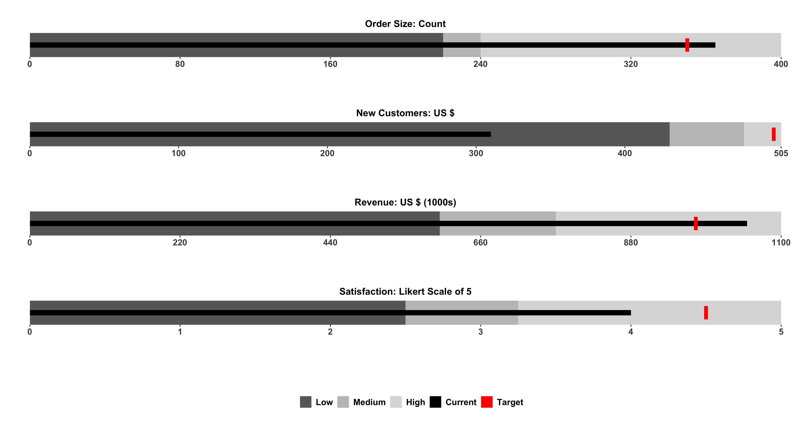
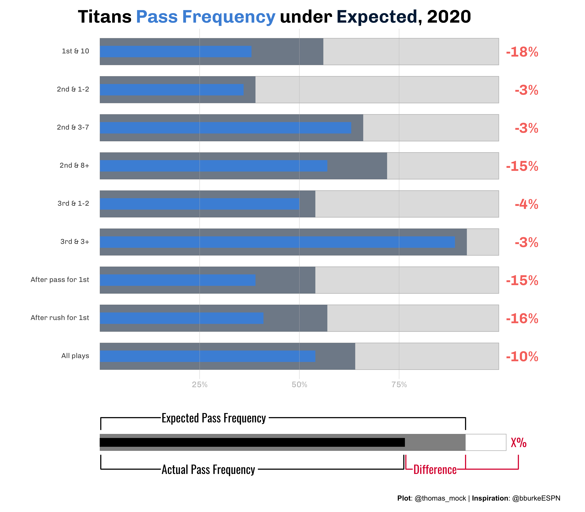

```{r setup, include=FALSE}
knitr::opts_chunk$set(echo = TRUE)
library(tidyverse)
library(ggtext)
library(patchwork)
library(bulletchartr)
```


## Bullet Charts

A [bullet chart](https://en.wikipedia.org/wiki/Bullet_graph) is a rich variant of the simple bar chart. Most commonly they can be used to replace "flashier" gauges, and are more compact/efficient in their display of multiple measures at once.

Classically they encode a quantitative measure, a qualitative scale, and a comparison or target measure. 

```{r fig.cap='Figure from [Stephen Few via Wikipedia](https://en.wikipedia.org/wiki/Bullet_graph)', out.extra="class=external", echo=FALSE}
knitr::include_graphics("https://upload.wikimedia.org/wikipedia/commons/thumb/9/9a/Labelled_Bullet_Graph_Example.svg/500px-Labelled_Bullet_Graph_Example.svg.png")
```

The original design of bullet charts can be given to [Stephen Few](http://www.perceptualedge.com/articles/misc/Bullet_Graph_Design_Spec.pdf), and the above image is from his blog - [perceptualedge.com](http://www.perceptualedge.com).

Others have tried some various strategies to robustly graph these with `ggplot2` - notably [Bob Rudis' `Rbulletgraph`](https://github.com/hrbrmstr/Rbulletgraph) and Ryo Nakagawara/Amit Kohli's [`bulletchartr`](https://ryo-n7.github.io/2018-04-30-bulletchartr-package-experience/), and my own [`geom_bullet`](https://github.com/jthomasmock/tomtom). 

It's a hard problem to solve with a *general* function, given that often the bullet charts don't typically adhere nicely to a single data frame and tidy-data principles, typically require re-factoring of the input data or external reference data, or at the least require multiple columns to be charted.

My personal attempts are very much modeled after Bob's approach, which is layering graph components as opposed a single `geom_` call. 

The `bulletchartr` approach on the other hand (which is relatively similiar to my `geom_bullet()`) is to create a function that takes a summary data frame and plots several columns from the data. 

```{r, eval = FALSE}
bulletchartr::bullet_chart(dataframe = bc_ex)
```

```{r, layout="l-body-outset", fig.width=12, fig.height=6, echo = FALSE}

```

This is a fine approach for an opinionated take on bullet charts, but I'll focus on building your own from scratch in case you only want some of the features.

## Component Parts

We can break down the bullet chart into the comparative range and the quantitative measure. Thus we can approximate the chart by overlaying 2x `geom_col()` calls in `ggplot2`.

```{r, eval = FALSE}
library(tidyverse)
```

```{r, warning=FALSE, fig.dim=c(6,2)}
tibble(
  name = "Example",
  quant_value = 75,
  qualitative = 100
) %>% 
  ggplot(aes(x = quant_value, y = name)) +
  geom_col(aes(x = qualitative), fill = "grey") +
  geom_col(width = 0.5, fill = "black") +
  coord_cartesian(ylim = c(0.3, 1.7)) +
  theme_minimal() +
  theme(panel.grid.major.y = element_blank())
```

Alternatively, we can do it in one call if the data is arranged in a longer format.

```{r, warning=FALSE, fig.dim=c(8,2)}
ex_df <- tibble(
  name = rep("Example", 2),
  group = c("Qualitative", "Measure"),
  value = c(100, 75),
  width = c(0.9, 0.5)
)
ex_df %>% 
  ggplot(aes(x = value, y = name, fill = group)) +
  geom_col(width = ex_df$width) +
  coord_cartesian(ylim = c(0.3, 1.7)) +
  scale_fill_manual(values = c("black", "grey")) +
  theme_minimal() +
  theme(panel.grid.major.y = element_blank())
```

## Add a target

Next we can also include a target measure. At this point you can see that we're really stretching what is reasonable for a dataset, as we're duplicating a lot of values that don't really need to be duplicated. We could store this outside or indicate them manually but again you can see why this can in theory be generalized, but it's complex.

```{r, warning=FALSE, fig.dim=c(6,4)}
ex_df <- bind_rows(
  tibble(
  name = rep("Ex 1", 2),
  group = c("Qualitative", "Measure"),
  color = c("grey", "black"),
  value = c(100, 75),
  width = c(0.9, 0.5),
  target = rep(82, 2),
  ymin = rep(0.7, 2),
  ymax = rep(1.3, 2)
  ),
  tibble(
  name = rep("Ex 2", 2),
  group = c("Qualitative", "Measure"),
  color = c("grey", "black"),
  value = c(88, 64),
  width = c(0.9, 0.5),
  target = rep(77, 2),
  ymin = rep(1.7, 2),
  ymax = rep(2.3, 2)
  )
)

ex_df %>% 
  ggplot(aes(x = value, y = name, fill = color)) +
  geom_col(width = c(0.9, 0.5, 0.9, 0.5)) +
  geom_linerange(
    aes(x = target, ymin = ymin, ymax = ymax),
    size = 2, color = "red"
    ) +
  coord_cartesian(ylim = c(0.3, 2.7)) +
  scale_fill_identity() +
  theme_minimal() +
  theme(panel.grid.major.y = element_blank())
```

## Add qualitative ranges

The next layer of complexity arises around the idea of creating more qualitative ranges (ie poor, good, great). I've hidden the code in an expandable section due to the length, but it's all there! This is an example from an [older `#TidyTuesday` plot](https://twitter.com/thomas_mock/status/1184121610216886279) I did in 2019.

<details><h4>Full Code</h4>

```{r, cache = TRUE, message=FALSE, warning=FALSE}
big_epa_cars <- readr::read_csv("https://raw.githubusercontent.com/rfordatascience/tidytuesday/master/data/2019/2019-10-15/big_epa_cars.csv")

cars_clean <- big_epa_cars %>%
  janitor::clean_names()

range_cars <- cars_clean %>%
  filter(!is.na(eng_dscr)) %>%
  filter(year == 2018) %>%
  summarize(
    q50 = quantile(highway08, probs = 0.50),
    q95 = quantile(highway08, probs = 0.95),
    q100 = quantile(highway08, probs = 1.00)
  )

top_cars <- cars_clean %>%
  filter(!is.na(eng_dscr)) %>%
  filter(year == 2018) %>%
  group_by(make) %>%
  top_n(1, city08) %>%
  ungroup() %>%
  filter(make %in% c(
    "Subaru",
    "Volvo",
    "Chevrolet",
    "Ford",
    "Mazda",
    "Honda",
    "Toyota",
    "Volkswagen"
  )) %>%
  distinct(make, .keep_all = TRUE) %>%
  select(make, model, highway08, city08, eng_dscr, year) %>%
  arrange(desc(highway08), city08) %>%
  mutate(
    eng_type = if_else(
      str_detect(eng_dscr, "PHEV|Hybrid"), 
      "Hybrid", "Gas"
      )
    ) %>%
  mutate(make_model = paste(make, eng_type, sep = " - "))

mpg_levels <- top_cars %>%
  arrange(desc(highway08), city08) %>%
  pull(make_model)

plot_cars <- top_cars %>%
  mutate(
    min_mpg = pull(range_cars, q50),
    middle_mpg = pull(range_cars, q95),
    max_mpg = pull(range_cars, q100)
  ) %>%
  mutate(make_model = factor(make_model, levels = rev(mpg_levels)))

bar_cars <- plot_cars %>%
  distinct(make, .keep_all = TRUE)

car_plot <- bar_cars %>%
  ggplot() +
  geom_col(
    aes(x = make_model, y = max_mpg),
    fill = "#A9A9A9",
    width = 0.6,
    alpha = 0.9
  ) +
  geom_col(
    aes(x = make_model, y = middle_mpg),
    fill = "#808080",
    width = 0.6,
    alpha = 0.9
  ) +
  geom_col(
    aes(x = make_model, y = min_mpg),
    fill = "#696969",
    width = 0.6,
    alpha = 0.9
  ) +
  geom_col(
    aes(x = make_model, y = highway08),
    fill = "black",
    color = NA,
    width = 0.2
  ) +
  geom_errorbar(
    aes(x = make_model, ymin = city08, ymax = city08),
    color = "red",
    width = 0.45,
    size = 2
  ) +
  coord_flip() +
  theme_minimal() +
  labs(
    x = "",
    y = "\nMiles per Gallon",
    title = "Some hybrids are more efficient in the <span style='color:#FF0000'>**City**</span> than <span style='color:#000000'>**Highway**</span>",
    subtitle = "Typically, vehicles are more efficient on the highway"
  ) +
  theme(
    panel.grid = element_blank(),
    plot.title = element_markdown(),
    axis.text = element_text(face = "bold")
  ) +
  annotate(
    "text",
    x = c(rep((8 + .45), 4)),
    y = c(
      bar_cars$min_mpg[1] * 0.5,
      bar_cars$middle_mpg[1] * 0.85,
      bar_cars$max_mpg[1] * 0.8,
      bar_cars$city08[1]
    ),
    label = c("Poor", "Good", "Great", "City"),
    color = c(rep("black", 3), "red")
  ) +
  scale_y_continuous(breaks = seq(0, 60, 10)) +
  NULL
```

</details>

```{r, layout="l-body-outset", fig.width=8, fig.height=6}
car_plot
```

At this point, we've essentially recreated the approach of things like `geom_bullet()` or `bulletchartr`. As you can see this is a bit of work, but once you have the rough structure setup you could create or use a function (like `bulletchartr`t) or a `geom_` like `geom_bullet()`.

## The buried lede

The whole reason I got started on this post was my interest in re-creating ESPN's Playoff Probablity Leverage from Brian Burke's team. He outlined the process in a [nice Twitter thread](https://twitter.com/bburkeESPN/status/1331755980175052803?s=20).

<blockquote class="twitter-tweet"><p lang="en" dir="ltr">Almost forgot. These leverage graphs get a lot of love here for some reason, on a site where that&#39;s rare. So I&#39;m going to thread a tale of how they came to be... <a href="https://t.co/0O5fnRxVpu">pic.twitter.com/0O5fnRxVpu</a></p>&mdash; Brian Burke (@bburkeESPN) <a href="https://twitter.com/bburkeESPN/status/1331755980175052803?ref_src=twsrc%5Etfw">November 26, 2020</a></blockquote> <script async src="https://platform.twitter.com/widgets.js" charset="utf-8"></script>

Number one, these are gorgeous, and I really loved the addition of an example legend rather than a long description, which Brian Burke also noted was an extremly simple explanation of a relatively complex chart. Additionally, he mentioned that they were automated, which is always a driving force for why code is useful!

<blockquote class="twitter-tweet"><p lang="en" dir="ltr">I should note that Matt devised the &quot;key&quot; at the bottom of the charts that puts the 100 words in my original text box (&quot;This chart depicts...blah blah...&quot;) into the world&#39;s best succinct graphical explainer: <a href="https://t.co/tjhbY0XNRn">pic.twitter.com/tjhbY0XNRn</a></p>&mdash; Brian Burke (@bburkeESPN) <a href="https://twitter.com/bburkeESPN/status/1331766737017200643?ref_src=twsrc%5Etfw">November 26, 2020</a></blockquote> <script async src="https://platform.twitter.com/widgets.js" charset="utf-8"></script>

We can pretty quickly recreate the basic concept as seen below. Note that I have some additional data collection steps that we'll go over in just a second.

```{r get-data, cache=TRUE, echo=FALSE, message=FALSE,warning=FALSE}
library(ggtext)
library(systemfonts)
library(patchwork)

teams <- espnscrapeR::get_nfl_standings(2020)

team_meta <- espnscrapeR::get_nfl_teams() %>% 
  select(abb_name = team_short_name, team_color)

team_df <- teams %>% 
  select(abb_name, logos, playoff_seed) %>% 
  left_join(team_meta) %>% 
  group_by(playoff_seed) %>% 
  mutate(
    count = row_number(),
    conf = if_else(count == 1, "AFC", "NFC")) %>% 
  ungroup() %>% 
  filter(conf == "AFC") %>% 
  mutate(
    win_cur = c(
      99, 99, 81, 60, 73, 59, 52, 59, 16, 1, 3, 1, 1, 1, 0, 0
    ),
    win_pct = c(
    99,99.01,94, 91, 95, 83, 69, 86, 39, 3, 13, 1, 1,1,1, 0
    ),
    win_chg = round(win_pct - win_cur, 1)
  ) %>% 
  mutate(
    abb_name = factor(abb_name),
    abb_name = fct_reorder(abb_name, win_pct, .desc = TRUE),
    abb_name = fct_rev(abb_name)
  ) %>% 
  arrange(desc(win_pct))
```

```{r, layout="l-body-outset"}
team_df %>%
  ggplot(aes(x = win_cur, y = fct_reorder(abb_name, win_pct))) +
  geom_col(aes(x = 100), fill="white", color = "grey", width = 0.7) +
  geom_col(aes(x = win_pct), alpha = 0.5, width = 0.7) +
  geom_col(width = 0.7) +
  labs(x = "Win Probability", y = "")
```

We could make these more "bullet-chart-y" by altering the width of the columns, but I honestly think the stacked/alpha approach is more appealing here given the amount of variables. Also, since we're showing the minimal range and then the potential achievement (leverage) I think the stack is more appropriate than a classical bullet. Regardless, both can work and I'll leave it up to the reader to decide which is more informative.

```{r, layout="l-body-outset"}
team_df %>%
  ggplot(aes(x = win_cur, y = fct_reorder(abb_name, win_pct))) +
  geom_col(aes(x = 100), fill="white", color = "grey", width = 0.7) +
  geom_col(aes(x = win_pct), alpha = 0.5, width = 0.7) +
  geom_col(width = 0.3) +
  labs(x = "Win Probability", y = "")
```

So the next step is to add in team colors, replace team names with logos, and add the explanatory legend.

## Data Collection

I'm going to be getting team standings, colors and logos from my own `espnscrapeR`. Also, to cheat I'm not going to do the 20K simulations that ESPN and many others do to create the underlying data, but rather "borrow" the data from the original chart. Note I'm also loading [`patchwork`](https://patchwork.data-imaginist.com/) for combining plots, and [`ggtext`](https://github.com/wilkelab/ggtext) to use for the team logos on the axis. Lastly, I'm using a few custom fonts which I'll load via the [`systemfonts`](https://github.com/r-lib/systemfonts) package.

```{r get-data, cache=TRUE}
```

I've also defined a function to take the logo url and convert it to a HTML `` tag which `ggtext` can then plot in `ggplot2` for us!

```{r}
link_to_img <- function(x, width = 30) {
  glue::glue("")
}
```

## Plot with colors/logos

I'm really pleased with this, as it's a very close approximation of the original, and Brian Burke did a great job on the original aesthetics. We still need to create the legend plot and then "attach" it to the bottom of this plot. We can combine the plots with `patchwork`, but first let's try building it!

```{r, cache=TRUE}
team_logo_plot <- team_df %>%
  mutate(logos = link_to_img(logos)) %>% 
  ggplot(aes(x = win_cur, y = fct_reorder(logos, win_pct), fill = team_color)) +
  geom_text(
    aes(x = 100, label = paste0(win_chg, "%")), 
    nudge_x = 6, hjust = 1, fontface= "bold", family = "Chivo", size = 6
    ) +
  geom_col(aes(x = 100), fill="white", color = "grey", width = 0.7) +
  geom_col(aes(x = win_pct), alpha = 0.5, width = 0.7) +
  geom_col(width = 0.7) +
  scale_fill_identity() +
  scale_x_continuous(breaks = c(25, 50, 75), labels = scales::percent_format(scale = 1)) +
  theme_minimal() +
  theme(
    text = element_text(family = "Chivo"),
    panel.grid.major.y = element_blank(),
    panel.grid.minor = element_blank(),
    panel.grid.major.x = element_line(color = "grey", size = 0.2),
    panel.ontop = TRUE,
    axis.text.y = element_markdown(margin = margin(r = -25, unit = "pt")),
    axis.text.x = element_text(size = 16, color = "grey"),
    plot.title = element_text(size = 36, face = "bold"),
    plot.subtitle = element_text(size = 24),
    plot.margin = unit(c(0.5, 1.5, 0.5, 1.5), "cm")
  ) +
  labs(
    x = "", y = "", 
    title = "Playoff Probability Leverage",
    subtitle = "AFC Week 12"
  )
```

```{r, layout="l-body-outset", echo = FALSE}
knitr::include_graphics("team_logo_prob.png")
```


## Create a legend

I'm going to be creating a few dataframes to plot in my legend. These include labels, and some "segments" to create the lines around the labels.

```{r}
# Core dataset with the basic labels
label_df <- tibble(
  x = c(15, 15, 77, 101),
  y = c(1.6, 0.35, 0.35, 1),
  label = c("Chance to make playoffs with win ", "Chance to make playoffs with loss ", "Leverage", "X%")
)


# the horizontal lines
seg_df <- tibble(
  x1 = c(0.2, 90, 0.2, 74.8, 75.3, 90, 103),
  x2 = c(0.2, 90, 0.2, 74.8, 75.3, 90, 103),
  y1 = c(1.3, 1.3, rep(.7, 5)),
  y2 = c(1.61, 1.61, rep(.343, 5))

)

# vertical lines
seg2_df <- tibble(
  x1 = c(0.2, 0.2, 75.3),
  x2 = c(90, 74.8, 103),
  y1 = c(1.6, .35, .35),
  y2 = c(1.6, .35, .35)
)
```

The first plot is very simple, and close to our examples at the very beginning of this post!

```{r, fig.dim=c(6,2)}
legend_plot <- tibble(
  x = 75,
  y = factor("Y"),
  x2 = 90
) %>%
  ggplot(aes(x = x, y = y)) +
  geom_col(aes(x = 100), fill = "white", color = "grey", width = 0.4) +
  geom_col(aes(x = x2), width = 0.4, color = "#DC143C", fill = "grey") +
  geom_col(width = 0.4, color = "black", fill = "black")

legend_plot
```

You'll notice a few things. Since our y-axis is a factor it's essentially an integer where `Y == 1`. Each additional factor will be placed at `N + 1`

```{r, fig.dim=c(6,2)}
legend_plot +
  geom_text(aes(x = 50, y = 1, label = "Label at 1"), color = "red", size = 8) +
  geom_text(aes(x = 50, y = 1.5, label = "Label at 1.5"), color = "red", size = 8)
```

Since we can place labels above or below or measure of interest, we can use that concept to create line segments via `geom_segment()` at specific locations. You will notice that there is some ovelap/overplotting of the lines - I do this so that there isn't a gap when things are blown up a bit in the final graph.

We can add in the horizontal/vertical lines by two `geom_segment` layers. 

```{r, fig.dim = c(6,2)}
legend_plot <- tibble(
  x = 75,
  y = factor("Y"),
  x2 = 90
) %>%
  ggplot(aes(x = x, y = y)) +
  geom_col(aes(x = 100), fill = "white", color = "grey", width = 0.4) +
  geom_col(aes(x = x2), width = 0.4, color = "#DC143C", fill = "grey") +
  geom_col(width = 0.4, color = "black", fill = "black") +
  geom_segment(
    data = seg_df,
    aes(x = x1, y = y1, xend = x2, yend = y2),
    color = c(rep("black", 4), rep("#DC143C", 3)),
    size = 1
  ) +
  geom_segment(
    data = seg2_df,
    aes(x = x1, y = y1, xend = x2, yend = y2),
    color = c("black", "black", "#DC143C"),
    size = 1
  ) 

legend_plot
```

Our final step will be to add the text/labels in, and make sure they have a white background to "hide" the lines behind them.

```{r, layout="l-body-outset", fig.dim=c(12,4)}
final_legend <- legend_plot +
  geom_label(
    data = label_df,
    aes(x = x, y = y, label = label),
    hjust = 0, size = 8, fontface = "bold", fill = "white",
    color = c("black", "black", "#DC143C", "#DC143C"),
    label.size = NA,
    family = "Oswald",
    label.padding = unit(0.05, "lines"),
  ) +
  coord_cartesian(ylim = c(0.7, 1.2), xlim = c(0, 108)) +
  theme_void() +
  theme(
    plot.margin = unit(c(0.5, 1.5, 0.5, 1.5), "cm"),
    plot.caption = element_markdown(size = 14)
    )  +
  labs(
    caption = "<br><br>**Plot**: @thomas_mock | **Inspiration**: @bburkeESPN"
  )

final_legend
```

## Combine the plots

Now that both plots are done, we can very quickly combine them with `patchwork`. `patchwork` provides additional capabilities for layout/combining plots.

We can read the code below as `plot1` over `plot2` and then height of `plot1 == 5`, height of `plot2 == 1`.

```{r}
combo_plot <- team_logo_plot / legend_plot + plot_layout(heights = c(5,1))
```

```{r, layout="l-body-outset", echo = FALSE}
knitr::include_graphics("combo_plot.png")
```

And that's it! We've recreated Brian Burke's example in R, and figured out how to make some custom legends and combine them together.

## Another example

Ben Baldwin also had another tweet that inspired me to apply a similar concept. The full code snippet I used is on [GitHub](https://git.io/JkNfu). Here, Ben is comparing the Actual and Expected Pass Frequency over/under expected with a lollipop chart. Given that we're comparing ranges I thought a bullet chart would be a nice alternative!

<blockquote class="twitter-tweet"><p lang="en" dir="ltr">This is since week 7, whew boy <a href="https://t.co/O40sdbbtDA">pic.twitter.com/O40sdbbtDA</a></p>&mdash; Computer Cowboy (@benbbaldwin) <a href="https://twitter.com/benbbaldwin/status/1332732996030517251?ref_src=twsrc%5Etfw">November 28, 2020</a></blockquote> <script async src="https://platform.twitter.com/widgets.js" charset="utf-8"></script>

The part to note here is we are now comparing one measure to another, as opposed to the theoretical value + the minimal value we saw in the ESPN example. I also used *almost* the same code as above, but now the `actual` passing frequency bar is thinner than the `expected` passing range.

<details><h4>Full Code</h4>

```{r, cache=TRUE, message = FALSE, warning=FALSE}
library(patchwork)
library(ggtext)

team_colors <- nflfastR::teams_colors_logos %>% filter(team_abbr == "TEN") %>% 
  select(team_color, team_color2) %>% 
  unlist()

# approximated data
run_df <- tibble(
  down_distance = c(
    "1st & 10",
    "2nd & 8+",
    "2nd & 3-7",
    "2nd & 1-2",
    "3rd & 3+",
    "3rd & 1-2",
    "After pass for 1st",
    "After rush for 1st",
    "All plays"
  ),
  actual = c(
    38, 57, 63, 36, 89, 50, 39, 41, 54
  ),
  expected = c(
    56, 72, 66, 39, 92, 54, 54, 57, 64
  )
) %>% 
  mutate(
    down_distance = factor(down_distance),
    difference = actual - expected,
    diff_color = if_else(difference < 0, "#DC143C", "black")
    )

run_plot <- run_df %>%
  ggplot(aes(x = actual, y = fct_rev(down_distance))) +
  geom_text(
    aes(x = 100, label = paste0(difference, "%"), color = diff_color), 
    nudge_x = 10, hjust = 1, fontface= "bold", family = "Chivo", size = 10
  ) +
  geom_col(aes(x = 100), width = 0.7, color = "grey", alpha = 0.2) +
  geom_col(aes(x = expected), fill = team_colors[1], alpha = 0.5, width = 0.7) +
  geom_col(width = 0.3, fill = team_colors[2]) + 
  scale_fill_identity() +
  scale_x_continuous(breaks = c(25, 50, 75), labels = scales::percent_format(scale = 1)) +
  theme_minimal() +
  theme(
    text = element_text(family = "Chivo"),
    panel.grid.major.y = element_blank(),
    panel.grid.minor = element_blank(),
    panel.grid.major.x = element_line(color = "grey", size = 0.2),
    panel.ontop = TRUE,
    axis.text.y = element_markdown(size = 14, margin = margin(r = -25, unit = "pt")),
    axis.text.x = element_text(size = 16, color = "grey"),
    plot.title = element_markdown(size = 36, face = "bold"),
    plot.subtitle = element_text(size = 24),
    plot.margin = unit(c(0.5, 1.5, 0.5, 1.5), "cm"),
    legend.position = "none"
  ) +
  labs(
    x = "", y = "", 
    title = glue::glue("Titans <span style='color:{team_colors[2]}'>Pass Frequency</span> under <span style='color:{team_colors[1]}'>Expected</span>, 2020")
  )


# Legend plot -------------------------------------------------------------


label_df <- tibble(
  x = c(15, 15, 77, 101),
  y = c(1.6, 0.35, 0.35, 1),
  label = c("Expected Pass Frequency ", "Actual Pass Frequency ", "Difference", "X%")
)

seg_df <- tibble(
  x1 = c(0.2, 90, 0.2, 74.8, 75.3, 90, 103),
  x2 = c(0.2, 90, 0.2, 74.8, 75.3, 90, 103),
  y1 = c(1.3, 1.3, rep(.7, 5)),
  y2 = c(1.61, 1.61, rep(.343, 5))
  
)

seg2_df <- tibble(
  x1 = c(0.2, 0.2, 75.3),
  x2 = c(90, 74.8, 103),
  y1 = c(1.6, .35, .35),
  y2 = c(1.6, .35, .35)
)

legend_plot <- tibble(
  x = 75,
  y = factor("Y"),
  x2 = 90
) %>%
  ggplot(aes(x = x, y = y)) +
  geom_col(aes(x = 100), fill = "white", color = "grey", width = 0.4) +
  geom_col(aes(x = x2), width = 0.4, fill = "black", alpha = 0.5) +
  geom_col(width = 0.2, color = "black", fill = "black") +
  geom_segment(
    data = seg_df,
    aes(x = x1, y = y1, xend = x2, yend = y2),
    color = c(rep("black", 4), rep("#DC143C", 3)),
    size = 1
  ) +
  geom_segment(
    data = seg2_df,
    aes(x = x1, y = y1, xend = x2, yend = y2),
    color = c("black", "black", "#DC143C"),
    size = 1
  ) +
  geom_label(
    data = label_df,
    aes(x = x, y = y, label = label),
    hjust = 0, size = 8, fontface = "bold", fill = "white",
    color = c("black", "black", "#DC143C", "#DC143C"),
    label.size = NA,
    family = "Oswald",
    label.padding = unit(0.05, "lines"),
  ) +
  theme_void() +
  theme(
    plot.margin = unit(c(0.5, 1.5, 0.5, 1.5), "cm"),
    plot.caption = element_markdown(size = 14)
  ) +
  coord_cartesian(ylim = c(0.7, 1.2), xlim = c(0, 108)) +
  labs(
    caption = "<br><br>**Plot**: @thomas_mock | **Inspiration**: @bburkeESPN"
  )

legend_plot

combo_plot <- run_plot / legend_plot + plot_layout(heights = c(5,1))

combo_plot

# ggsave("ten_rush.png", combo_plot, height = 14, width = 16, units = "in", dpi = "retina")
```


</details>

```{r, layout="l-body-outset", echo=FALSE}

```

