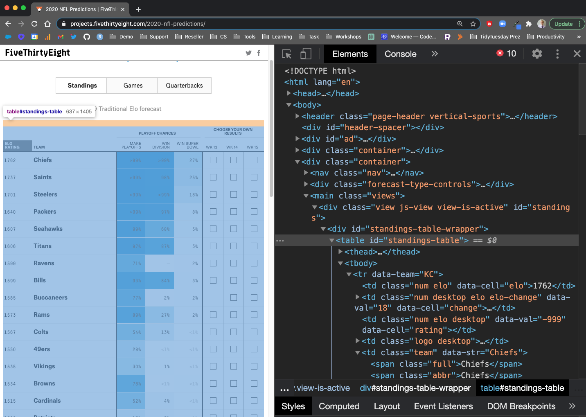
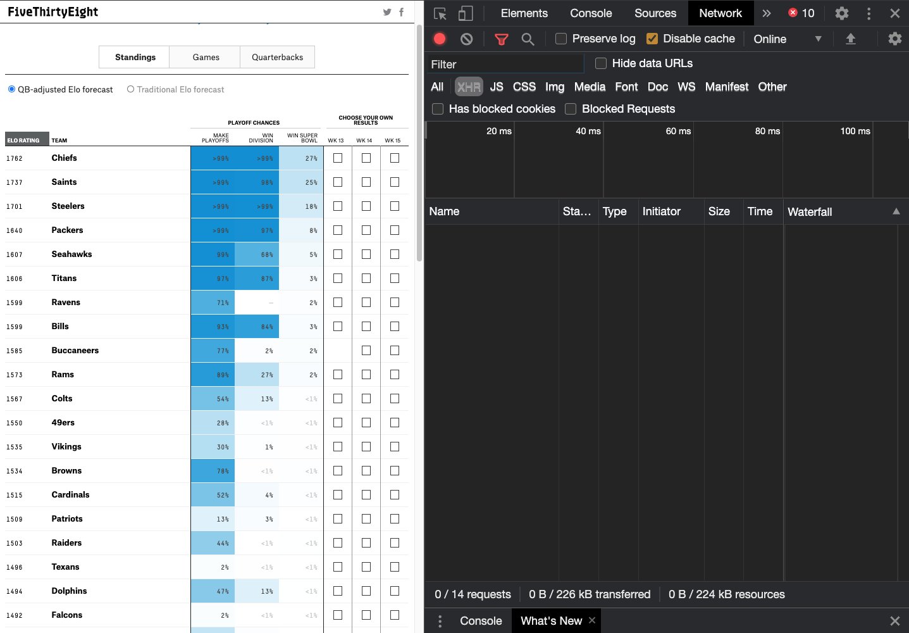
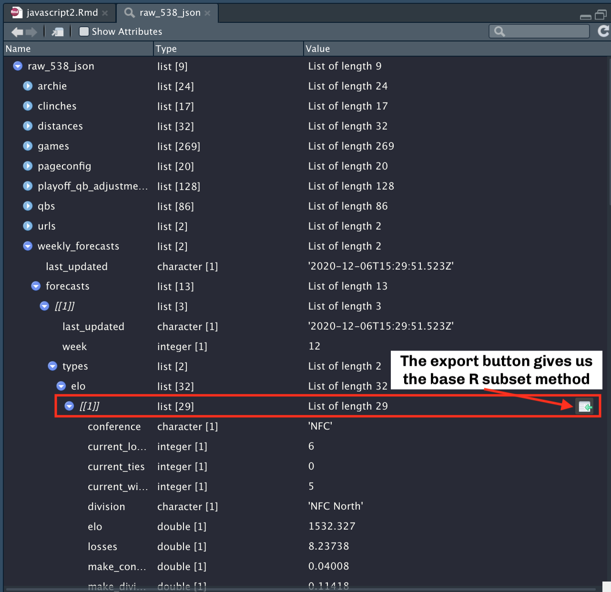
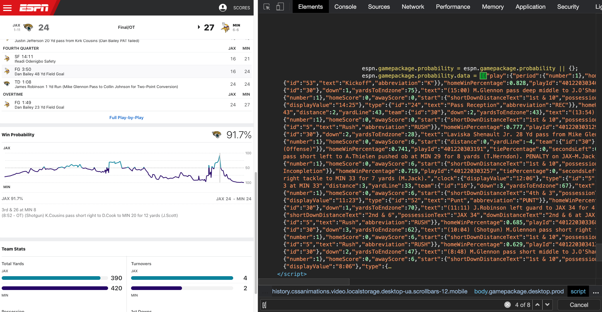

```{r setup, include=FALSE}
knitr::opts_chunk$set(echo = TRUE)
library(tidyverse)
library(reactable)
library(jsonlite)
library(rvest)
library(xml2)
library(xaringanExtra)

xaringanExtra::use_panelset()
```

# Finding JSON Sources

I've covered some strategies for parsing JSON with a few methods in base R and/or `tidyverse` in a [previous blog post](https://themockup.blog/posts/2020-05-22-parsing-json-in-r-with-jsonlite/). I'd like to go one step up in the chain, and talk about pulling raw data/JSON from sites. While having a direct link to JSON is common, in some situations where you're scraping JavaScript fed by APIs the raw data source is not always as easy to find.

I have three examples for today:  
- FiveThirtyEight 2020 NFL Predictions  
- ESPN Win Percentage/play-by-play (embedded JSON)  
- ESPN Public API  

## Web vs Analysis

Most of these JSON data sources are intended to be used with JavaScript methods, and have not been oriented to a "flat" data style. This means the JSON has lots of separations of the data for a specific use/purpose inside the site, and efficient singular representations of each data in JSON storage as opposed to normalized data with repeats in a dataframe.  While extreme detail is out of scope for this blogpost, JSON is structured as a "collection of name/value pairs" or a "an ordered list of values". This means it is typically represented in R as repeated lists of list elements, where the list elements can be named lists, vectors, dataframes, or character strings.

Alternatively typically data for analysis is usually most useful as a normalized rectangle eg a dataframe/tibble. "Under the hood a data frame is a list of equal length vectors" per [Advanced R](http://adv-r.had.co.nz/Data-structures.html#:~:text=Data%20frames,-A%20data%20frame&text=Under%20the%20hood%2C%20a%20data,the%20matrix%20and%20the%20list.&text=The%20length()%20of%20a,gives%20the%20number%20of%20rows.). 

One step further is `tidy` data which is essentially "3rd normal form". Hadley goes into more detail in his ["Tidy Data" publication](http://vita.had.co.nz/papers/tidy-data.pdf). The takeaway here is that web designers are optimizing for their extremely focused interactive JavaScript apps and websites, as opposed to novel analyses that we often want to work with. This is often why there are quite a few steps to "rectangle" a JSON.

# An aside on Subsetting

Subsetting in R is done many different ways, and Hadley Wickham has an _entire chapter_ dedicated to this in [Advanced R](https://adv-r.hadley.nz/subsetting.html). It's worth reading through that chapter to better understand the nuance, but I'll provide a _very brief_ summary of the options.

```{r}
# a VERY basic list of named elements
car_list <- list(manufacturer = "Honda", vehicle = "Civic", year = 2020)
```

> "Subsetting a list works in the same way as subsetting an atomic vector. Using `[` always returns a list; `[[` and `$`, ... let you pull out elements of a list."  

- [Advanced R](https://adv-r.hadley.nz/subsetting.html#lists-1)

When working with lists, you can typically use `$` and `[[` interchangeably to extract single list elements by **name**. `[[` requires _exact_ matching whereas `$` allows for partial matching, so I typically prefer to use `[[`. To extract by **location** from base R you need to use `[[`.

> `purrr` functions `pluck()` and `chuck()` implement a generalised form of `[[` that allow you to index deeply and flexibly into data structures. `pluck()` consistently returns `NULL` when an element does not exist, `chuck()` always throws an error in that case."  

- [`purrr` docs](https://purrr.tidyverse.org/reference/pluck.html).

So in short, you can use `$`, `[[` and `pluck`/`chuck` in many of the same ways. I'll compare all the base R and `purrr` versions below (all should return "Honda").

```{r}
# $ subsets by name
car_list$manufacturer
# notice partial match
car_list$man

# [[ requires exact match or position
car_list[["manufacturer"]]
car_list[[1]]

# pluck and chuck provide a more strict version of [[
# and can subset by exact name or position
purrr::pluck(car_list, "manufacturer")
purrr::pluck(car_list, 1)
purrr::chuck(car_list, "manufacturer")
purrr::chuck(car_list, 1)
```

For one more warning of partial name matching with `$`,  where we now have a case of two elements with similar names see below:  

```{r}
car_list2 <- list(manufacturer = "Honda", vehicle = "Civic", manufactured_year = 2020)

# partial match throws a null
car_list2$man

# exact name returns actual elements
car_list2$manufacturer
```


# An aside on JavaScript

If we dramatically oversimplify JavaScript or their R-based counterparts `htmlwidgets`, they are a combination of some type of JSON data and then functions to display or interact with that data.

We can quickly show a `htmlwidget` example via the fantastic `reactable` R package.

```{r}
library(reactable)

table_ex <- mtcars %>% 
  select(cyl, mpg, disp) %>% 
  reactable()

table_ex
```

That gives us the power of JavaScript in R! However, what's going on with this function behind the scenes? We can extract the dataframe that has now been represented as a JSON file from the `htmlwidget`!

```{r}
table_data <- table_ex[["x"]][["tag"]][["attribs"]][["data"]]

table_data %>% class()
```

This basic idea, that the data is embedded as JSON to fill the JavaScript app can be further applied to web-based apps! We can use a similar idea to scrape raw JSON or query a web API that returns JSON from a site.

# FiveThirtyEight

FiveThirtyEight publishes their ELO ratings and playoff predictions for the NFL via a table at [projects.fivethirtyeight.com/2020-nfl-predictions/](https://projects.fivethirtyeight.com/2020-nfl-predictions/). They are also kind enough to post this data as a [download publicly](https://data.fivethirtyeight.com/#nfl-elo)! However, let's see if we can "find" the data source feeding the JavaScript table.



## `rvest`

We can try our classical `rvest` based approach to scrape the HTML content and get back a table. However, the side effect of this is we're returning the literal data with units, some combined columns, and other formatting. You'll notice that all the columns show up as character and this introduces a lot of other work we'd have to do to "clean" the data.

```{r}
library(xml2)
library(rvest)

url_538 <- "https://projects.fivethirtyeight.com/2020-nfl-predictions/"

raw_538_html <- read_html(url_538)

raw_538_table <- raw_538_html %>% 
  html_node("#standings-table") %>% 
  html_table(fill = TRUE) %>% 
  janitor::clean_names() %>% 
  tibble()

raw_538_table %>% glimpse()
```

## Inspect + Network

Alternatively, we can Right Click + inspect the site, go to the Network tab, reload the site and see what sources are loaded. Again, FiveThirtyEight is very kind and essentially just loads the JSON as `data.json`.

I have screenshots below of each item, and the below is a short video of the entire process.

::::: {.panelset}

::: {.panel}
[Network Tab]{.panel-name}

We can click over to the Network Tab after inspecting the site

```{r, fig.width=10, echo = FALSE}

```

:::

::: {.panel}
[Network Tab Reloaded]{.panel-name}

We need to reload the web page to find sources


```{r, fig.width=10, echo = FALSE}
knitr::include_graphics("network-tab-reloaded.png")
```

:::

::: {.panel}
[Network Tab Data]{.panel-name}

We can examine specific elements by clicking on them, which then shows us JSON!


```{r, fig.width=10, echo = FALSE}
knitr::include_graphics("network-tab-data.png")
```


:::

:::::

---

<video width="1000" height="768" controls>
  <source src="inspect-json-1000.mp4" type="video/mp4">
</video>

---

In our browser inspect, we can see the structure, and that it has some info about games, QBs, and forecasts. This looks like the right dataset! You can right click on `data.json` and open it in a new page. The url is [https://projects.fivethirtyeight.com/2020-nfl-predictions/data.json](https://projects.fivethirtyeight.com/2020-nfl-predictions/data.json), and note that we can adjust the year to get older or current data. So [https://projects.fivethirtyeight.com/2019-nfl-predictions/data.json](https://projects.fivethirtyeight.com/2019-nfl-predictions/data.json) returns the data for 2019, and you can go all the way back to 2016! 2015 also exists, but with a different JSON structure, and AFAIK they don't have data before 2015.

### Read the JSON

Now that we have a JSON source, we can read it into R with `jsonlite`. By using the RStudio viewer or `listviewer::jsonedit()` we can take a look at what the overall structure of the JSON. 

```{r}
library(jsonlite)

raw_538_json <- fromJSON("https://projects.fivethirtyeight.com/2020-nfl-predictions/data.json", simplifyVector = FALSE)

raw_538_json %>% str(max.level = 1)
```

Don't forget that the RStudio Viewer also gives you the ability to export the base R code to access a specific component of the JSON!



Which gives us the following code:  

`raw_538_json[["weekly_forecasts"]][["forecasts"]][[1]][["types"]][["elo"]][[1]]`

```{r}
ex_538_data <- raw_538_json[["weekly_forecasts"]][["forecasts"]][[1]][["types"]][["elo"]][[1]]

ex_538_data %>% str()
```

We can also play around with `listviewer`.

```{r}
raw_538_json %>% 
  listviewer::jsonedit()
```

Since these are unique list elements, we can turn it into a dataframe! This is the current projection for Minnesota.

```{r}
data.frame(ex_538_data) %>% glimpse()
```


## Parse the JSON

Ok so we've found at least one set of data that is pretty dataframe ready, let's clean it all up in bulk! I'm most interested in the `weekly_forecasts` data, so let's start there.

```{r}
raw_538_json$weekly_forecasts %>% str(max.level = 1)
```

Ok so `last_updated` is good to know, but not something I need right now. Let's go one step deeper into `forecasts`.

```{r}
raw_538_json$weekly_forecasts$forecasts %>% str(max.level = 1)
```

Ok now we have a list of 14 lists. This may seem not helpful, BUT remember that as of `2020-12-12`, we are in Week 14 of the NFL season! So this is likely 1 list for each of the weekly forecasts, which makes sense as we are in `weekly_forecasts$forecasts`!

At this point, I think I'm at the right data, so I'm going to take the list and put it in a `tibble` via `tibble::enframe()`.

```{r}
raw_538_json$weekly_forecasts$forecasts %>% 
  enframe()
```

We need to separate the list items out, so we can try `unnest_auto()` to see if `tidyr` can parse the correct structure. Note that `unnest_auto` works and tells us we could have used `unnest_wider()`.

```{r}
raw_538_json$weekly_forecasts$forecasts %>% 
  enframe() %>% 
  unnest_auto(value)
```

We can keep going on the `types` list column! Note that as `unnest_auto()` tells us "what" to do, I'm going to replace it with the appropriate function. 

```{r}
raw_538_json$weekly_forecasts$forecasts %>% 
  enframe() %>% 
  unnest_wider(value) %>% # changed per recommendation
  unnest_auto(types)
```

We now have a list of 32 x 14 weeks. There are 32 teams so we're most likely at the appropriate depth and can go longer vs wider now. We can also see that `name`/`week` don't align so let's drop `name`, and we can use `unchop()` to increase the length of the data for `elo` and `rating` at the same time.

```{r}
raw_538_json$weekly_forecasts$forecasts %>% 
  enframe() %>% 
  unnest_wider(value) %>% 
  unnest_wider(types) %>% # Changed per recommendation
  unchop(cols = c(elo, rating)) %>% 
  select(-name)
```

We now have 14 weeks x 32 teams (448 rows), along with last_updated, week, elo and rating data. We can use `unnest_auto()` on the `elo` column to see what's the next step. Rating is duplicated so there's been name repair to avoid duplicated names. We get the following warning that tells us this has occurred. 

> `* rating -> rating...18`  
> `* rating -> rating...32`  

You'll see that I've done `unnest_auto()` on both `elo` and `rating...32` (the renamed `rating` list column). If you look closely at the names, we can also see that there is duplication of the names for MANY of the columns. A tricky part is that `elo`/`rating` each have a LOT of overlap, and are most appropriate as separate data frames that could be stacked if desired. 

```{r}
elo_raw <- raw_538_json$weekly_forecasts$forecasts %>% 
  enframe() %>% 
  unnest_wider(value) %>% 
  unnest_wider(types) %>% # Changed per recommendation
  unchop(cols = c(elo, rating)) %>% 
  select(-name) %>% 
  unnest_auto(elo) %>% 
  unnest_auto(rating...32)

elo_raw %>% 
  names()
```

Let's try this again, with the knowledge that `elo` and `rating` should be treated separately for now. Since they have the same names, we can also combine the data by stacking (`bind_rows()`). I have added a new column so that we can differentiate between the two datasets (ELO vs Rating).

```{r}
weekly_raw <- raw_538_json$weekly_forecasts$forecasts %>% 
  enframe() %>% 
  unnest_wider(value) %>% 
  unnest_wider(types) %>% 
  select(-name) %>%
  unchop(cols = c(elo, rating))

weekly_elo <- weekly_raw %>% 
  select(-rating) %>% 
  unnest_wider(elo) %>% 
  mutate(measure = "ELO", .after = last_updated)

weekly_rating <- weekly_raw %>% 
  select(-elo) %>% 
  unnest_wider(rating) %>% 
  mutate(measure = "Rating", .after = last_updated)

# confirm same names
all.equal(
  names(weekly_elo),
  names(weekly_rating)
)

weekly_forecasts <- bind_rows(weekly_elo, weekly_rating)

weekly_forecasts %>% glimpse()
```

## Create a Function

Finally, we can combine the techniques we showed above as a function (and I've added it to `espnscrapeR`). Now we can use this to get data throughout the current season OR get info from past seasons (2015 and beyond). Again, note that 2015 has a different JSON structure but the core forecasts portion is still the same.

```{r}
get_weekly_forecast <- function(season) {
  
  # Fill URL and read in JSON
  raw_url <- glue::glue("https://projects.fivethirtyeight.com/{season}-nfl-predictions/data.json")
  raw_json <- fromJSON(raw_url, simplifyVector = FALSE)
  
  # get the two datasets
  weekly_raw <- raw_538_json$weekly_forecasts$forecasts %>%
    enframe() %>%
    unnest_wider(value) %>%
    unnest_wider(types) %>%
    select(-name) %>%
    unchop(cols = c(elo, rating))
  
  # get ELO
  weekly_elo <- weekly_raw %>%
    select(-rating) %>%
    unnest_wider(elo) %>%
    mutate(measure = "ELO", .after = last_updated)
  # get Rating
  weekly_rating <- weekly_raw %>%
    select(-elo) %>%
    unnest_wider(rating) %>%
    mutate(measure = "Rating", .after = last_updated)
  # combine
  bind_rows(weekly_elo, weekly_rating)
}

get_weekly_forecast(2015) %>% 
  glimpse()
```

# Other FiveThirtyEight Data

There's several other interesting data points in this JSON, but they're also much easier to extract.

## QB playoff adjustment values

```{r}
qb_playoff_adj <- raw_538_json$playoff_qb_adjustments %>% 
  enframe() %>% 
  unnest_wider(value)
```

<details><summary>Output</summary>

```{r}
qb_playoff_adj
```

</details>

## Games Data

This one is interesting, it's got ELO change as a result of win/loss along with the spread and ratings.

```{r}
games_df <- raw_538_json$games %>% 
  enframe() %>% 
  unnest_auto(value) %>% 
  select(-name)
```

<details><summary>Output</summary>

```{r}
games_df
```

</details>

## Distances

This data has the distances for each team to other locations/stadiums.

```{r}
distance_df <- raw_538_json$distances %>% 
  enframe() %>% 
  unnest_wider(value) %>% 
  unnest_longer(distances)
```

<details><summary>Output</summary>

```{r}
distance_df
```

</details>

## QB Adjustment

I believe this is the in-season QB adjustment for each team.

```{r}
qb_adj <- raw_538_json$qbs %>% 
  enframe() %>% 
  select(-name) %>% 
  unnest_wider(value)
```

<details><summary>Output</summary>

```{r}
qb_adj
```

</details>

# ESPN

ESPN has interactive win probability charts for their  games. They also go a step farther than FiveThirtyEight and the JSON is embedded into the HTML "bundle". They also have a hidden API, but I'm going to first show an example of how to get the JSON from within the page itself.

<details><summary>Example End Function</summary>

```{r}
get_espn_win_prob <- function(game_id){

  raw_url <-glue::glue("https://www.espn.com/nfl/game?gameId={game_id}")

  raw_html <- raw_url %>%
    read_html()

  raw_text <- raw_html %>%
    html_nodes("script") %>%
    .[23] %>%
    html_text()

  raw_json <- raw_text %>%
    gsub(".*(\\[\\{)", "\\1", .) %>%
    gsub("(\\}\\]).*", "\\1", .)

  parsed_json <- jsonlite::parse_json(raw_json)

  raw_df <- parsed_json %>%
    enframe() %>%
    rename(row_id = name) %>%
    unnest_wider(value) %>%
    unnest_wider(play) %>%
    hoist(period, quarter = "number") %>%
    unnest_wider(start) %>%
    hoist(team, pos_team_id = "id") %>%
    hoist(clock, clock = "displayValue") %>%
    hoist(type, play_type = "text") %>%
    select(-type) %>%
    janitor::clean_names() %>%
    mutate(game_id = game_id)

  raw_df

}
```

</details>

## Get the data

Let's use an example from a pretty wild swing in Win Percentage from Week 13 of the 2020 NFL season. The Vikings and Jaguars went to overtime, with a lot of back and forth. Since there is an interactive data visualization, I'm assuming the JSON data is present there as well.


---

If we try our previous trick from FiveThirtyEight and the `Inspect -> Network` we get a total of... about 300 different requests! None of them appear big enough to be the "right" data. We're expecting 4-5 Mb of data. 


---

Another trick is to look for embedded JSON in the site itself. The basic representation of JSON is `[{name: item}]`, so let's try looking for `[{` as the start of a JSON structure.

Inside the Google Chrome Dev tools we can search and find a few JSON files, including one inside some JavaScript called `espn.gamepackage.probability`! There's a good amount of data there, but we need to extract it from the raw HTML. This JSON is inside a `<script>` object, so let's parse the HTML and get `script` nodes.



---

```{r}
espn_url <-glue::glue("https://www.espn.com/nfl/game?gameId=401220303")

raw_espn_html <- espn_url %>%
    read_html()

raw_espn_html %>%
    html_nodes("script") 
```

Big oof. There's 27 scripts here and just parsing through the start of the script as they are in XML is not helpful...So let's get the raw text from each of these nodes and see if we can find the `espn.gamepackage.probability` element which we're looking for!

```{r}
raw_espn_text <- raw_espn_html %>%
  html_nodes("script") %>% 
  html_text()

raw_espn_text %>% 
  str_which("espn.gamepackage.probability")
```

Ok! So we're looking for the 23rd node, I'm going to hide the output inside an expandable tag, as it's a long output!

```{r}
example_embed_json <- raw_espn_html %>%
    html_nodes("script") %>% 
    .[23] %>%
    html_text()
```

<details><summary>Example Embed JSON</summary>

```{r}
example_embed_json
```

</details>

Now the short of this is that we have the full script text, so there's a lot of random JavaScript and logic along with HTML around the actual JSON we want. We want to find the "starting edge" and the end of the JSON file, which should be `[{` and `}]` respectively.

I'll start by removing all the new lines (`\n`) and tabs (`\t`), then finding anything that matches `[{` and replace anything before it with `[{`, followed by the same idea for `}]`.

This should return a raw string of the JSON content, which we can then parse with `jsonlite`! Regex is `#magic`, but in short the pattern of `".*(\\[\\{)"` finds any text `.*` ahead of `[{` which needs to be escaped as `(\\[\\{)` and replaces it with the matched component (`\\1`) which should be `[{`. We do that for both the start and end of the JSON file, to remove all the extra text and just get the JSON file itself.

```{r}
raw_json_embed <- example_embed_json %>%
  str_remove_all("\\n|\\t") %>% 
  str_replace(".*(\\[\\{)", "\\1") %>% 
  str_replace("(\\}\\]).*", "\\1")

ex_parsed_json <- jsonlite::parse_json(raw_json_embed)

ex_parsed_json %>% enframe()
```


# ESPN's native API

Now that was a lot of work to just get at the JSON, but I wanted to show an example of where JSON data is embedded into the site. Alternatively, ESPN has a native pseudo-public API that returns the same data!

Let's use that to get the data instead! (Note the summary below shows the full script if you want to skip ahead).

<details><summary>Full Script</summary>

```{r}
espn_url <- "http://site.api.espn.com/apis/site/v2/sports/football/nfl/summary?event=401220303"

raw_espn_json <- fromJSON(espn_url, simplifyVector = FALSE)

win_pct_df <- raw_espn_json[["winprobability"]] %>%
  enframe() %>%
  rename(row_id = name) %>%
  unnest_wider(value) %>%
  janitor::clean_names()

pbp_raw_espn <- raw_espn_json[["drives"]][[1]] %>% 
  enframe() %>% 
  unnest_wider(value) %>% 
  rename(
    drive_id = id,
    drive_start = start,
    drive_end = end
  ) 

pbp_raw_espn_plays <- pbp_raw_espn %>% 
  unnest_longer(plays) %>% 
  unnest_wider(plays) %>% 
  rename(play_id = id)

espn_pbp_clean <- pbp_raw_espn_plays %>% 
  hoist(
    .col = team,
    pos_team = "name",
    pos_abb = "abbreviation",
    pos_full = "displayName",
    pos_short = 4 # could also use "shortDisplayName"
  ) %>% 
  hoist(
    type,
    play_type_id = "id",
    play_type = "text",
    play_type_abb = "abbreviation"
  ) %>% 
  hoist(
    period,
    quarter = "number"
  ) %>% 
  hoist(
    clock,
    clock = "displayValue"
  ) %>% 
    janitor::clean_names() %>% 
  # drop remaining list columns
  select(-where(is.list))

espn_joined <- left_join(espn_pbp_clean, win_pct_df, by = "play_id") 

final_espn <- espn_joined %>% 
  mutate(
    home_team = raw_espn_json[["boxscore"]][["teams"]][[1]][["team"]][["abbreviation"]],
    away_team = raw_espn_json[["boxscore"]][["teams"]][[2]][["team"]][["abbreviation"]]
    )
```

```{r, fig.dim=c(8, 4)}
final_espn %>% 
  ggplot(aes(x = row_id, y = 1 - home_win_percentage)) +
  geom_line(size = 1) +
  scale_y_continuous(breaks = c(0, 0.25, .5, .75, 1), labels = c(100, "", 50, "", 100), limits = c(0, 1)) +
  theme_minimal() +
  theme(
    panel.grid.minor = element_blank(),
    panel.grid.major.x = element_blank()
  ) + 
  labs(x = "", y = "")
```

</details>

## `tidyr::hoist()`

We're going to introduce a new `tidyr` function in this section called `hoist()`. You can think of [`tidyr::hoist()`](https://tidyr.tidyverse.org/reference/hoist.html) as a way of extracting or hoisting specific list column elements into a new named column. This is especially helpful where the JSON has duplicate names, like `id` which really means `game_id` and `id` which really means `play_id`. With repeated names, `unnest_` functions will error or append names as you're essentially recreating existing columns.

```{r}
espn_url <- "http://site.api.espn.com/apis/site/v2/sports/football/nfl/summary?event=401220303"

raw_espn_json <- fromJSON(espn_url, simplifyVector = FALSE)

raw_espn_json %>% str(max.level = 1)
```

Now I'm most interested in the `winprobability` data, although you could get all sorts of metadata about simple play-by-play, news, etc. This is a VERY long output, so I'm just going to grab the first few.

```{r}
raw_espn_json[["winprobability"]] %>% length()

raw_espn_json[["winprobability"]] %>% 
  .[1:3] %>% 
  str(max.level = 2)
```

Sinec we have a long list of repeated lists of length 4, we can assume that `unnest_wider()` is the right choice here (4 distinct columns, that are already "long"). We could always rely on `unnest_auto()` to guess for us and then replace it with the correct function afterwards.

I'm going to stick with my preferred workflow of `tibble::enframe()` and then `unnest_wider`.

```{r}
win_pct_df <- raw_espn_json[["winprobability"]] %>%
  enframe() %>%
  rename(row_id = name) %>%
  unnest_wider(value) %>%
  janitor::clean_names()

win_pct_df
```

## Play-by-play

Now the other datasets we're interested in are the drive info (for play-by-play), along with the game info like teams playing, play type, period, and time remaining.

Let's start with the core JSON data, and then extract the `drives` data.

```{r}
raw_espn_json %>% str(max.level = 1)

raw_espn_json[["drives"]][[1]] %>% enframe()
```

Again we notice that this is already "long" so we can assume we need to `unnest_wider()`. I'll also rename a few columns since they're not very descriptive (and duplicates of other columns).

```{r}
pbp_raw_espn <- raw_espn_json[["drives"]][[1]] %>% 
  enframe() %>% 
  unnest_wider(value) %>% 
  rename(
    drive_id = id,
    drive_start = start,
    drive_end = end
  ) 

pbp_raw_espn %>% str(max.level = 2)
```

## Let's go longer

At this point we can see the data is at the drive level, and the description is the metadata about how long the drive lasted. We want actual plays, and there is a list column named `plays`. We'll need to increase the length of the data, so let's try `unnest_longer()`. 

```{r}
pbp_raw_espn %>%  
  unnest_longer(plays) %>% 
  str(max.level = 2)
```

This gives us 188 plays, but `plays` is still a list column, so we need to "widen" it with `unnest_wider()`. Let's go ahead and do that and then look at what the data looks like.

```{r}
pbp_raw_espn_plays <- pbp_raw_espn %>% 
  unnest_longer(plays) %>% 
  unnest_wider(plays) %>% 
  rename(play_id = id)

pbp_raw_espn_plays %>% 
  glimpse()
```

## Hoist away!

Looking good! We still have some list-columns to work on though (`team`, `period`, `clock`, `start`). Let's pull some selected items from those columns via `hoist()`. I'm going to start with a small example, and limit the columns shown so that we don't get overwhelmed. 

```{r}
pbp_raw_espn_plays %>%
  select(drive_id, play_id, yards, team) %>% 
  slice(1) %>% 
  str(max.level = 4)
```

This shows us that the `team` list column has 5 named list items within it (name, abbreviation, displayName, shortDisplayName, and another list of lists for logos).

`hoist()` takes several arguments, first a column to work on (`.col`), and then some new columns to create. Note that we're using raw strings (`"name"`) to pull named list elements from the list column or we could use a number to grab by position.

```{r}
pbp_raw_espn_plays %>%
  select(drive_id, play_id, yards, team) %>% 
  hoist(
    .col = team,
    pos_team = "name",
    pos_abb = "abbreviation",
    pos_full = "displayName",
    pos_short = 4 # could also use "shortDisplayName"
  )
```

Ok, so hopefully that shows you how we can first find the list column elements, and then `hoist()` a select few of them by name/position. For the next section I'm just going to `hoist()` the ones I want and then save the dataframe. While there are some other list columns, I'm just going to drop them as I'm not interested in them right now.

```{r}
espn_pbp_clean <- pbp_raw_espn_plays %>% 
  hoist(
    .col = team,
    pos_team = "name",
    pos_abb = "abbreviation",
    pos_full = "displayName",
    pos_short = 4 # could also use "shortDisplayName"
  ) %>% 
  hoist(
    type,
    play_type_id = "id",
    play_type = "text",
    play_type_abb = "abbreviation"
  ) %>% 
  hoist(
    period,
    quarter = "number"
  ) %>% 
  hoist(
    clock,
    clock = "displayValue"
  ) %>% 
    janitor::clean_names() %>% 
  # drop remaining list columns
  select(-where(is.list))
```

## Join the data

The next thing we have to do is join the Win Probability data with the play-by-play info! This is easy as we have a common key column with `play_id`.

```{r}
espn_joined <- left_join(espn_pbp_clean, win_pct_df, by = "play_id") 

espn_joined %>% 
  glimpse()
```

Now there's one more tricky point, which is that there isn't a column that says "home" vs "away".

ESPN's JSON reports this simply by position, we can access this data, and will need to create a logical statement in order to assign home vs away. 

```{r}
raw_espn_json[["boxscore"]][["teams"]] %>% str(max.level = 2)
```

From comparing the box scores and the JSON, the team listed first is always the away team. So for this game that means the Jaguars.

```{r}
# 1st team == AWAY
raw_espn_json[["boxscore"]][["teams"]][[1]][["team"]][["abbreviation"]]

# 2nd team == HOME
raw_espn_json[["boxscore"]][["teams"]][[2]][["team"]][["abbreviation"]]
```

```{r}
final_espn <- espn_joined %>% 
  mutate(
    home_team = raw_espn_json[["boxscore"]][["teams"]][[1]][["team"]][["abbreviation"]],
    away_team = raw_espn_json[["boxscore"]][["teams"]][[2]][["team"]][["abbreviation"]]
    )
```

Just for fun, let's create a very quick graph to compare against the ESPN Win Percentage plot! Note that we still need to calculate the game seconds (from the clock data), so I'll just use the row number as the x-axis for now. We can see that this aligns well with the "actual" plot from ESPN's box score!

```{r, fig.dim=c(8, 4)}
final_espn %>% 
  ggplot(aes(x = row_id, y = 1 - home_win_percentage)) +
  geom_line(size = 1) +
  scale_y_continuous(breaks = c(0, 0.25, .5, .75, 1), labels = c(100, "", 50, "", 100), limits = c(0, 1)) +
  theme_minimal() +
  theme(
    panel.grid.minor = element_blank(),
    panel.grid.major.x = element_blank(),
    axis.text.y.right = element_text(size = 24),
    axis.text.x = element_blank()
  ) + 
  labs(x = "", y = "")
```


---

## Roll it into a Function

We can quickly convert that into a function. Eventually this will be rolled into `espnscrapeR` proper. For now, I just have `espnscrapeR::get_espn_win_prob()`.

```{r}
get_espn_pbp <- function(game_id) {
  espn_url <- glue::glue("http://site.api.espn.com/apis/site/v2/sports/football/nfl/summary?event={game_id}")

  raw_espn_json <- fromJSON(espn_url, simplifyVector = FALSE)

  win_pct_df <- raw_espn_json[["winprobability"]] %>%
    enframe() %>%
    rename(row_id = name) %>%
    unnest_wider(value) %>%
    janitor::clean_names()

  espn_df <- raw_espn_json[["drives"]][[1]] %>%
    enframe() %>%
    unnest_wider(value) %>%
    rename(
      drive_id = id,
      drive_start = start,
      drive_end = end
    ) %>%
    unnest_longer(plays) %>%
    unnest_wider(plays)

  pbp_raw_espn_plays <- pbp_raw_espn %>%
    unnest_longer(plays) %>%
    unnest_wider(plays) %>%
    rename(play_id = id)

  espn_pbp_clean <- pbp_raw_espn_plays %>%
    hoist(
      .col = team,
      pos_team = "name",
      pos_abb = "abbreviation",
      pos_full = "displayName",
      pos_short = 4 # could also use "shortDisplayName"
    ) %>%
    hoist(
      type,
      play_type_id = "id",
      play_type = "text",
      play_type_abb = "abbreviation"
    ) %>%
    hoist(
      period,
      quarter = "number"
    ) %>%
    hoist(
      clock,
      clock = "displayValue"
    ) %>%
    janitor::clean_names() %>%
    # drop remaining list columns
    select(-where(is.list))

  espn_joined <- left_join(espn_pbp_clean, win_pct_df, by = "play_id")

  final_espn <- espn_joined %>%
    mutate(
      home_team = raw_espn_json[["boxscore"]][["teams"]][[1]][["team"]][["abbreviation"]],
      away_team = raw_espn_json[["boxscore"]][["teams"]][[2]][["team"]][["abbreviation"]]
    )

  final_espn
}

get_espn_pbp("401220303") %>% glimpse()
```

# More ESPN

Now you may be asking yourself, how the heck do I get the `game_id` to use with our fancy new function?!

ESPN provides the "scoreboard" for many sports, including the NFL, you can query it like so, which returns 333 games from 2018 for example. Note that this includes playoffs from the 2017 season (it is just returning _any_ games that were played in the 2018 calendar year).

```{r}
espn_scores_url <- "http://site.api.espn.com/apis/site/v2/sports/football/nfl/scoreboard?dates=2018&limit=500"

raw_json_scores <- fromJSON(espn_scores_url, simplifyVector = FALSE)

raw_json_scores %>% str(max.level = 1)
```

Looks like we're interested in the `events` list element, so let's take a look at the first few observations in it, and see what we're working with.

```{r}
raw_json_scores[["events"]] %>% 
  .[1:3] %>% # get the first 3 elements
  str(max.level = 2)
```

Yep! That's the one of interest, and we've got essentially a data.frame inside each of the list elements. So we can apply our typical workflow of `enframe()` + `unnest_wider()`.


```{r}
espn_games_2018 <- raw_json_scores[["events"]] %>% 
  enframe() %>% 
  rename(row_id = name) %>% 
  unnest_wider(value) %>% 
  rename(game_id = id)

espn_games_2018 %>% 
  glimpse()
```

We still need to grab some information from the `season` column, and there are few other list-columns if we wanted to further clean the data.

```{r}
espn_season_2018 <- espn_games_2018 %>% 
  unnest_wider(season) %>% 
  unchop(competitions)
```

```{r}
espn_season_2018 %>% 
  select(competitions) %>% 
  slice(1) %>% 
  str(max.level = 5)
```

## `hoist` again

So we're going to use `hoist()` to again grab specific items from our list columns. Here I'm passing increasing "depth" to `hoist()` via a `list()`. While it can be a bit hard to initially wrap your head around, `hoist()` is similar to native subsetting with R. 

So the following code is roughly equivalent in base R and `hoist()`. Note that the subsetting base R version with `[[` is getting the first element (of 333), so I'm going to grab the first element of our new `home_team_id` column from our vectorized `hoist()` call.

```{r}
ex_id_subset <- espn_season_2018[["competitions"]][[1]][["competitors"]][[1]][["id"]]

ex_id_hoist <- espn_season_2018 %>%
  hoist(competitions, home_team_id = list("competitors", 1, "id"))

all.equal(ex_id_subset, ex_id_hoist[["home_team_id"]][1])
```

So we can now use that same idea to grab a few desired columns. We can sanity check our work by seeing how many games we have of each "type" with a quick `count()`. There should be 256 regular season games in each season.

```{r}
espn_season_2018_final <- espn_season_2018 %>%
  hoist(
    competitions,
    home_team_id = list("competitors", 1, "id"),
    home_team_abb = list("competitors", 1, "team", "abbreviation"),
    away_team_id = list("competitors", 2, "id"),
    away_team_abb = list("competitors", 2, "team", "abbreviation"),
    home_score = list("competitors", 1, "score"),
    away_score = list("competitors", 2, "score")
  ) %>%
  select(-where(is.list), -row_id) %>%
  janitor::clean_names() %>%
  rename(season_type = type) %>%
  mutate(
    season_type = case_when(
      season_type == 1L ~ "Preseason",
      season_type == 2L ~ "Regular Season",
      season_type == 3L ~ "Playoffs",
      TRUE ~ as.character(season_type),
    )
  )

espn_season_2018_final %>% 
  count(season_type)
```

We could then find a specific game or `purrr::map()` across all the games as needed.

Inside the below detail tag, we have the full method of getting the data as JSON, cleaning/rectangling, and returning as a relatively tidy dataframe.

<details><summary>ESPN Schedule Function</summary>

```{r}

get_espn_schedule <- function(season) {
  espn_scores_url <- glue::glue("http://site.api.espn.com/apis/site/v2/sports/football/nfl/scoreboard?dates={season}&limit=500")

  raw_json_scores <- fromJSON(espn_scores_url, simplifyVector = FALSE)

  espn_games <- raw_json_scores[["events"]] %>%
    enframe() %>%
    rename(row_id = name) %>%
    unnest_wider(value) %>%
    rename(game_id = id)
  
  espn_season <- espn_games %>% 
    unnest_wider(season) %>% 
    unchop(competitions)

  espn_season_final <- espn_season %>%
    hoist(
      competitions,
      home_team_id = list("competitors", 1, "id"),
      home_team_abb = list("competitors", 1, "team", "abbreviation"),
      away_team_id = list("competitors", 2, "id"),
      away_team_abb = list("competitors", 2, "team", "abbreviation"),
      home_score = list("competitors", 1, "score"),
      away_score = list("competitors", 2, "score")
    ) %>%
    select(-where(is.list), -row_id) %>%
    janitor::clean_names() %>%
    rename(season_type = type) %>%
    mutate(
      season_type = case_when(
        season_type == 1L ~ "Preseason",
        season_type == 2L ~ "Regular Season",
        season_type == 3L ~ "Playoffs",
        TRUE ~ as.character(season_type),
      )
    )
  
  espn_season_final
}

```


</details>