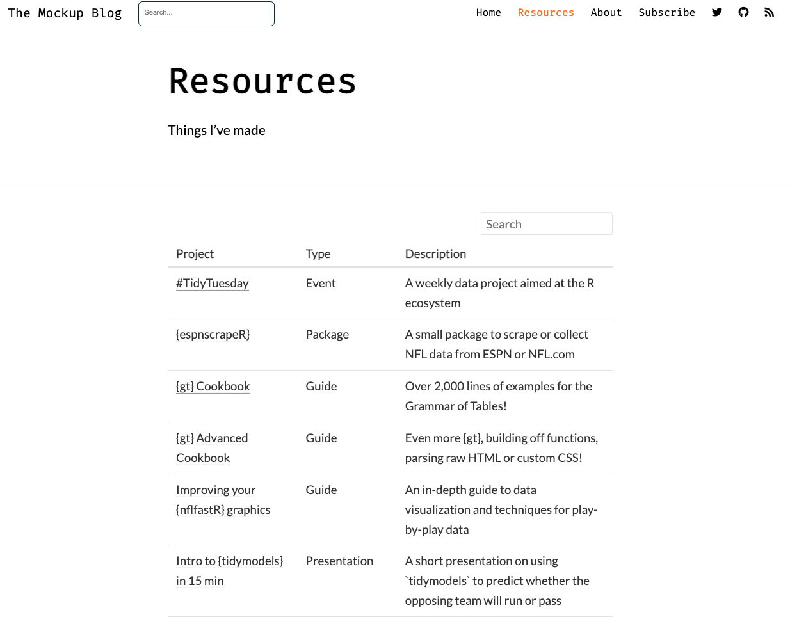
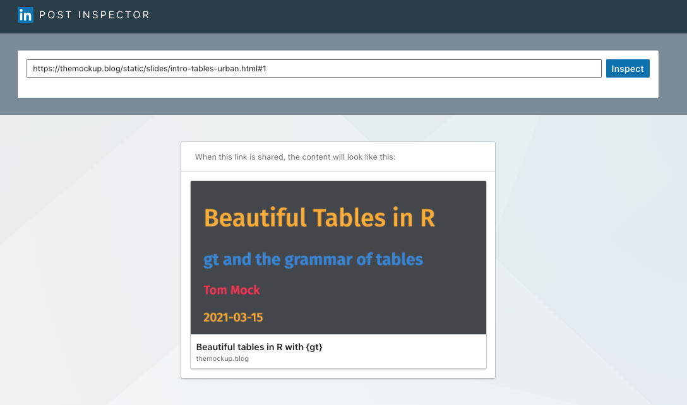

```{r setup, include=FALSE}
knitr::opts_chunk$set(EVAL = FALSE)
```


Including "extra" content in your blog is very useful for collecting all of your content beyond just blogposts. For example, I have a [Resources page](https://themockup.blog/resources.html) that sublinks to other things I've created or wanted to share at a specific URL.

<aside>

Header photo by <a href="https://unsplash.com/@jessedo81?utm_source=unsplash&utm_medium=referral&utm_content=creditCopyText">jesse orrico</a> on <a href="/s/photos/organize?utm_source=unsplash&utm_medium=referral&utm_content=creditCopyText">Unsplash</a>

</aside>



These extra pieces of content include `{xaringan}` slides, books, or one-off RMarkdown "sites" that don't really fit into a blogpost.

My approach is to store these extra pages into a new folder called `/static/` in my blog project directory. I do this to generally keep my top-level directory a bit cleaner, and to separate them out from the core blog. Note that lastly, you do not _need_ to put everything in `/static` if you don't want to, and you can keep everything at the top-level directory which would serve up content at `site-name.com/content-name.html`.

## Including alternate content

As long as you are using `{distill}` v 1.2 or later and `{rmarkdown}` v 2.7 or later, you can include [alternate RMarkdown-generated content](https://rstudio.github.io/distill/website.html#alternate-formats) within your `{distill}` blog!

Alternate format in this case really just means any other RMarkdown format _besides_ `{distill}`. 

Now while you can knit files locally and see the output, it will not be moved to your `_site` directory and served up on your website until you rebuild the site.

These alternate-format pages are rebuilt and included in the `_site` directory whenever you run `rmarkdown::render_site()` OR build one of the top-level site pages (ie `index.Rmd`, `about.Rmd`, etc).

So for my example, my `static` pages get written to:  
`_site/static/FILE-NAME.HTML`

and will show up on my blog at:  
`themockup.blog/static/FILE-NAME.HTML`

For example my `{gt}` cookbook is linked at:  

`https://themockup.blog/static/gt-cookbook.html`

That's easy enough, and now you can include basically any piece of arbitrary content you create via RMarkdown, all collected underneath the main URL of your blog/site!

### Resources pane

Since I'm on `{distill}`, to provide links for everything I want to add another "tab" to my site that shows all the various extra content. I add the below code to my navbar in my `_site.yaml` file to add a new tab.

```
navbar:
  right:
    - text: "Home"
      href: index.html
    - text: "Resources"
      href: resources.html
    - text: "About"
```

The resources page itself can be super lightweight and just link out to the files, but I decided to use a `{reactable}` table that references all of the content so it is searchable and sortable. This page is generated by my `resources.Rmd` file.

Again, you could just provide the raw URL links as hyperlinks to the various pieces of content, it's "just another page" so feel free to do whatever you want!

## Tagging

Having various pieces of content sublinked on your blog generally makes them available to folks trying to access the content on the web. However, it's also a good idea to add "tags" to them so that they are organically discoverable via search engines. The other benefit is that tags can make your links display summary cards or other rich content on social media sites.

Adding social cards/previews to one-off pieces of content and sub-pages of your blog can help a lot with engagement^[ In some cases, 2-3x more views/clicks per https://www.socialsongbird.com/2020/01/how-to-create-clickable-posts-on-social.html]. It also has the benefit of helping describe the linked content without having to embed ALL of the description into the body of the Tweet/LinkedIn post. Ultimately it's also more rewarding as rather than a bare link or a preview card without an image, you can explicitly decide what you want the preview to show!

### Blogposts

Now for most blogposts in `{distill}` you are able to get social preview cards "for free" in that they can just be added via some [extra lines in the YAML header](https://rstudio.github.io/distill/metadata.html#twitter-card). The `preview` argument turns into the preview image on the index page of your blog and in the meta tags. The title and description also get written into meta tags to be reused by social.

```
---
title: "JavaScript & D3"
description: Enhance communication with interactive visualizations 
base_url: https://rstudio.github.io/distill
preview: images/javascript-d3-preview.png
twitter:
  site: "@rstudio"
  creator: "@fly_upside_down"
---
```

### `{distill}` home page

However, notably the preview image option is missing from the MAIN page of your `{distill}` blog.

You can use the strategies outlined below with `{metathis}` or `<meta>` tags to create a nice tag/meta details for your `{distill}` homepage as well. 

While I'll be covering more details about `{metathis}` below, here is what my `index.Rmd` looks like that attaches `<meta>` tags via `{metathis}`


```
---
title: "Posts"
site: distill::distill_website
listing: posts
---

{r, include=FALSE, results='asis'}
library(metathis)

meta() %>%
  meta_social(
    title = "The MockUp Blog",
    description = "Tom's musings on all things R",
    url = "https://themockup.blog/",
    image = "https://raw.githubusercontent.com/jthomasmock/radix_themockup/master/static/logo-plot.png",
    image_alt = "Chaos into tidy code",
    og_type = "website",
    og_author = "Tom Mock",
    twitter_card_type = "summary",
    twitter_creator = "@thomas_mock"
  )

```

<aside>

Others have written about social card/meta tags for [`{blogdown}`](https://bookdown.org/yihui/blogdown/), with examples from [Alison Hill](https://alison.rbind.io/post/2019-02-19-hugo-archetypes/), [Xavier A](https://xvrdm.github.io/2017/10/23/socialize-your-blogdown/), [Sharleen W.](https://sharleenw.rbind.io/2020/09/02/how-to-remake-a-blogdown-blog-from-scratch/), and [Len Kiefer](http://lenkiefer.com/2017/10/23/sharing-is-caring/).

</aside>

### Extra content

Those built-in options work great for blogposts, but again I also have quite a few extra pieces of content, like my [`{gt}` cookbooks](https://themockup.blog/static/gt-cookbook.html), [`{xaringan}` slide decks](https://themockup.blog/static/slides/intro-tables-urban.html), or example [interactive tables](https://themockup.blog/static/100-women.html).

For these non-blog pages, they are essentially just bare RMarkdown sites. As such, often I need to manually add the `<meta>` tags that tell the various social pages "what to do" with the page as far as previews.

### `<meta>` Tags

`<meta>` tags are useful for search engine optimization (aka discoverability) of your content, for sharing on social media like LinkedIn or Twitter, or even messaging platforms like Slack, and generally helpful for accessibility. Garrick Aden-Buie recommended the Guide to `<meta>` and `<head>` details from [Josh Buchea](https://github.com/joshbuchea/HEAD). That sublinks to LOTS of great detail for specific social pages.

Per [w3chools.com](https://www.w3schools.com/tags/tag_meta.asp):

> The `<meta>` tag defines metadata about an HTML document. Metadata is data (information) about data.

> Metadata is used by browsers (how to display content or reload page), search engines (keywords), and other web services.

Furthermore, per the [Mozilla blog](https://developer.mozilla.org/en-US/docs/Learn/HTML/Introduction_to_HTML/The_head_metadata_in_HTML#other_types_of_metadata):

> As you travel around the web, you'll find other types of metadata, too. A lot of the features you'll see on websites are proprietary creations, designed to provide certain sites (such as social networking sites) with specific pieces of information they can use.
> 
> For example, Open Graph Data is a metadata protocol that Facebook invented to provide richer metadata for websites. 
> Twitter also has its own similar proprietary metadata called Twitter Cards, which has a similar effect when the site's URL is displayed on Twitter.com

### Writing `<meta>` tags

You can always write `<meta>` tags by hand, and they aren't _overly_ complicated, as seen in the [Twitter Documentation](https://developer.twitter.com/en/docs/twitter-for-websites/cards/overview/summary-card-with-large-image):  

```
<meta name="twitter:card" content="summary_large_image">
<meta name="twitter:site" content="@nytimes">
<meta name="twitter:creator" content="@SarahMaslinNir">
<meta name="twitter:title" content="Parade of Fans for Houston">
<meta name="twitter:description" content="NEWARK - The guest list and parade of limousines with celebrities emerging from them seemed more suited to a red carpet event in Hollywood or New York than than a gritty stretch of Sussex Avenue near the former site of the James M. Baxter Terrace public housing project here.">
<meta name="twitter:image" content="http://graphics8.nytimes.com/images/2012/02/19/us/19whitney-span/19whitney-span-articleLarge.jpg">
```

However, thanks to [Garrick Aden-Buie](https://github.com/gadenbuie), you can save yourself a lot of effort and just use the [`{metathis}` package](https://pkg.garrickadenbuie.com/metathis/), which provides R functions to generate `<meta>` tags.

From the documentation, here's an example of what a meta-tag generation looks like for the R4DS textbook.

```{r, eval=FALSE}
library(metathis)

meta() %>%
  meta_description(
    "This book will teach you how to do data science with R..."
  ) %>% 
  meta_name("github-repo" = "hadley/r4ds") %>% 
  meta_viewport() %>% 
  meta_social(
    title = "R for Data Science",
    url = "https://r4ds.had.co.nz",
    image = "https://r4ds.had.co.nz/cover.png",
    image_alt = "The cover of the R4DS book",
    og_type = "book",
    og_author = c("Garrett Grolemund", "Hadley Wickham"),
    twitter_card_type = "summary",
    twitter_creator = "@hadley"
  )
```

And the HTML output

```
#> <meta name="viewport" content="width=device-width, initial-scale=1, orientation=auto"/>
#> <meta name="description" content="This book will teach you how to do data science with R..."/>
#> <meta name="github-repo" content="hadley/r4ds"/>
#> <meta name="twitter:title" content="R for Data Science"/>
#> <meta name="twitter:description" content="This book will teach you how to do data science with R..."/>
#> <meta name="twitter:url" content="https://r4ds.had.co.nz"/>
#> <meta name="twitter:image:src" content="https://r4ds.had.co.nz/cover.png"/>
#> <meta name="twitter:image:alt" content="The cover of the R4DS book"/>
#> <meta name="twitter:card" content="summary"/>
#> <meta name="twitter:creator" content="@hadley"/>
#> <meta name="twitter:site" content="@hadley"/>
#> <meta property="og:title" content="R for Data Science"/>
#> <meta property="og:description" content="This book will teach you how to do data science with R..."/>
#> <meta property="og:url" content="https://r4ds.had.co.nz"/>
#> <meta property="og:image" content="https://r4ds.had.co.nz/cover.png"/>
#> <meta property="og:image:alt" content="The cover of the R4DS book"/>
#> <meta property="og:type" content="book"/>
#> <meta property="og:locale" content="en_US"/>
#> <meta property="article:author" content="Garrett Grolemund"/>
#> <meta property="article:author" content="Hadley Wickham"/>
```

I prefer this to writing it all by hand, as it's less error prone than me typing it out manually!

### `{metathis}` options

An aside that tripped me up is that the preview image needs to be linked as a URL, so you won't be able to just link to a local file, but rather the site or GitHub URL for that specific image.

Generally you can just write a RMarkdown chunk with `echo=FALSE` as you'd expect and put the `{metathis}` code in it.

```
meta() %>% 
  meta_description("My awesome presentation")
```

However, for some pieces of content you in RMarkdown there are already `<meta>` tags that are generated, or they need to explicitly need to be added into the header of the HTML file.

In that cases where the basic approach is not working, I recommend following Garrick's [`{metathis}` advice](https://pkg.garrickadenbuie.com/metathis/) from the readme.

Option 1:  

> Using [`metathis::include_meta()`](https://pkg.garrickadenbuie.com/metathis/reference/include_meta.html) to explicitly declare the `<meta>` tags as an HTML dependency  

Option 2 (if all else fails):  

> In other packages or situations, you can use `include_meta()` to explicitly declare the meta tags as an html dependency or use write_meta() to save the `<meta>` tags to an `.html` file that can be included via `includes: in_header` in the YAML of the RMarkdown doc. (In `blogdown`, consult your blogdown/hugo theme for the correct inclusion method.)

```
meta() %>% 
  meta_description("A fantastic blog post") %>% 
  write_meta("meta.html")
``` 

That will generally solve most problems for including social tags in RMarkdown.

## Optimal image sizes

Each of the social sites have "optimal" sizes/ratios of the images, and [Hootsuite](https://blog.hootsuite.com/social-media-image-sizes-guide/) has a meta-guide of social media image sizing.

The short summary is, keep your image file size relatively small, as it'll cost less in bandwidth and is presented relatively small anyway on social. Twitter specifically will crop your images to a square for basic preview cards.

## Confirm tags

You can "check" to make sure your tags worked by using tools like:  

- [Twitter's Card Validator](https://cards-dev.twitter.com/validator?)  
- [LinkedIn's Post Inspector](https://www.linkedin.com/post-inspector/inspect/)  
- More generally, just doing a test post to your social feed  

Note that if your website is too large, you can't always get the social "crawlers" to parse the page and return a preview. It's a good idea to keep your image sizes relatively low, and generally not include TOO much content in a single page.

Now rather than getting a blank preview card, you can get nice previews!




So go on and create your content, share it widely, and enjoy better previews/urls!