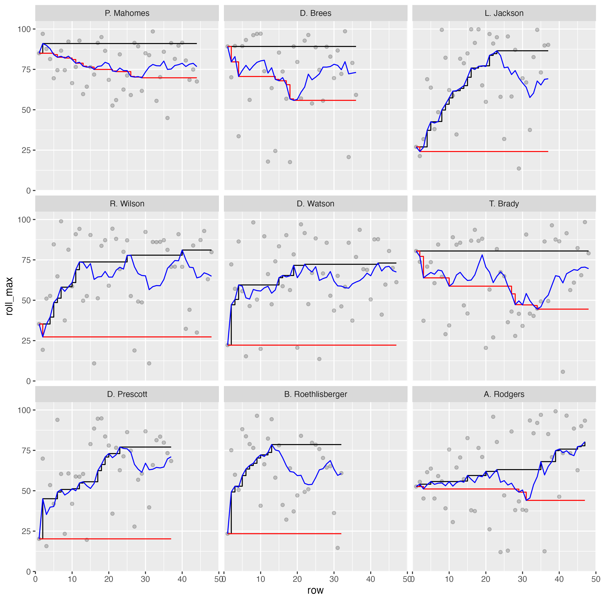
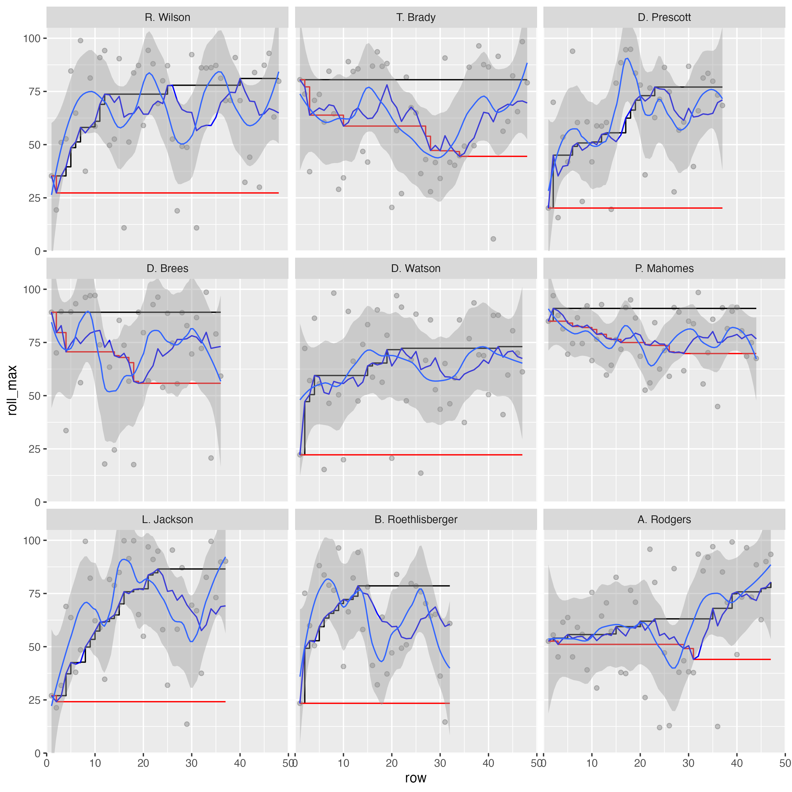

```{r setup, include=FALSE}
knitr::opts_chunk$set(echo = TRUE)
library(tidyverse)
library(espnscrapeR)
library(slider)

test_data <- read_rds("test_data.rds")
```

It's been a while since my last post, so I wanted to get back into the swing of things with a shorter article. My goal was to get a new one up on the blog before August 1st.

As such, I was working late on a *much* longer form article and as part of this I wanted to display some smoothed lines for several players on one plot. A sneak peek of some of this below:


Now, I've been programming in R for quite some time, but for the life of me I couldn't get my facets to align properly. This led to a bit of frustration as I "knew" what I was doing *should be right* but wasn't returning the expected "correct" output. 

This article walks through why I believe [`{reprex}`](https://reprex.tidyverse.org/index.html) driven testing is so useful for compartmentalizing a problem and getting at the specifics of why our expectation sometimes don't match the output.

Like most useful ideas, I'm far from the first person to think of it!

<blockquote class="twitter-tweet"><p lang="en" dir="ltr">I’ve decided that preparing a reprex is, in fact, a very effective technique for solving your own problems<br><br>it’s basically the rubber duck in disguise</p>&mdash; Jenny Bryan (@JennyBryan) <a href="https://twitter.com/JennyBryan/status/948971918266281985?ref_src=twsrc%5Etfw">January 4, 2018</a></blockquote> <script async src="https://platform.twitter.com/widgets.js" charset="utf-8"></script>

<blockquote class="twitter-tweet"><p lang="en" dir="ltr">My problem-solving workflow:<br><br>1. 🤬 something’s wrong with this pkg<br>2. I’m gonna open a GitHub issue<br>3. Wait, I need to add a reprex<br>4. Oohhhhhh 💡<br>5. Problem solved ✅ <a href="https://t.co/8GVJvR71YL">https://t.co/8GVJvR71YL</a></p>&mdash; Garrick Aden-Buie (@grrrck) <a href="https://twitter.com/grrrck/status/1406307933969948676?ref_src=twsrc%5Etfw">June 19, 2021</a></blockquote> <script async src="https://platform.twitter.com/widgets.js" charset="utf-8"></script>

<blockquote class="twitter-tweet"><p lang="en" dir="ltr">Software engineering research question: if people are required to create a short reproducible example (reprex) when filing a bug, how often does doing that result in them solving their own problem?</p>&mdash; Greg Wilson (@gvwilson) <a href="https://twitter.com/gvwilson/status/1363893685209956362?ref_src=twsrc%5Etfw">February 22, 2021</a></blockquote> <script async src="https://platform.twitter.com/widgets.js" charset="utf-8"></script>

That's a few folks who I have a great deal of respect for, and as usual they have great advice for us! (Write a `reprex` and you'll likely solve the problem as you go)

## Who's problem is this?

Now whenever I run into errors, mistakes, or unexpected outputs I ask myself:  

> Is this a "Tom" problem? Or is this R's fault?


The short answer is that it's almost always a "me" problem, as R is just diligently following the commands I gave to it. However, in some *rare* cases I do find a bug and can use the `{reprex}` testing I've done to quickly log a useful a bug report for the package developers.

If you haven't run into the term "reprex" before, it is a:  

> "minimal **repr**oducible **ex**ample"

You can read more about the [`{reprex}` package](https://reprex.tidyverse.org/index.html) on the package documentation [site](https://reprex.tidyverse.org/index.html).

> If you’re asking for R help, reporting a bug, or requesting a new feature, you’re more likely to succeed if you include a good reprex.

That quote is from the `{reprex}` docs, and I'll add to it that a reprex can help with you solving your *own* problems **BEFORE** even submitting the bug request!

## The Goal

While writing the article, I wanted to create a scatter plot, and facet the players by their respective QBR (Quarterback ratings) average scores. However, I kept getting the players to `facet_wrap()` by somewhat of an alphabetical order instead of in descending ranked order. This was a hint that my factor ordering via `{forcats}` was not being respected. I have included the "wrong" plot below.



This was of course frustrating, so I started doing some testing/troubleshooting of the complex plot as it was.

## Initiate testing

Let's reproduce the initial problem. We'll load the necessary packages, bring in the data, and generate the respective dataframes/plots as well. I'm intentionally leaving the code without comments and as a single code chunk as this is supposed to be a bit like a random code review. In retrospect the error is quite clear to me, but I was honestly stumped for a good chunk of time. 

```{r, eval = FALSE}
library(slider)
library(tidyverse)
library(espnscrapeR)

all_qbr <- crossing(season = 2018:2020, week = 1:17) %>% 
  pmap_dfr(get_nfl_qbr)

all_college_qbr <- 2018:2020 %>% 
  map_dfr(~get_college_qbr(.x, type = "weekly"))

test_data <- all_qbr %>%
  select(player_id, qbr = qbr_total, team_abb, short_name) %>%
  mutate(pure_avg = mean(qbr)) %>%
  group_by(player_id) %>%
  filter(n() >= 30) %>% 
  mutate(
    short_name = fct_reorder(short_name, qbr, .fun= mean, .desc = TRUE),
    grp_avg = mean(qbr, na.rm = TRUE),
    diff_avg = qbr - pure_avg,
    roll_mean = slide_dbl(qbr, mean, .before = 8L),
    roll_max = slide_dbl(roll_mean, max, .before = Inf),
    roll_min = slide_dbl(roll_mean, min, .before = Inf),
    row = row_number()
  ) %>% 
  ungroup()

test_plot <- test_data %>% 
  filter(grp_avg >= 62) %>% 
  ggplot(aes(x = row, y = roll_max)) +
  geom_point(aes(y = qbr), alpha = 0.2) +
  geom_step() +
  geom_step(aes(y = roll_min), color = "red") +
  geom_line(aes(y = roll_mean), color = "blue") +
  geom_smooth(aes(y = qbr),method = "loess", size = 0.5, span = 0.35) +
  facet_wrap(~factor(short_name)) +
  coord_cartesian(ylim = c(0, 105), xlim = c(0, 50), expand = FALSE)

test_plot
```


### Maybe it's a factor thing?

My initial thought is "it seems the factors are not being represented correctly". Since I'm using `forcats::fct_reorder(.f = short_name, .x = qbr, .fun = mean, .desc = TRUE)` the Quarterback names should respect the "ranking" by their respective descending average QBR. 

However, what I was getting out in `{ggplot2}` is ordered as below. It's not in any real order!

```{r}
test_data %>% 
  filter(grp_avg >= 62) %>% 
  distinct(short_name, grp_avg) %>% 
  arrange(short_name)
```

What I wanted, and how it "should" arrange like below:  

```{r}
test_data %>% 
  filter(grp_avg >= 62) %>% 
  mutate(short_name = fct_reorder(short_name, qbr, .fun = mean, .desc = TRUE)) %>% 
  distinct(short_name, grp_avg) %>% 
  arrange(short_name)
```

So let's take a look at the `test_data` object. The factors are simply "wrong"! We know we're looking for "P. Mahomes" to always lead our rankings in this dataset. The results below are not in any "real" order!

```{r}
test_data %>% 
  filter(grp_avg >= 62) %>% 
  distinct(short_name) %>% 
  arrange(short_name) %>% 
  pull() %>% 
  levels()
```

I thought to try to correct it manually. I could just get a vector of the quarterbacks according to the ranking and then apply it with `factor(short_names, levels = qb_lvls)`. This gets us the "right" order of the names BUT it doesn't really solve our underlying problem or tell us why it's not working out as expected. This is a "bandaid" instead of a "cure" to my problem! If I did that I would never know if I had a wrong mental model, if there was an actual bug in `{ggplot2}` or `{forcats}` (unlikely), or if I was simply coding it all wrong.

```{r}
qb_lvls <- test_data %>% 
  group_by(short_name) %>% 
  distinct(grp_avg) %>%
  arrange(desc(grp_avg)) %>% 
  pull(short_name) %>% 
  as.character()

qb_lvls
```

### Make a reprex

So far, I dove into a few troubleshooting steps but it didn't clarify what my underlying problem was. What I should have done was create a reprex or break the problem down into smaller pieces! I was about to ask for some help, so I wanted to generate a `reprex` to use as the "ask".

Now for the `reprex`, I don't want to include data scraped from the internet as the data doesn't really matter (and it requires a separate package - `espnscrapeR`). So let's simulate data!

```{r, cache = TRUE, message=FALSE, warning=FALSE}
library(tidyverse)

set.seed(20210728)

sim_data <- crossing(
  grp = letters[1:4],
  series = 1:10
) %>% 
  mutate(
    val = rnorm(n = nrow(cur_data()), mean = 70, sd = 8)
  )

sim_data
```

We also don't need ALL the calculations we are doing, so let's simplify it to just the minimal calculation:  
- a grouped average  
- an ordered factor according to that grouped average  

```{r}
sim_plot_df <- sim_data %>% 
  group_by(grp) %>% 
  mutate(
    grp_avg = mean(val, na.rm = TRUE),
    grp_fct = fct_reorder(grp, val, .fun = mean, .desc = TRUE)
  ) %>% 
  ungroup()

sim_plot_df
```

Let's check what the order _should_ be - looks like `c > a > d > b`

```{r}
sim_plot_df %>% 
  distinct(grp, grp_avg) %>% 
  arrange(desc(grp_avg))
```

Now, let's confirm what are the returned levels?

```{r}
sim_plot_df %>% 
  pull(grp_fct) %>% 
  levels()
```

Our `reprex` returned the "wrong" values! At this point, I thought I had legitimately found a bug...but I wanted to go one step further and check the plotting. I went ahead and added back in some complexity to check myself - specifically adding a horizontal line to indicate the group average and a label of the actual numeric group average on each facet.

STILL WRONG!

```{r}
sim_plot_df %>% 
  ggplot(aes(x = series, y = val)) +
  geom_point() +
  geom_hline(aes(yintercept = grp_avg), color = "red") +
  geom_text(aes(x = 2.5, y = 100, label = round(grp_avg, digits = 1))) +
  facet_wrap(~grp_fct, ncol = 4) 
```

Last step was to confirm I could get `{ggplot2}` to return the expected behavior of `c > a > d > b`. I _could_ get the "right" behavior by adding in the `fct_reorder()` across the *overall data* inside `facet_wrap()`.

```{r}
sim_plot_df %>% 
  ggplot(aes(x = series, y = val)) +
  geom_point() +
  geom_smooth() +
  geom_hline(aes(yintercept = grp_avg), color = "red") +
  geom_text(aes(x = 2.5, y = 100, label = round(grp_avg, digits = 1))) +
  facet_wrap(~fct_reorder(grp_fct, val, .fun = mean, .desc = TRUE), ncol = 4) 
```

At this point the answer stared me right in the face!

> I _could_ get the "right" behavior by adding in the `fct_reorder()` across the **overall data** inside `facet_wrap()`.

Emphasis there added on "**overall data**". In my `group_by` + `mutate` I was applying a factor transformation WITHIN each group so each factor was basically a factor with *only* 1 level (the specific group), and when combined back into the dataframe it returned an overall factor with levels simply according to the order of the rows in the data.

Here's a peek at the initial `reprex`.

```{r}
sim_plot_df <- sim_data %>% 
  group_by(grp) %>% 
  mutate(
    grp_avg = mean(val, na.rm = TRUE),
    # this should be done BEFORE grouping
    grp_fct = fct_reorder(grp, val, .fun = mean, .desc = TRUE)
  ) %>% 
  ungroup()
```

and now after I've moved the `fct_reorder()` ahead of the `group_by()`.

```{r}
sim_plot_df_fixed <- sim_data %>% 
  # fct_reorder done BEFORE grouping
  mutate(grp_fct = fct_reorder(grp, val, .fun = mean, .desc = TRUE)) %>% 
  group_by(grp) %>% 
  mutate(
    grp_avg = mean(val, na.rm = TRUE)
  ) %>% 
  ungroup()

sim_plot_df_fixed %>% 
  ggplot(aes(x = series, y = val)) +
  geom_point() +
  geom_hline(aes(yintercept = grp_avg), color = "red") +
  geom_text(aes(x = 2.5, y = 100, label = round(grp_avg, digits = 1))) +
  facet_wrap(~fct_reorder(grp_fct, val, .fun = mean, .desc = TRUE), ncol = 4) 
```

By breaking the problem down into the simplest version of itself, and carefully checking my assumptions as I went, I was able to get at the root of the problem.

In essence by preparing the `reprex` in preparation of asking for help, I was able to solve the problem. 

In the words of [Jenny Bryan](https://twitter.com/JennyBryan/status/948971918266281985?s=20):  

> it’s basically the [rubber duck](https://en.wikipedia.org/wiki/Rubber_duck_debugging#:~:text=In%20software%20engineering%2C%20rubber%20duck,%2Dline%2C%20to%20the%20duck.) in disguise


<aside>
[Rubber duck debugging according to Wikipedia](https://en.wikipedia.org/wiki/Rubber_duck_debugging)

> In software engineering, rubber duck debugging is a method of debugging code. The name is a reference to a story in the book The Pragmatic Programmer in which a programmer would carry around a rubber duck and debug their code by forcing themselves to explain it, line-by-line, to the duck.
</aside>

So go out, create your `reprex`, solve some of your own problems, and submit even better bug reports!