```{r setup, include=FALSE}
options(htmltools.dir.version = FALSE, tibble.max_extra_cols = 6, tibble.width = 60)
knitr::opts_chunk$set(warning = FALSE, message = FALSE, fig.align = "center", dpi = 700)
library(tidyverse)
library(gt)
library(kableExtra)
library(xaringanExtra)
xaringanExtra::use_panelset()

```


layout: true

<div class="my-footer"><span>cmsac-tidymodels.netlify.app/</span></div>

---

### Tables with R

Construct a wide variety of useful tables with a cohesive set of table parts. These include the *table header*, the *stub*, the *column labels* and *spanner column labels*, the *table body* and the *table footer*.

--


---


--
.pull-left[
```{r, eval = FALSE}
mtcars %>% 
  select(cyl:wt) %>% 
  head() %>% 
  gt() 
```

]

--

.pull-right[
```{r, echo = FALSE, results='asis'}
mtcars %>% 
  select(cyl:wt) %>% 
  head() %>% 
  gt() %>% 
  gt::as_raw_html()
```

]


---

```{r, echo = FALSE, eval = FALSE}
tibble(
  `Use Tables When` = c(
    "* The display will be used to look up individual values",
    "* It will be used to compare individual values",
    "* Precise values are required",
    "* Quantitative values include more than one unit of measure",
    "* Both detail and summary values are included"
  ),
  `Use Graphs When` = c(
    "* The display will be used to reveal relationships among whole sets of values",
    "* The message is contained in the shape of the values (e.g., patterns, trends, exceptions)",
    "",
    "",
    ""
  )
) %>% 
  gt() %>% 
  fmt_markdown(everything()) %>% 
  tab_options(
    column_labels.font.weight = "bold"
  ) %>% 
  cols_width(
    1 ~ 300,
    2 ~ 380
  ) %>% 
  tab_options(
    table_body.hlines.color = "white",
    table.border.top.color = "white",
    table.border.top.width = px(3)
  ) %>% 
  tab_source_note(
    md("Adapted from:<br>Few, Stephen. (2012). *Show Me the Numbers: Designing Tables and Graphs to Enlighten*.(4)57")
  ) %>% 
  gtsave("tables/few-table-rule.png")
```

```{r, echo = FALSE, out.width="100%"}
knitr::include_graphics("tables/few-table-rule.png")
```


---

```{r few-examples, echo = FALSE, eval = FALSE}
tibble(
  `Primary Function` = c("Look-Up", "", "", "Comparison", ""),
  `Relationship Type` = c("Quantitative-to-Categorical", "", "", "Quantitative-to-Quantitative", ""),
  Relationship = c("Between a **single** set of quantitative values and a **single set of categorical items**", 
                   "Between a **single** set of quantitative values and the **intersection of multiple categories**",
                   "Between a **single** set of quantitative values and the **intersection of multiple hierarchical categories**",
                   "Among a **single** set of quantitative values associated with **multiple categorical items**",
                   "Among **distinct** sets of quantitative values associated with a **single categorical item**"),
  Example = glue::glue("https://raw.githubusercontent.com/jthomasmock/radix_themockup/master/static/few{c(1:5)}.png")
  ) %>% 
    gt() %>% 
  fmt_markdown(vars(Relationship)) %>% 
  cols_width(
    vars(`Primary Function`) ~ px(150),
    2 ~ px(150),
    vars(Relationship) ~ 300,
    4 ~ 300
  ) %>% 
  text_transform(
    locations = cells_body(vars(Example)),
    fn = function(x){
      web_image(
        url = x,
        height = px(150)
      )
    }
  ) %>% 
  tab_options(
    table.border.top.color = "white",
    table.border.top.width = px(3),
    column_labels.font.weight = "bold"
  ) %>% 
  tab_source_note(
    md("Adapted from: Few, Stephen. (2012). *Show Me the Numbers: Designing Tables and Graphs to Enlighten* p. 53-58<br>Table Examples: @thomas_mock")
  ) %>% 
  gtsave("tables/few-table-ex.png")
```

```{r,echo=FALSE, dpi=700, out.width="70%"}
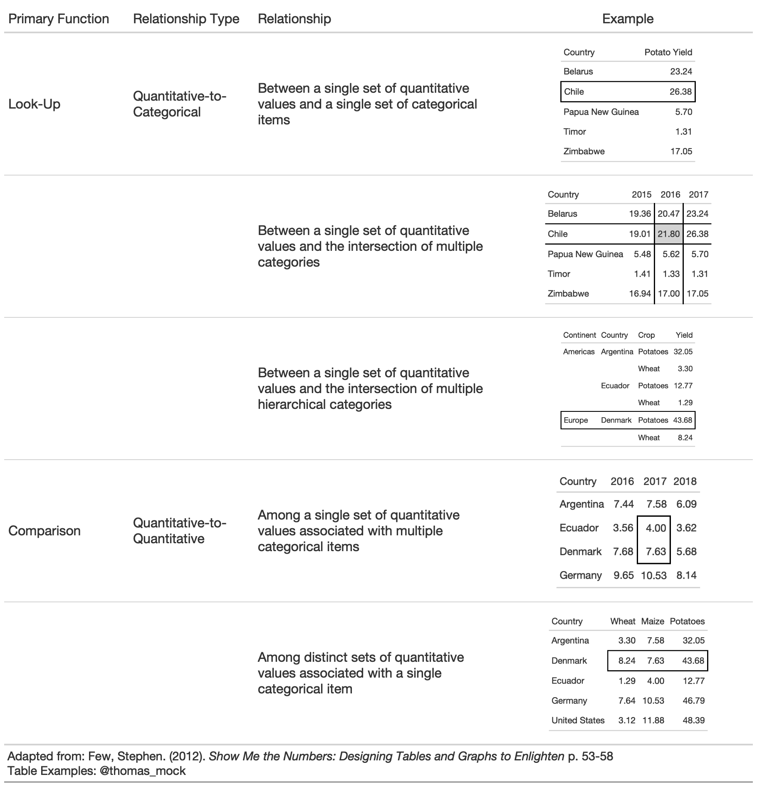
```


---

### `#TidyTuesday` data

```{r, cache = TRUE}
library(tidyverse)
library(gt)

url_in <- 'https://raw.githubusercontent.com/rfordatascience/tidytuesday/master/data/2020/2020-09-01/key_crop_yields.csv'

raw_yields <- readr::read_csv(url_in)

yield_data <- raw_yields %>% 
  janitor::clean_names() %>% 
  rename_with(~str_remove(., "_tonnes_per_hectare")) %>% 
  select(entity:beans, -code) %>% 
  pivot_longer(cols = wheat:beans, names_to = "crop", values_to = "yield") %>% 
  rename(Country = entity)

yield_data
```


---

### `#TidyTuesday` data


```{r}
country_sel <- c(
  "China", "India", "United States", 
  "Indonesia", "Mexico", "Pakistan"
  )

yield_data_wide <- raw_yields %>% 
  janitor::clean_names() %>% 
  rename_with(
    ~str_remove(., "_tonnes_per_hectare")
    ) %>% 
  select(entity:beans, -code) %>% 
  pivot_longer(
    cols = wheat:beans, 
    names_to = "crop", 
    values_to = "yield"
    ) %>% 
  rename(Country = entity) %>% 
  filter(
    crop %in% c("potatoes", "maize"), 
    year %in% c(2014:2016),
    Country %in% country_sel
    ) %>% 
  pivot_wider(
    names_from = year, 
    values_from = yield
    )
```


---

### `#TidyTuesday` data

```{r}
yield_data_wide
```

---

### Basic `gt` table

```{r basic-gt, eval = FALSE}
yield_data_wide %>% 
  gt()
```

--

```{r, echo = FALSE, out.width="40%"}
knitr::include_graphics("tables/basic-gt.png")
```


---

### Add groups

.pull-left[
```{r, eval = FALSE}
yield_data_wide %>% 
  head() %>% 
  # respects grouping from dplyr
  group_by(Country) %>%  #<<
  gt(rowname_col = "crop") 
```

```{r, echo = FALSE, out.width="65%"}
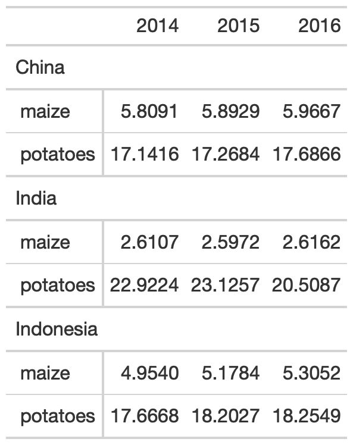
```


]


--

.pull-right[
```{r, results = FALSE}
yield_data_wide %>% 
  head() %>%
  gt(
    groupname_col = "crop", #<<
    rowname_col = "Country" #<<
  ) 
```

```{r, echo = FALSE, out.width="65%"}

```

]


---


.pull-left[
### Groups

```{r group-sum, eval = FALSE}
yield_data_wide %>% 
  mutate(crop = str_to_title(crop)) %>% 
  group_by(crop) %>% 
  gt(
    rowname_col = "Country"
  ) %>% 
  fmt_number(
    columns = 2:5, # reference cols by pos
    decimals = 2 # decrease decimal places
    ) %>% 
  summary_rows( #<<
    groups = TRUE, #<<
    # reference cols by name
    columns = vars(`2014`, `2015`, `2016`), 
    fns = list(
      # add summary stats
      avg = ~mean(.),  #<<
      sd = ~sd(.) #<<
    )
  )

```

]

--

.pull-right[
```{r, echo = FALSE, eval = TRUE, out.width="60%"}
knitr::include_graphics("tables/group-sum.png")
```

]

---

### Add spanners

Table spanners can be added quickly with `tab_spanner()` and again use either position (column number) or + `vars(name)`.

.pull-left[
```{r, eval = FALSE}
yield_data_wide %>% 
  head() %>%
  gt(
    groupname_col = "crop",
    rowname_col = "Country"
  ) %>% 
  tab_spanner( #<<
    label = "Yield in Tonnes/Hectare", #<<
    columns = 2:5 #<<
    ) 
```

]

--

.pull-right[
```{r, echo=FALSE, out.width="70%"}
knitr::include_graphics("tables/tab-spanner.png")
```

]

---

### Add notes and titles

Footnotes can be added with `tab_footnote()`. Note that this is our first use of the `locations` argument. Locations is used with things like `cells_column_labels()` or `cells_body()`, `cells_summary()` to offer very tight control of where to place certain changes. 

.pull-left[
```{r, eval = FALSE}
yield_data_wide %>% 
  head() %>%
  gt(
    groupname_col = "crop",
    rowname_col = "Country"
  ) %>% 
  tab_footnote(
    footnote = "Yield in Tonnes/Hectare", 
    locations = cells_column_labels( #<<
      columns = 1:3
      )
    )
```

]

--

.pull-right[
```{r, echo = FALSE, out.width="65%"}
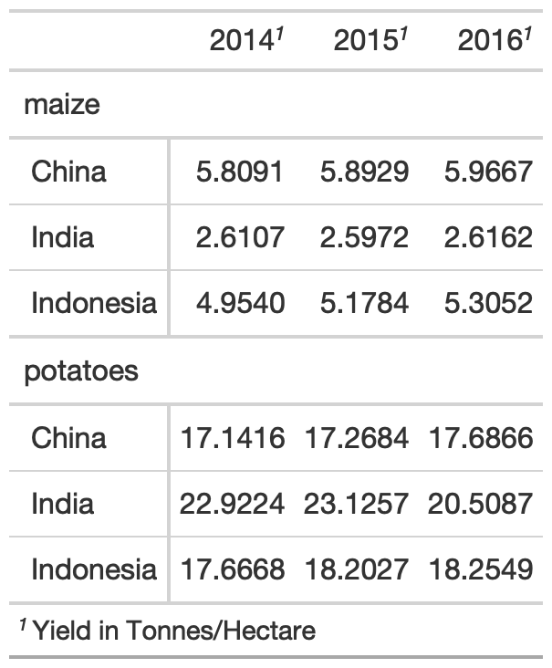
```

]

---

### Add notes and titles

Footnotes can be added with `tab_footnote()`. Note that this is our first use of the `locations` argument. Locations is used with things like `cells_column_labels()` or `cells_body()`, `cells_summary()` to offer very tight control of where to place certain changes. 

.pull-left[
```{r, eval = FALSE}
yield_data_wide %>% 
  head() %>%
  gt(
    groupname_col = "crop",
    rowname_col = "Country"
  ) %>% 
  tab_footnote(
    footnote = "Yield in Tonnes/Hectare", 
    locations = cells_column_labels(
      columns = 1:3 # note
      )
    ) %>% 
  # Adding a `source_note()`
  tab_source_note(
    source_note = "Data: OurWorldInData" #<<
    )
```

]

--

.pull-right[
```{r, out.width="65%", echo = FALSE}
knitr::include_graphics("tables/source-note-tab.png")
```

]


---

### Add Title/Subtitle

Adding a title or subtitle with `tab_header()` and notice that I used `md()` around the title and `html()` around subtitle to adjust their appearance. 

.pull-left[
```{r, eval = FALSE}
yield_data_wide %>% 
  head() %>%
  gt(
    groupname_col = "crop",
    rowname_col = "Country"
  ) %>%
  tab_header(
    title = md("**Crop Yields between 2014 and 2016**"),
    subtitle = html("<em>Countries limited to Asia</em>")
  )
```

]

--

.pull-right[
```{r, echo = FALSE, out.width="70%"}
knitr::include_graphics("tables/title-tab.png")
```

]

---

### Adjust appearance

You can customize large chunks of the table appearance all at once via `tab_options()`. The full reference to ALL the options you can customize are in the [`gt` packagedown site](https://gt.rstudio.com/reference/tab_options.html).

.pull-left[
```{r, eval = FALSE}
yield_data_wide %>% 
  head() %>%
  gt(
    groupname_col = "crop",
    rowname_col = "Country"
  ) %>%
  tab_header(
    title = "Crop Yields between 2014 and 2016",
    subtitle = "Countries limited to Asia"
  ) %>% 
  tab_options( #<<
    heading.subtitle.font.size = 12,
    heading.align = "left",
    table.border.top.color = "red",
    column_labels.border.bottom.color = "red",
    column_labels.border.bottom.width= px(3)
  )
```

]

--

.pull-right[
```{r, echo = FALSE, out.width = "70%"}
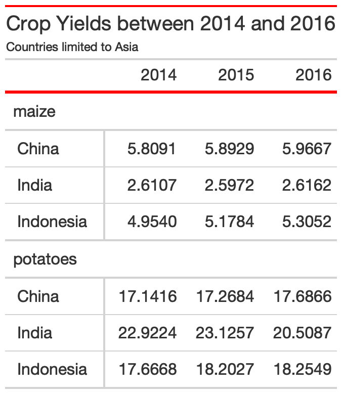
```

]

---

### Pseudo-themes

Because `gt` is built up by a series of piped examples, you can also pass along additional changes/customization as a function almost like a `ggplot2` theme!

.pull-left[
```{r, eval = FALSE}
my_theme <- function(data) {
  tab_options(
    data = data,
    heading.subtitle.font.size = 12,
    heading.align = "left",
    table.border.top.color = "red",
    column_labels.border.bottom.color = "red",
    column_labels.border.bottom.width= px(3)
  )
}
yield_data_wide %>% 
  head() %>%
  gt(
    groupname_col = "crop",
    rowname_col = "Country"
  ) %>%
  tab_header(
    title = "Crop Yields between 2014 and 2016",
    subtitle = "Countries limited to Asia"
  ) %>% 
  my_theme()
  
```
]

--

.pull-right[
```{r, echo = FALSE, out.width="70%"}

```

]

---

### Style specific cells w/ `tab_style()`

.pull-left[
.small[

```{r tab-style, eval = FALSE}
yield_data_wide %>% 
  head() %>%
  gt() %>% 
  tab_style(
    style = list(
      cell_text(weight = "bold")
    ),
    locations = cells_column_labels(everything())
  ) %>% 
  tab_style(
    style = list(
      cell_fill(color = "black", alpha = 0.2),
      cell_borders(
        side = c("left", "right"), 
        color = "black",
        weight = px(2)
        )
      ),
    locations = cells_body(
      columns = vars(crop)
      )
  ) %>% 
  tab_style(
    style = list(
      cell_text(color = "red", style = "italic")
    ),
    locations = cells_body(
      columns = 3:5,
      rows = Country == "China"
    )
  )
```

]

]

--

.pull-right[
```{r, echo = FALSE, out.width="75%"}
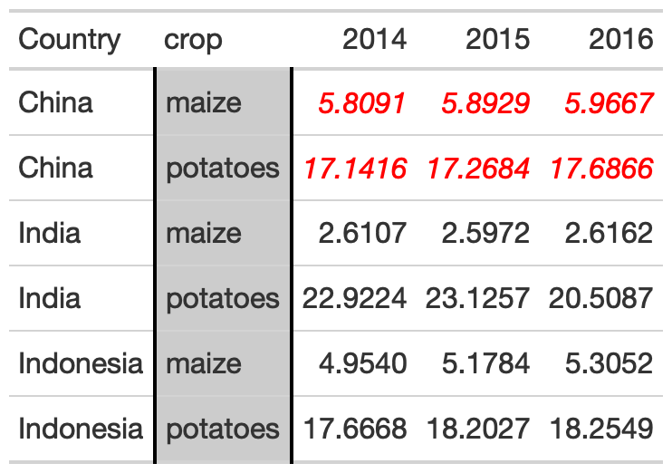
```

]

---

### Color Gradient


.pull-left[
```{r color-gradient, eval = FALSE}

my_pal <- scales::col_numeric(
  paletteer::paletteer_d(
    palette = "ggsci::red_material"
    ) %>% as.character(),
  domain = NULL
  )
  
yield_data_wide %>% 
  head() %>%
  gt(
    groupname_col = "crop",
    rowname_col = "Country"
  ) %>% 
  data_color(
    columns = vars(`2014`, `2015`, `2016`),
    colors = my_pal
      )
```

]

--

.pull-right[
```{r, echo = FALSE, out.width="75%"}
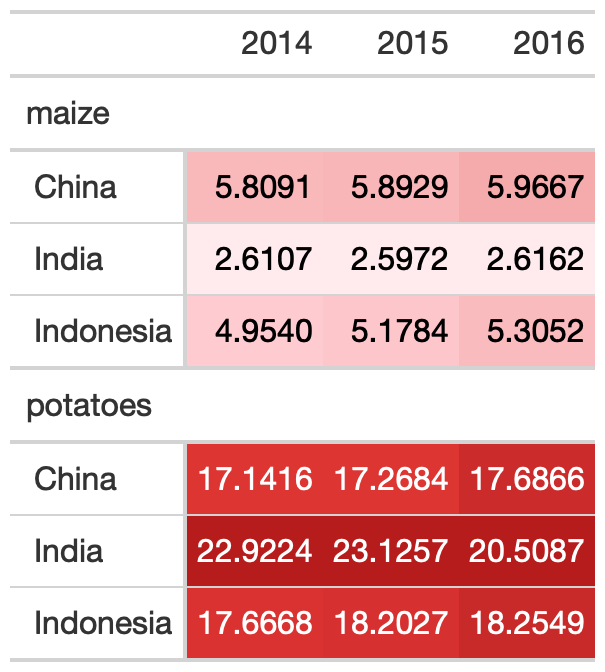
```

]

---
class:inverse, center, middle

# 10 Guidelines with `gt`

---

### Original Credit

<blockquote class="twitter-tweet"><p lang="en" dir="ltr">I recently published &quot;Ten Guidelines for Better Tables&quot; in the Journal of Benefit Cost Analysis (<a href="https://twitter.com/benefitcost?ref_src=twsrc%5Etfw">@benefitcost</a>) on ways to improve your data tables. <br><br>Here&#39;s a thread summarizing the 10 guidelines. <br><br>Full paper is here: <a href="https://t.co/VSGYnfg7iP">https://t.co/VSGYnfg7iP</a> <a href="https://t.co/W6qbsktioL">pic.twitter.com/W6qbsktioL</a></p>&mdash; Jon Schwabish (@jschwabish) <a href="https://twitter.com/jschwabish/status/1290323581881266177?ref_src=twsrc%5Etfw">August 3, 2020</a></blockquote> <script async src="https://platform.twitter.com/widgets.js" charset="utf-8"></script>

---

### Rule 1: Offset the Heads from the Body

```{r rule1-data}
# data prep
potato_data <- yield_data %>% 
  filter(Country %in% country_sel, crop == "potatoes", year %in% c(2013:2016)) %>% 
  filter(crop == "potatoes") %>% 
  pivot_wider(names_from = year, values_from = "yield")

potato_data
```

---

### Rule 1: Offset the Heads from the Body

.panelset[
.panel[.panel-name[Bad Table]

```{r, echo = FALSE, out.width="60%"}
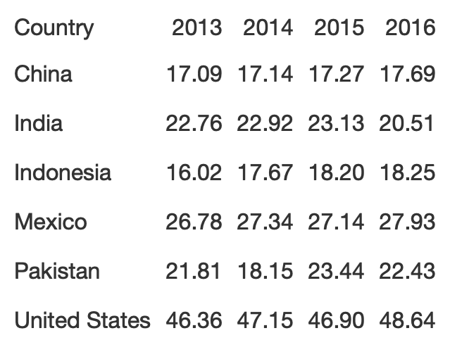
```

]

.panel[.panel-name[Good Table]
```{r, echo = FALSE, out.width="60%"}
knitr::include_graphics("tables/hot-potato.png")
```

]

.panel[.panel-name[Bad Code]
```{r rule1-poor}
potato_tb <- potato_data %>% 
  gt() %>% 
  cols_hide(vars(crop)) %>% 
  opt_table_lines(extent = "none") %>% 
  fmt_number(
    columns = 3:6,
    decimals = 2
  )

```

]

.panel[.panel-name[Good Code]
```{r rule1-good}
hot_potato <- potato_tb %>% 
  tab_style(
    style = list(
      cell_text(weight = "bold")
    ),
    locations = cells_column_labels(everything())
  ) %>% 
  opt_table_lines(extent = "default") %>%
  tab_options(
    column_labels.border.top.color = "white",
    column_labels.border.top.width = px(3),
    column_labels.border.bottom.color = "black",
    table_body.hlines.color = "white",
    table.border.bottom.color = "white",
    table.border.bottom.width = px(3)
  ) %>% tab_source_note(
    md(
      "**Table**: @thomas_mock |
       **Data**: OurWorldInData.org
      <br>**Inspiration**: @jschwabish"
      )
    )
```

]
]

---

### Rule 2: Use Subtle Dividers Rather Than Heavy Gridlines

The idea here is that you want to clearly indicate dividers when necessary. Especially with many column labels, you want to make sure that changes in the structure are clear.

```{r rule2-data}
# data prep
rule2_data <- yield_data %>% 
  filter(Country %in% country_sel, crop == "potatoes", year %in% c(2007:2016)) %>% 
  filter(crop == "potatoes") %>% 
  select(-crop) %>% 
  pivot_wider(names_from = year, values_from = "yield") %>% 
  rowwise() %>% 
  mutate(
    avg_07_11 = mean(`2007`:`2011`),
    .before = `2012`
    ) %>% 
  mutate(
    avg_12_16 = mean(`2012`:`2016`)
  ) %>% 
  ungroup()
```

---

### Rule 2: Use Subtle Dividers Rather Than Heavy Gridlines

.panelset[
.panel[.panel-name[Bad Table]

```{r, echo = FALSE, out.width="75%"}
knitr::include_graphics("tables/rule2-tab1.png")
```

]

.panel[.panel-name[Good Table]
```{r, echo = FALSE, out.width="75%"}
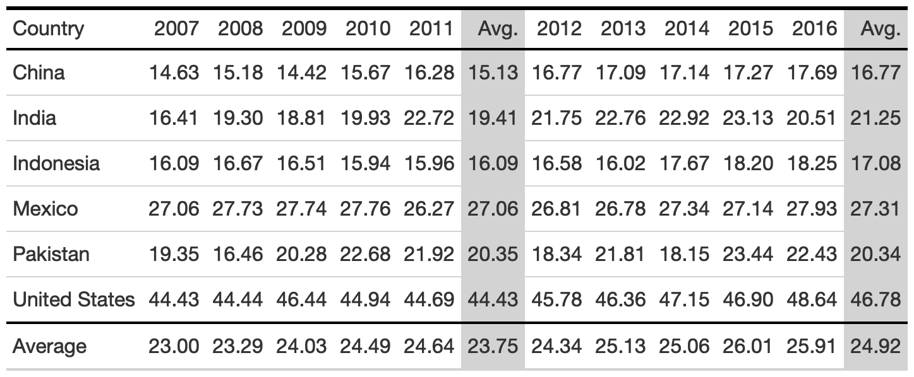
```

]

.panel[.panel-name[Bad Code]
.small[
```{r}
rule2_tab1 <- rule2_data %>% 
  gt(
    rowname_col = "Country"
  ) %>% 
  cols_label(
    avg_07_11 = "Avg.",
    avg_12_16 = "Avg."
  ) %>% 
  cols_width(
    1 ~ px(125)
  ) %>% 
  fmt_number(
    columns = 2:last_col()
  ) %>% 
  tab_style(
    style = cell_borders(
      side = "all",
      color = "grey",
      weight = px(1),
      style = "solid"
    ),
    locations = list(
      cells_body(
        everything()
        ),
      cells_column_labels(
        everything()
      )
      )
  ) %>% 
  grand_summary_rows(
    columns = 2:last_col(),
    fns = list(
      "Average" = ~mean(.)
    ),
    formatter = fmt_number
  )

```
]

]

.panel[.panel-name[Good Code]
.small[
```{r rule1}
rule2_tab2 <- rule2_data %>% 
  add_row(
    rule2_data %>% 
      summarize(
        across(where(is.double), 
               list(Average = mean),
               .names = "{col}")
      ) %>% 
      mutate(Country = "Average")
  ) %>% 
  gt() %>% 
  cols_label(
    avg_07_11 = "Avg.",
    avg_12_16 = "Avg."
  ) %>%
  fmt_number(
    columns = 2:last_col()
  ) %>% 
  tab_style(
    style = cell_fill(
      color = "lightgrey"
    ),
    locations = list(
      cells_body(
        columns = vars(avg_07_11, avg_12_16)
        ),
      cells_column_labels(
        columns = vars(avg_07_11, avg_12_16)
      )
      )
  ) %>%
  tab_style(
    style = cell_borders(
      sides = "top",
      color = "black",
      weight = px(2)
    ),
    locations = cells_body(
      columns = everything(),
      rows = Country == "Average"
    )
  ) %>% 
  tab_style(
    style = list(
      cell_text(weight = "bold")
    ),
    locations = cells_column_labels(everything())
  ) %>% 
  tab_options(
    column_labels.border.top.color = "black",
    column_labels.border.top.width = px(3),
    column_labels.border.bottom.color = "black"
  )
```
]

]
]

---

### Rule 3: Right-Align Numbers and Heads

In this case, you want to right align numbers and ideally choose mono-spaced or numerically-aligned fonts, while avoiding "oldstyle" fonts which have numbers with varying vertical placement. Importantly, `gt` already automatically follows best practices for the most part so we have to change some of the defaults to get **bad** examples.

```{r rule3-data}
# Prep data
rule3_data <- yield_data %>% 
  filter(Country == "United States", year %in% c(2016)) %>% 
  mutate(crop = str_to_title(crop)) %>% 
  pivot_wider(names_from = year, values_from = "yield") %>% 
  arrange(crop) %>% 
  select(-Country, Crop = crop)
```

---

### 3. Comparison of alignment

Notice that left-alignment or center-alignment of numbers impairs the ability to clearly compare numbers and decimal places. Right-alignment lets you align decimal places and numbers for easy parsing.

.panelset[
.panel[.panel-name[Compare Alignment]
```{r, echo = FALSE, out.width = "50%"}
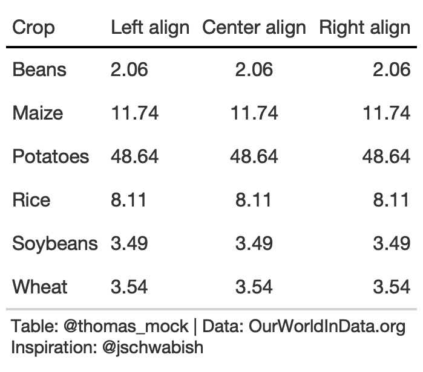
```

]

.panel[.panel-name[Code]
.small[
```{r rule3-align}
rule3_align <- rule3_data %>% 
  mutate(`Center align` = `2016`,
             `Right align` = `2016`) %>%
  rename(`Left align` = 2) %>% 
  gt() %>% 
  tab_style(
    style = list(
      cell_text(weight = "bold")
    ),
    locations = cells_column_labels(everything())
  ) %>% 
  fmt_number(
    columns = 2:4
  ) %>% 
  cols_align(align = "left",
             columns = 2) %>% 
  cols_align(align = "center",
             columns = 3) %>% 
  cols_align(align = "right",
             columns = 4) %>% 
  tab_options(
    column_labels.border.top.color = "white",
    column_labels.border.top.width = px(3),
    column_labels.border.bottom.color = "black",
    table_body.hlines.color = "white",
    table.border.bottom.color = "white",
    table.border.bottom.width = px(3)
  )
```

]
]

]

---

### 3. Addendums to Alignment

When aligning text of equal length (long or very short), center alignment of text can be fine or even preferable. For example, very short text with a long header can be better suited to center-align. Equal length text can be centered without negatively affecting the ability to quickly read.

.panelset[
.panel[.panel-name[Bad]
```{r, echo = FALSE, out.width = "30%"}
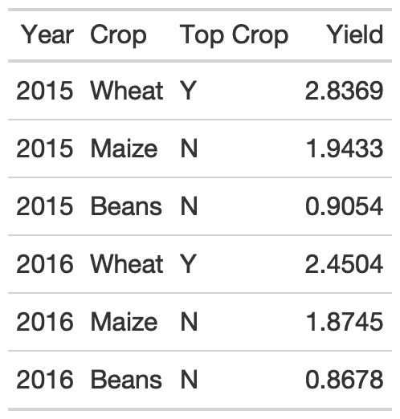
```

]

.panel[.panel-name[Good]
```{r, echo = FALSE, out.width = "30%"}
knitr::include_graphics("tables/rule3-mid.png")
```

]


.panel[.panel-name[Bad Code]
```{r}
rule3_data_addendum <- yield_data %>% 
  filter(
    Country %in% c("Africa"), 
    year >= 2015,
    str_length(crop) == 5
    ) %>%
  group_by(year) %>% 
  mutate(
    crop = str_to_title(crop),
    max_yield = max(yield),
    `Top Crop` = if_else(yield == max_yield, "Y", "N")
    ) %>%
  select(Year = year, Crop = crop, `Top Crop`, Yield = yield) %>% 
  ungroup() %>% 
  head() %>% 
  gt()
```
]

.panel[.panel-name[Good Code]
```{r, eval = FALSE}
rule3_data_addendum %>% 
  gt() %>% 
  gt::cols_align(
    align = "center",
    columns = vars(`Top Crop`, Crop)
  )
```
]

]


---

### 3. Addendum to Alignment


As an aside, note that `pivot_wider()` can also improve the function of this table, reducing repetition of both the `Crop` and `Top Crop` columns. Again, center alignment helps with the `Top Crop` column regardless.

.pull-left[
```{r, eval = FALSE}
rule3_data_addendum %>% 
  pivot_wider(
    names_from = Year, 
    values_from = Yield
    ) %>% 
  gt() %>% 
  gt::cols_align(
    align = "center",
    columns = vars(`Top Crop`)
  )
```

]

--

.pull-right[
```{r, echo= FALSE, out.width="65%"}
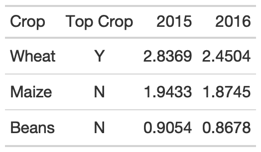
```

]

---

### 3. Choose fonts carefully

For the fonts below, notice that the Default for `gt` along with a monospaced font in `Fira Mono` have nice alignment of decimal places and equally-spaced numbers.

.panelset[

.panel[.panel-name[Table]
```{r, echo = FALSE, out.width="55%"}
knitr::include_graphics("tables/font-tab.png")
```

]

.panel[.panel-name[Style Function]
```{r}
tab_font_fct <- function(data, font, column){
  tab_style(
    data = data,
    style = list(
      cell_text(font = font, decorate = "underline")
    ),
    locations = list(
      cells_column_labels(
        vars({{column}})
        ),
      cells_body(
        vars({{column}})
      )
  )
  )
}
```

]

.panel[.panel-name[Code]
```{r rule3-fonts}
rule3_text <- rule3_data %>% 
  mutate(Karla = `2016`,
             Cabin = `2016`,
             Georgia = `2016`,
             `Fira Mono` = `2016`) %>%
  rename(Default = 2) %>% 
  gt() %>% 
  tab_font_fct("Default", Default) %>% 
  tab_font_fct("Karla", Karla) %>% 
  tab_font_fct("Cabin", Cabin) %>% 
  tab_font_fct("Georgia", Georgia) %>% 
  tab_font_fct("Fira Mono", `Fira Mono`) %>% 
  fmt_number(columns = 2:6) %>% 
  tab_spanner("Good", c(2,6)) %>% 
  tab_spanner("Bad", 3:5) %>% 
  tab_options(
    column_labels.border.top.color = "white",
    column_labels.border.top.width = px(3),
    column_labels.border.bottom.color = "black",
    table_body.hlines.color = "white",
    table.border.bottom.color = "white",
    table.border.bottom.width = px(3)
  )
```

]

]

---

### Rule 4: Left-align Text and Heads

For labels/strings it is typically more appropriate to left-align. This allows your eye to follow both short and long text vertically to scan a table, along with a clear border.

.panelset[
.panel[.panel-name[Table]
```{r, echo = FALSE, out.width = "75%"}
knitr::include_graphics("tables/rule4-tab.png")
```

]

.panel[.panel-name[Theme]
```{r}
basic_theme <- function(data) {
  tab_options(
    data,
    column_labels.border.top.color = "white",
    column_labels.border.top.width = px(3),
    column_labels.border.bottom.color = "black",
    column_labels.font.weight = "bold",
    table_body.hlines.color = "white",
    table.border.bottom.color = "white",
    table.border.bottom.width = px(3),
    data_row.padding = px(3)
  ) 
}
```

]

.panel[.panel-name[Code]
```{r rule4-data, layout = 'l-page'}
country_names <- c(
  "British Virgin Islands", "Cayman Islands", 
  "Democratic Republic of Congo", "Luxembourg", 
  "United States","Germany", "New Zealand", "Costa Rica", "Peru"
)
rule4_tab_left <- tibble(
  right = country_names,
  center = country_names,
  left = country_names
) %>% 
  gt()  %>% 
  cols_align(align = "left",
             columns = 3) %>% 
  cols_align(align = "center",
             columns = 2) %>% 
  cols_align(align = "right",
             columns = 1) %>% 
  cols_width(
    everything() ~ px(250)
  ) %>% 
  cols_label(
    right = md("Right aligned and<br>hard to read"),
    center = md("Centered and<br>even harder to read"),
    left = md("Left-aligned and<br>easiest to read")
  ) %>% 
  basic_theme() %>% 
  tab_source_note(md("**Table**: @thomas_mock | **Data**: OurWorldInData.org<br>**Inspiration**: @jschwabish"))
```
]


]

---

### Rule 5: Select the Appropriate Level of Precision

While you can sometimes justify increased decimal places, often 1 or 2 is enough.


.panelset[
.panel[.panel-name[Table]
```{r, echo=FALSE, out.width="40%"}
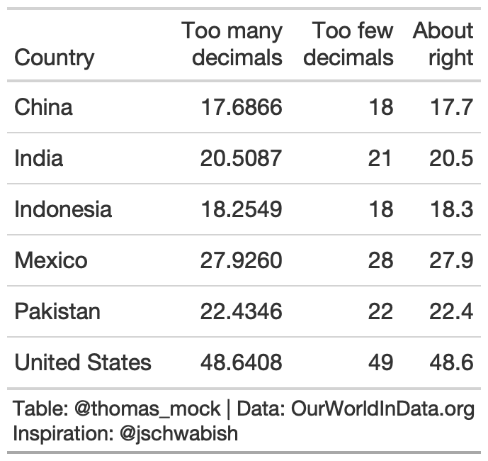
```

]

.panel[.panel-name[Code]
```{r rule5}
rule5_tab <- yield_data %>% 
  filter(
    Country %in% country_sel, 
    crop == "potatoes", 
    year %in% c(2016)
    ) %>% 
  select(Country, yield) %>% 
  mutate(few = yield, right = yield) %>% 
  gt() %>% 
  fmt_number(
    columns = vars(few),
    decimals = 0
  ) %>% 
  fmt_number(
    columns = vars(right),
    decimals = 1
  ) %>% 
  cols_label(
    yield = md("Too many<br>decimals"),
    few = md("Too few<br>decimals"),
    right = md("About<br>right")
  ) %>% 
  tab_source_note(md("**Table**: @thomas_mock | **Data**: OurWorldInData.org<br>**Inspiration**: @jschwabish"))
```

]
]

---

### Rule 6: Guide Your Reader with Space

Think of how you want to guide the reader - vertically or horizontally. 

.panelset[
.panel[.panel-name[Vertical]
```{r, echo = FALSE, out.width="45%"}
knitr::include_graphics("tables/rule6-tab.png")
```

]

.panel[.panel-name[Horizontal]
```{r, echo = FALSE, out.width="35%"}
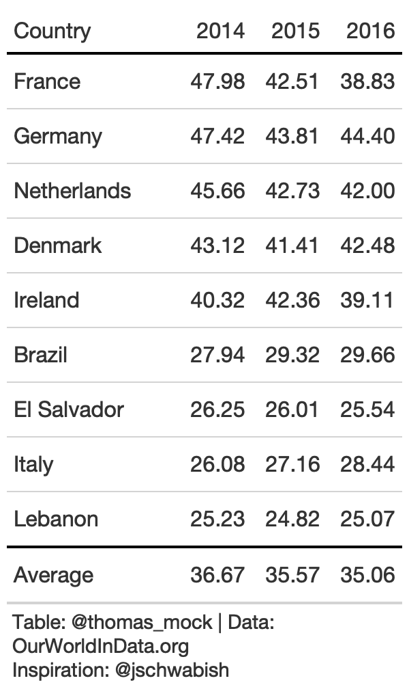
```

]

.panel[.panel-name[Data]
```{r}
rule6_data <- yield_data %>% 
  filter(
    Country %in% country_sel, 
    crop == "potatoes", 
    year %in% c(2014:2016)
    ) %>% 
  filter(crop == "potatoes") %>% 
  pivot_wider(
    names_from = year, 
    values_from = "yield"
    ) %>% 
  select(-crop)
```

]

.panel[.panel-name[Code V]
```{r rule6}
rule6_tb <- rule6_data %>% 
  arrange(desc(`2014`)) %>% 
  add_row(
    rule6_data %>% 
      summarize(across(where(is.double), list(Average = mean),
                       .names = "{col}")
      ) %>% mutate(Country = "Average")
  ) %>% 
  gt() %>% 
  fmt_number(columns = 2:4,
    decimals = 2) %>% 
  tab_style(
    style = list(cell_text(weight = "bold")),
    locations = cells_column_labels(everything())
  ) %>% 
  tab_style(
    style = cell_borders(
      sides = "top",
      color = "black",
      weight = px(2)
    ),
    locations = cells_body(
      columns = everything(),
      rows = Country == "Average"
    )
  ) %>% 
  cols_width(vars(Country) ~ px(125),
             2:4 ~ px(75)) %>% 
  basic_theme()
```
]

.panel[.panel-name[Code H]
```{r, eval = FALSE}
rule6_tb %>% 
  cols_width(vars(Country) ~ px(125),
             2:4 ~ px(55)) %>% 
  tab_options(data_row.padding = px(10),
              table_body.hlines.color = "lightgrey") 
```
]

]

---

### Rule 7: Remove Unit Repetition

.panelset[
.panel[.panel-name[Remove]
```{r unit-repeat, eval = FALSE}
rule6_tb %>% 
  fmt_percent(
    columns = 2:4,
    scale_values = FALSE
  ) 
```

```{r, echo = FALSE, out.width="45%"}

```
]

.panel[.panel-name[Left]
```{r,eval = FALSE}
rule6_tb %>% 
  fmt_percent(
    columns = 2:4,
    rows = 1,
    scale_values = FALSE,
    placement = "left"
  )
```
```{r, echo = FALSE, out.width = "45%"}
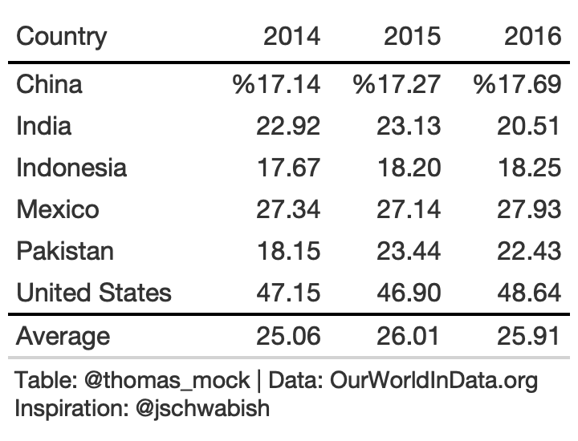
```


]

.panel[.panel-name[Label]
```{r add-percent-sign, eval = FALSE}
rule6_tb %>% 
  cols_label(
    `2014` = "2014 (%)",
    `2015` = "2015 (%)",
    `2016` = "2016 (%)"
  ) %>% 
  cols_width(
    2:4 ~ px(100)
  )
```
```{r, echo = FALSE, out.width = "45%"}
knitr::include_graphics("tables/tab6-label.png")
```

]

.panel[.panel-name[Spanner]
```{r, eval = FALSE}
rule6_tb %>% 
  tab_spanner(
    label = md("**% Yield of Total**"),
    columns = 2:4
  )
```
```{r, echo = FALSE, out.width="45%"}
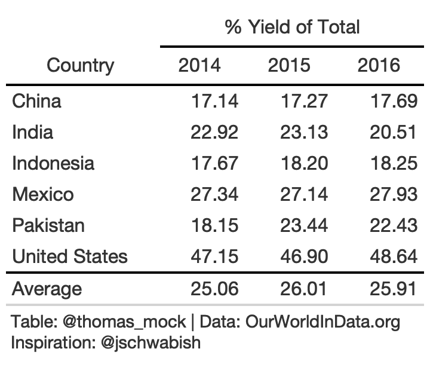
```

]

.panel[.panel-name[Footnote]
```{r, eval = FALSE}
rule6_tb %>% 
  tab_footnote(
    footnote = md("**% Yield of Total**"),
    locations = cells_column_labels(2:4)
  )
```
```{r, echo = FALSE, out.width = "45%"}
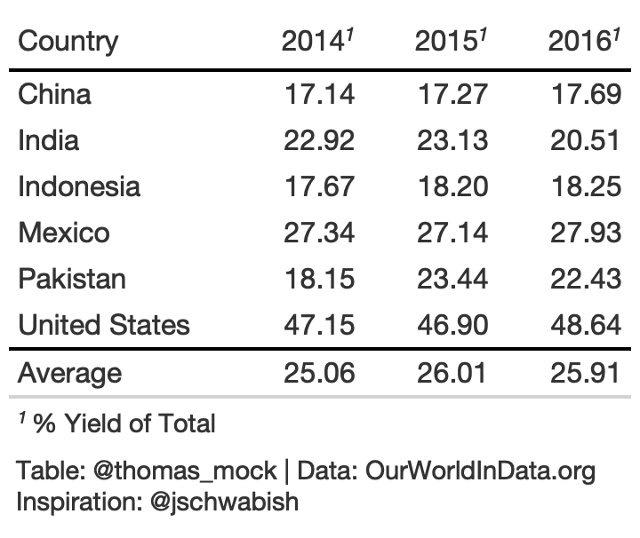
```

]

]

---


### Rule 8: Highlight Outliers  

With large data tables, it can be useful to take a page from our Data Viz and highlight outliers with color or shape.

.panelset[
.panel[.panel-name[Table]
```{r, echo = FALSE, out.width="75%"}
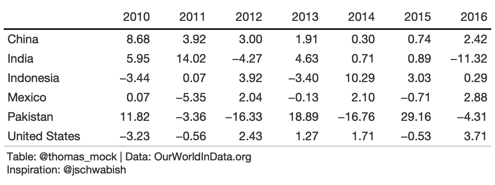
```
]

.panel[.panel-name[Data]
```{r rule8-data, eval = FALSE}
rule8_data <- yield_data %>% 
  filter(
    Country %in% country_sel, 
    crop == "potatoes", 
    year %in% 2009:2017
    ) %>% 
  group_by(Country) %>% 
  mutate(pct_change = (yield/lag(yield)-1)*100) %>% 
  ungroup() %>% 
  filter(between(year, 2010, 2016)) %>% 
  select(Country, year, pct_change) %>% 
  pivot_wider(names_from = year, values_from = pct_change)
```
]

.panel[.panel-name[Code]
```{r rule8-plain, eval = FALSE}
rule8_tb <- rule8_data %>% 
  gt() %>% 
  fmt_number(2:last_col()) %>% 
  cols_label(
    Country = ""
  ) %>% 
  tab_style(
    style = list(
      cell_text(weight = "bold")
    ),
    locations = cells_column_labels(everything())
  ) %>% 
  basic_theme() %>% 
  cols_width(vars(Country) ~ px(125),
             2:last_col() ~ px(75))
```
]

]

---

### Rule 8: Highlight Outliers

With a bit of color added we can clearly focus on the outliers.

.panelset[
.panel[.panel-name[Table]
```{r, echo = FALSE, out.width="75%"}
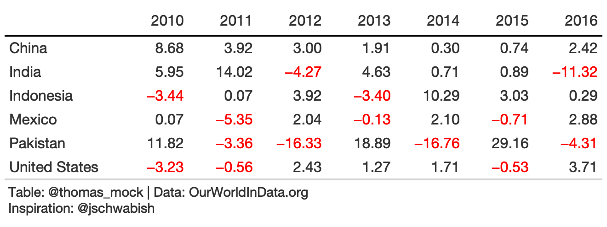
```
]

.panel[.panel-name[Data]
```{r rule8-data, eval = FALSE}
```
]

.panel[.panel-name[Code]
```{r rule8-red, eval = FALSE}
rule8_color <- rule8_tb %>% 
  tab_style(
    style = cell_text(color = "red"),
    locations = list(
      body_fct(2, `2010`),
      body_fct(3, `2011`),
      body_fct(4, `2012`),
      body_fct(5, `2013`),
      body_fct(6, `2014`),
      body_fct(7, `2015`),
      body_fct(8, `2016`)
    )
  ) 
```
]

.panel[.panel-name[Function]
```{r}
body_fct <- function(col, row){
  cells_body(
        columns = col,
        rows = {{row}} < 0
    )
}
```

]

]

---

### Rule 8: Highlight Outliers

We can *really* pull the focus with background **fill** of each cell *outlier*.

.panelset[
.panel[.panel-name[Table]
```{r, echo = FALSE, out.width="75%"}
knitr::include_graphics("tables/rule8-fill.png")
```

]

.panel[.panel-name[Code]
```{r rule8-fill, eval = FALSE}
rule8_fill <- rule8_tb %>% 
  tab_style(
    style = list(
      cell_fill(color = scales::alpha("red", 0.7)),
      cell_text(color = "white", weight = "bold")
      ),
    locations = list(
      body_fct(2, `2010`),
      body_fct(3, `2011`),
      body_fct(4, `2012`),
      body_fct(5, `2013`),
      body_fct(6, `2014`),
      body_fct(7, `2015`),
      body_fct(8, `2016`)
    )
  ) %>% 
  tab_source_note(md("**Table**: @thomas_mock | **Data**: OurWorldInData.org<br>**Inspiration**: @jschwabish"))
```
]

]

---

### Rule 9: Group Similar Data and Increase White Space

In this rule, you want to make sure to group similar categories to make parsing the table easier. We can also increase white space, or even remove repeats to increase the data-to-ink ratio.

```{r rule9-data}
rule9_data <- yield_data %>% 
  filter(Country %in% country_sel[-5], year %in% c(2015, 2016),
         crop %in% c("wheat", "potatoes", "rice", "soybeans"),
         !is.na(yield)) %>% 
  pivot_wider(names_from = year, values_from = yield) %>% 
  rowwise() %>% 
  mutate(crop = str_to_title(crop),
         pct_change = (`2016`/`2015`-1)*100) %>%
  group_by(Country) %>% 
  arrange(desc(`2015`)) %>% 
  ungroup() 
```

---

### 9. Bad Example

.pull-left[
```{r rule9-tb}
rule9_bad <- rule9_data %>% 
  gt() %>% 
  fmt_number(
    columns = vars(`2015`, `2016`, pct_change)
  ) %>% 
  tab_spanner(
    columns = vars(`2015`, `2016`),
    label = md("**Yield in<br>Tonnes/Hectare**")
    ) %>%  
  cols_width(
    vars(crop) ~ px(125),
    vars(`2015`, `2016`, pct_change) ~ 100
  ) 
```

]

--
  
.pull-right[
```{r, echo = FALSE, out.width="65%"}
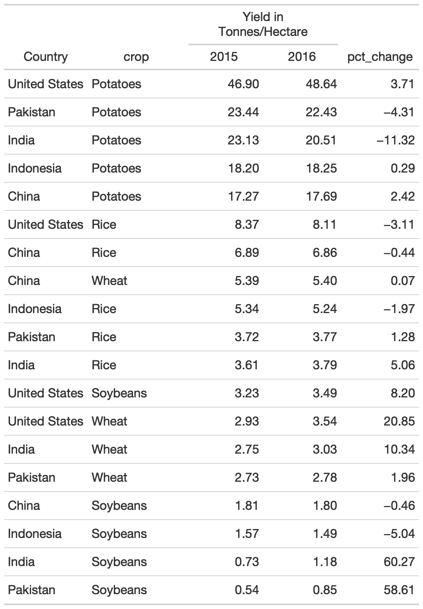
```

]

---

### 9. `gt` native grouping

`gt` provides row group levels that we can use to separate by Country.

.pull-left[
.small[
```{r rule9-groups}
rule9_grp <- rule9_data %>% 
  gt(groupname_col = "Country") %>% 
  tab_stubhead("label") %>% 
  tab_options(
    table.width = px(300)
  ) %>% 
  cols_label(
    crop = "",
    pct_change = md("Percent<br>Change")
  ) %>% 
  fmt_number(
    columns = vars(`2015`, `2016`, pct_change)
  ) %>% 
  tab_style(
    style = cell_text(color = "black", weight = "bold"),
    locations = list(
      cells_row_groups(),
      cells_column_labels(everything())
    )
  ) %>% 
  tab_spanner(
    columns = vars(`2015`, `2016`),
    label = md("**Yield in Tonnes/Hectare**")
    ) %>%  
  cols_width(
    vars(crop) ~ px(125),
    vars(`2015`, `2016`, pct_change) ~ 100
  ) %>% 
  basic_theme()
```

]
]

--

.pull-right[
```{r, echo = FALSE, out.width="50%"}
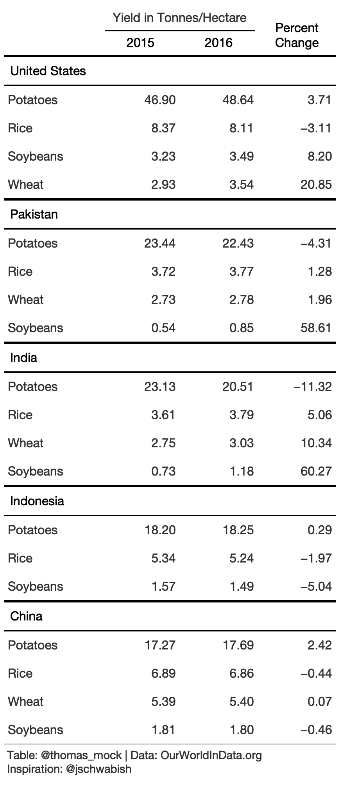

```

]

---

### 9. Remove duplicate data

Alternatively, we can remove some observations to create more white space.

.pull-left[
.small[
```{r rule9-duplicate}
rule9_dup <- rule9_data %>% 
  arrange(Country) %>% 
  gt() %>% 
  cols_label(
    Country = "",
    crop = "Crop",
    pct_change = md("Percent<br>Change")
  ) %>% 
  tab_spanner(columns = vars(`2015`, `2016`),
              label = md("**Yield in Tonnes/Hectare**")) %>% 
  fmt_number(
    columns = vars(`2015`, `2016`, pct_change)
  ) %>% 
  text_transform(
    locations = cells_body(
      columns = vars(Country),
      rows = crop != "Potatoes"
    ),
    fn = function(x){
      paste0("")
    }
  ) %>% 
  tab_style(
    style = cell_text(color = "black", weight = "bold"),
    locations = list(
      cells_row_groups(),
      cells_column_labels(everything())
    )
  ) %>% 
  cols_width(
    vars(Country, crop) ~ px(125),
    vars(`2015`, `2016`, pct_change) ~ 100
  ) %>% 
  basic_theme()
```

]
]

--

.pull-right[
```{r, echo = FALSE, out.width="70%"}
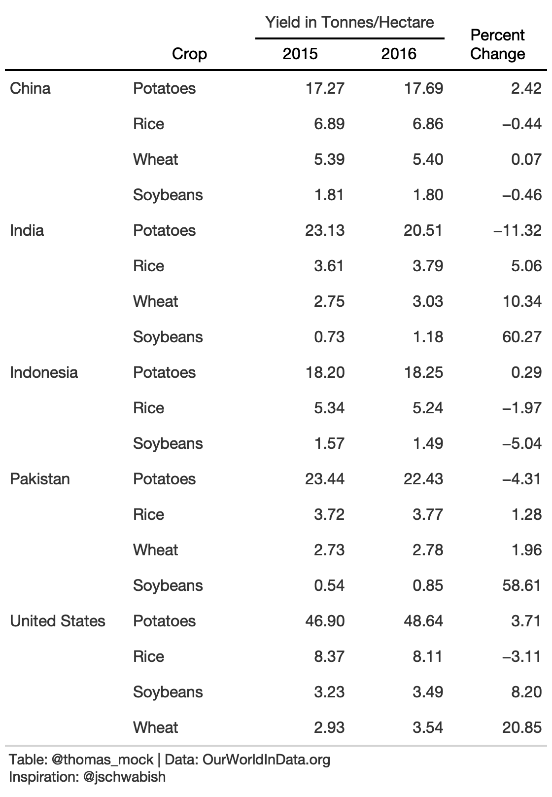
```

]

---

### Rule 10: Add visualizations When Appropriate

While data viz and tables are different tools, you can combine them in clever ways to further engage the reader. Embedded data viz can reveal trends, while the table itself shows the raw data for lookup.

.small[

```{r rule10-data}
country_sel <- c(
  "Germany", "Brazil", "Ireland", "Lebanon", "Italy", 
  "Netherlands", "France", "Denmark", "El Salvador", "Denmark"
    )

rule10_data <- yield_data %>% 
  filter(
    year %in% c(2013,2017), 
    crop == "potatoes", 
    Country %in% country_sel
    ) %>% 
  pivot_wider(names_from = year, values_from = yield)

rule10_data
```

]

---

### 10. Sparklines - Trends across Time

.panelset[
.panel[.panel-name[Table]
```{r, echo = FALSE, out.width="25%"}
knitr::include_graphics("tables/rule10-spark.png")
```

]

.panel[.panel-name[Data]
```{r}
small_yield <- yield_data %>% 
  filter(
    year %in% c(2013:2017), 
    crop == "potatoes", 
    Country %in% country_sel
  ) 

split_yield <- split(small_yield$yield, small_yield$Country)
```

]

.panel[.panel-name[Code]
.small[
```{r}
rule10_spark <- rule10_data %>% 
  mutate(spark = map(split_yield, kableExtra::spec_plot),
         spark = map(spark, "svg_text"),
         spark = map(spark, ~html(as.character(.x)))) %>% 
  select(-crop) %>% 
  gt() %>% 
  cols_label(
    spark = "2013-2017"
  ) %>% 
  fmt_number(2:3) %>% 
  tab_spanner(
    label = md("Potato Yield in<br>Tonnes/Hectare"),
    columns = c(2,3)
  ) %>% 
  tab_style(
    style = cell_text(color = "black", weight = "bold"),
    locations = list(
      cells_column_spanners(everything()),
      cells_column_labels(everything())
    )
  ) %>%  
  tab_options(
    row_group.border.top.width = px(3),
    row_group.border.top.color = "black",
    row_group.border.bottom.color = "black",
    table.border.top.color = "white",
    table.border.top.width = px(3),
    table.border.bottom.color = "white",
    table.border.bottom.width = px(3),
    column_labels.border.bottom.color = "black",
    column_labels.border.bottom.width = px(2),
  )
```

]
]

]

---

### 10. Barplot

For this example we can use barplots to indicate the average across the 5 years. Many thanks to the `formattable` author Renkun Kun and others like `rtjohnson12` who have shown examples about how to build up a bar chart with HTML! Thanks also to [Christophe Dervieux](https://community.rstudio.com/t/create-interactive-links-in-gt-table-in-rmarkdown/70266/2) for a great example of `gt` + custom HTML on RStudio Community.

.panelset[
.panel[.panel-name[Table]
```{r, echo = FALSE, out.width="45%"}
knitr::include_graphics("tables/rule10-bar.png")
```

]

.panel[.panel-name[Functions]
.small[
```{r rule10-barplot}
# Example of using glue to just paste the value into pre-created HTML block
# Example adapted from rtjohnson12 at: 
# https://github.com/renkun-ken/formattable/issues/79#issuecomment-573165954
bar_chart <- function(value, color = "red", display_value = NULL){
  # Choose to display percent of total
  if (is.null(display_value)) {
    display_value <- "&nbsp;"
  } else {
    display_value <- display_value
  }
  # paste color and value into the html string
  glue::glue("<span style=\"display: inline-block; direction: ltr; border-radius: 4px; padding-right: 2px; background-color: {color}; color: {color}; width: {value}%\"> {display_value} </span>")
}
# create a color palette w/ paletteer
col_pal <- function(value){
  # set high and low
  domain_range <- range(c(rule10_data$`2013`, rule10_data$`2017`))
  # create the color based of domain
  scales::col_numeric(
    paletteer::paletteer_d("ggsci::blue_material") %>% as.character(), 
    domain = c(min(value), max(value))
      )(value)
}
```

]
]

.panel[.panel-name[Data]
.small[
```{r}
bar_yields <- yield_data %>% 
  filter(
    year %in% c(2013:2017), 
    crop == "potatoes", 
    Country %in% c(
      country_sel, "Germany", "Brazil", "Ireland", "Lebanon", "Italy", 
      "Netherlands", "France", "Denmark", "El Salvador", "Denmark"
      )
    ) %>% 
  pivot_wider(names_from = year, values_from = yield) %>%  
  select(-crop) %>% 
  rowwise() %>% 
  mutate(
    mean = mean(c(`2013`, `2014`, `2015`, `2016`, `2017`))
    ) %>% 
  ungroup() %>% 
  select(Country, `2013`, `2017`, `mean`) %>% 
  mutate(
    bar = round(mean/max(mean)*100, digits = 2),
    color = col_pal(bar),
    bar_chart = bar_chart(bar, color = color),
    bar_chart = map(bar_chart, ~gt::html(as.character(.x)))) %>% 
  select(-bar, -color)
```

]
]


.panel[.panel-name[Code]
.small[
```{r}
rule10_bar <- bar_yields %>% 
  gt() %>% 
  cols_width(
    vars(bar_chart) ~ px(110),
    vars(mean, `2013`, `2017`) ~ px(90)
    ) %>% 
  cols_label(
    mean = md("Average<br>2013-17"),
    bar_chart = ""
  ) %>% 
  cols_align(
    align = "right",
    columns = 2:4
  ) %>% 
  cols_align(
    align = "left",
    columns = vars(bar_chart)
  ) %>% 
  fmt_number(2:4) %>% 
  tab_style(
    style = cell_text(color = "black", weight = "bold"),
    locations = list(
      cells_column_labels(everything())
    )
  ) %>%  
  basic_theme() %>% 
  tab_options(data_row.padding = px(8)) %>%
  tab_footnote(footnote = "Potato Yield in Tonnes per Hectare",
               locations = cells_column_labels(
                 columns =2:4
               ))
```

]
]

]

---

### 10. Heatmap

Lastly, you can add colors across the entire plot itself to show trends across the data over time and across country.

.panelset[
.panel[.panel-name[Table]
```{r, echo=FALSE, out.width="45%"}
knitr::include_graphics("tables/rule10-heat.png")
```

]

.panel[.panel-name[Data]
```{r}
rule10_wide <- yield_data %>% 
  filter(
    year %in% c(2013:2017), 
    crop == "potatoes", 
    Country %in% c(
      country_sel, "Germany", "Brazil", "Ireland", "Lebanon", "Italy", 
      "Netherlands", "France", "Denmark", "El Salvador", "Denmark"
    )
  ) %>% 
  pivot_wider(names_from = year, values_from = yield) %>% 
  arrange(desc(`2013`)) %>% 
  select(-crop)
```

]

.panel[.panel-name[Code]
.small[
```{r rule10-heatmap}
rule10_heat <- rule10_wide %>% 
  gt() %>% 
  data_color(
    columns = 2:6, 
    colors = scales::col_numeric(
      palette = paletteer::paletteer_d(
        palette = "ggsci::blue_material"
      ) %>% as.character(),
      domain = NULL
    )
  ) %>% 
  fmt_number(2:6) %>% 
  tab_spanner(
    label = "Potato Yield in Tonnes/Hectare",
    columns = c(2:6)
  ) %>% 
  tab_style(
    style = cell_text(color = "black", weight = "bold"),
    locations = list(
      cells_column_spanners(everything()),
      cells_column_labels(everything())
    )
  ) %>%  
  cols_width(
    1 ~ px(125),
    2:6 ~ px(65)
  ) %>% 
  basic_theme() 
```
]
]

]

---

### 10. Percent Change

Ok I lied! One more example, with color for a numeric column.

.panelset[
.panel[.panel-name[Table]
```{r, echo = FALSE, out.width="45%"}
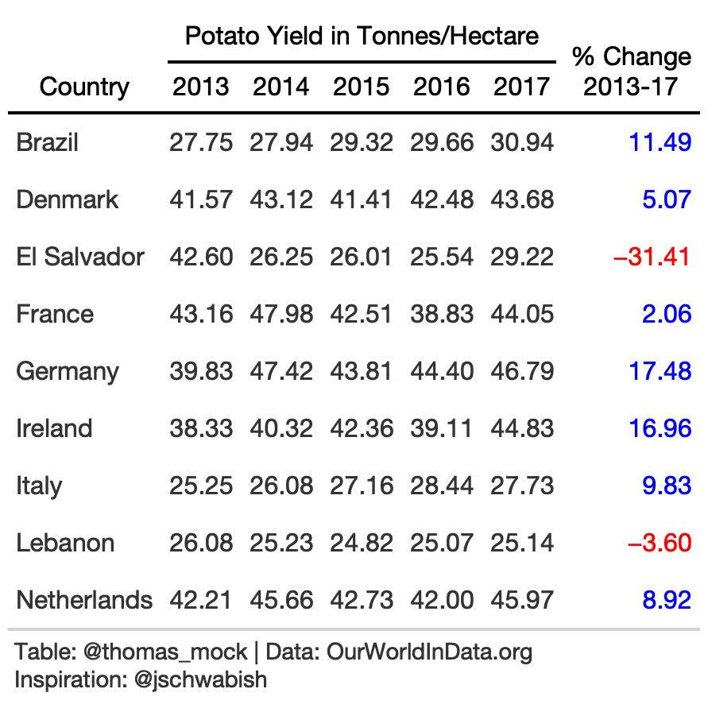
```

]

.panel[.panel-name[Data]
```{r}
rule10_wide <- yield_data %>% 
  filter(
    year %in% c(2013:2017), 
    crop == "potatoes", 
    Country %in% c(
      country_sel, "Germany", "Brazil", "Ireland", "Lebanon", "Italy", 
      "Netherlands", "France", "Denmark", "El Salvador", "Denmark"
    )
  ) %>% 
  pivot_wider(names_from = year, values_from = yield) %>% 
  arrange(Country) %>% 
  select(-crop) %>% 
  mutate(pct_change = (`2017`/`2013`-1)*100)
```


]

.panel[.panel-name[Code]
.small[
```{r rule10-wide-pct}
rule10_pct <- rule10_wide %>% 
  gt()%>% 
  fmt_number(2:7) %>% 
  cols_label(
    pct_change = md("% Change<br>2013-17")
  ) %>% 
  tab_style(
    style = list(
      cell_text(color = "red")
    ),
    locations = cells_body(
      columns = vars(pct_change),
      rows = pct_change <= 0
    )
  ) %>% 
  tab_style(
    style = list(
      cell_text(color = "blue")
    ),
    locations = cells_body(
      columns = vars(pct_change),
      rows = pct_change > 0
    )
  ) %>% 
  tab_spanner(
    label = "Potato Yield in Tonnes/Hectare",
    columns = c(2:6)
  ) %>% 
  tab_style(
    style = cell_text(color = "black", weight = "bold"),
    locations = list(
      cells_column_spanners(everything()),
      cells_column_labels(everything())
    )
  ) %>%  
  basic_theme() %>% 
  tab_options(data_row.padding = px(8)) 
```
]
]


]


---

### 10 Guidelines for Better Tables

.pull-left[
#### 1. Offset the Heads from the Body  
#### 2. Use Subtle Dividers over Heavy Grids  
#### 3. Right-Align Numbers  
#### 4. Left-Align Text  
#### 5. Select Appropriate Precision  
]

.pull-right[
#### 6. Guide your Reader with Space between Rows and Columns  
#### 7. Remove Unit Repetition  
#### 8. Highlight Outliers  
#### 9. Group Similar Data and Increase White Space  
#### 10. Add Visualizations when Appropriate  
]