```{r setup, include=FALSE}
options(htmltools.dir.version = FALSE, tibble.max_extra_cols = 6, tibble.width = 60)
knitr::opts_chunk$set(warning = FALSE, message = FALSE, fig.align = "center", dpi = 700)
library(tidyverse)
library(gt)
library(kableExtra)
library(xaringanExtra)
```

```{css, include = FALSE}
@import url(https://fonts.googleapis.com/css?family=Fira+Sans:300,300i,400,400i,500,500i,700,700i|IBM+Plex+Mono:400,500);
@import url(//cdn.jsdelivr.net/npm/hack-font@3.3.0/build/web/hack-subset.css);

body {
  font-family: 'Fira Sans','Droid Serif', 'Palatino Linotype', 'Book Antiqua', Palatino, 'Microsoft YaHei', 'Songti SC', serif;
}

a, a > code {
  color: #88398a;
  text-decoration: none;
}

strong {
  color: #fcab27;
}

em {
  color: #3686d3;
  font-style: normal;
  font-weight: bold;
}

del {
  color: #E5E5E5;
  text-decoration: none;
  font-weight: bold;
}

.remark-code {
  font-family: 'IBM Plex Mono', 'Lucida Console', Monaco, monospace;
  font-size: 70%;
}

.remark-inline-code {
  font-family: 'Fira Sans', 'Lucida Console', Monaco, monospace;
  font-weight: 400;
  font-size: 100%;
}

.remark-code-line-highlighted {
  background-color: #CEE9FF;
  font-weight: 500;
}

.large { font-size: 130% }
.medium { font-size: 115% }
.small { font-size: 70% }

.remark-slide-content {
  color: #6e6e6e;
  font-weight: 300;
  font-weight: 300;
  padding: 1em 2em 1em 2em
}

h1 {
  color: #3686d3;
  font-weight: 500;
}

h2 {
  font-weight: 500;
}

.remark-slide-number {
  font-size: 20px;
}

.title-slide .remark-slide-number {
  display: none;
}

.inverse.title-slide {
  background-size: cover;
  color: #708090;
}

.inverse.title-slide h1  {
  color: #fcab27;
  font-size: 72px;
  text-shadow: none;
  text-align: left;
  vertical-align: bottom;
}

.inverse.title-slide h2  {
  color: #fcab27;
  text-shadow: none;
  font-size: 48px;
  text-align: left;
  font-weight: bold;
}

.inverse.title-slide h3  {
  color: #fcab27;
  text-shadow: none;
  font-size: 36px;
  text-align: left;
  margin-bottom: 10px;
}

.inverse.title-slide h4  {
  color: #fcab27;
  text-shadow: none;
  font-size: 24px;
  text-align: left;
  margin-bottom: 10px;
}

.inverse {
  background-size: cover;
  background-color: #43464b;
  color: #fcab27;
  font-weight: bold;
  text-shadow: none;
}

.inverse-ns {
  background-size: cover;
  background-color: #fcab27;
  color: #fcab27;
  text-shadow: none;
  font-weight: bold;
}

.takeaways {
  padding-top: 80px;
}

.inverse h1, .inverse h2, .inverse h3  {
  color: #fcab27;
  font-weight: 500;
}


.inverse del {
  color: #fcab27;
}

img {
  display: block;
  margin-left: auto;
  margin-right: auto;
}


/* extra css */

.tiny {
  font-size: 50%;
}
.small {
  font-size: 70%;
}

.medium {
  font-size: 80%;
}

.small pre .remark-code {
  font-size: 75%;
}
.small .remark-code {
  font-size: 75%;
}
.tiny .remark-code {
  font-size: 50%;
}
.tiny pre .remark-code {
  font-size: 50%;
}
.medium .remark-code {
  font-size: 90%;
}

.medium pre .remark-code {
  font-size: 90%;
}


/* footer */

div.my-footer {
    background-color: white;
    position: absolute;
    bottom: 0px;
    left: 0px;
    height: 20px;
    width: 100%;
}

div.my-footer span {
    font-size: 12pt;
    color: black;
    position: absolute;
    left: 15px;
    bottom: 2px;
}

```


layout: true

<div class="my-footer"><span>themockup.blog/static/slides/intro-tables-urban.html</span></div>

---
class:inverse, center

# Why do we care about tables?

---
class:inverse, center

### *Why do we care about tables?*

# Why do we care about graphs?  

---
class:inverse, center

### *Why do we care about tables?*  

### *Why do we care about graphs?*  

# *Both* Graphs AND Tables *are* tools for communication


---
class:inverse, center

### *Why do we care about tables?*

### *Why do we care about graphs?*

### *Both Graphs and tables are tools for communication*

# Better Graphs/Tables *are* better communication

---

### A **grammar** of graphics

* `ggplot2` is an application of the **grammar of graphics** for R  

--

* A default dataset and set of mappings from variables to aesthetics  
* One or more layers of geometric objects    
* One scale for each aesthetic mapping used  
* A coordinate system  
* The facet specification  

---

### A **grammar** of graphics

--

Images from John-Burn Murdoch's presentation: [**ggplot2 as a creativity engine**](https://johnburnmurdoch.github.io/slides/r-ggplot/#/)  

.pull-left[
Easy enough to [*rapidly prototype*](https://johnburnmurdoch.github.io/slides/r-ggplot/#/14) graphics at the "speed of thought"  
```{r, echo = FALSE}
knitr::include_graphics("https://johnburnmurdoch.github.io/slides/r-ggplot/football-tide-2.png")
```

]

--

.pull-right[
Powerful enough for [*final "publication"*](https://johnburnmurdoch.github.io/slides/r-ggplot/#/34)  
```{r, echo = FALSE, out.width = "75%"}
knitr::include_graphics("http://blogs.ft.com/ftdata/files/2016/03/eng.png")
```


]


---

### A **grammar** of tables

--

Construct a wide variety of useful tables with a cohesive set of table parts. These include the *table header*, the *stub*, the *column labels* and *spanner column labels*, the *table body* and the *table footer*.

--


---


--
.pull-left[
Easy enough to *rapidly prototype*  
```{r, echo = FALSE, out.width="50%"}
# mtcars %>% 
#   select(cyl:wt) %>% 
#   head() %>% 
#   gt() %>% 
#   gtsave("prototype.png")

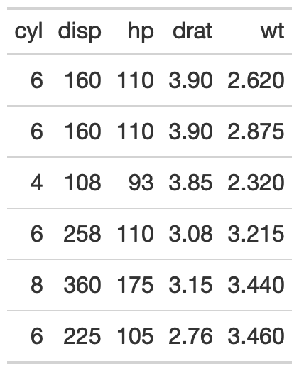
```

]

--

.pull-right[
Powerful enough for *final "publication"*  
```{r, echo = FALSE, out.width="40%"}
knitr::include_graphics("https://themockup.blog/static/slides/images/qbr_win_tab.png")
```

]


---
class:inverse, center, middle

# Best practices

---

```{r, echo = FALSE, eval = FALSE}
tibble(
  `Use Tables When` = c(
    "* The display will be used to look up individual values",
    "* It will be used to compare individual values",
    "* Precise values are required",
    "* Quantitative values include more than one unit of measure",
    "* Both detail and summary values are included"
  ),
  `Use Graphs When` = c(
    "* The display will be used to reveal relationships among whole sets of values",
    "* The message is contained in the shape of the values (e.g., patterns, trends, exceptions)",
    "",
    "",
    ""
  )
) %>% 
  gt() %>% 
  fmt_markdown(everything()) %>% 
  tab_options(
    column_labels.font.weight = "bold"
  ) %>% 
  cols_width(
    1 ~ 300,
    2 ~ 380
  ) %>% 
  tab_options(
    table_body.hlines.color = "white",
    table.border.top.color = "white",
    table.border.top.width = px(3)
  ) %>% 
  tab_source_note(
    md("Adapted from:<br>Few, Stephen. (2012). *Show Me the Numbers: Designing Tables and Graphs to Enlighten*.(4)57")
  ) %>% 
  gtsave("tables/few-table-rule.png")
```

```{r, echo = FALSE, out.width="100%"}
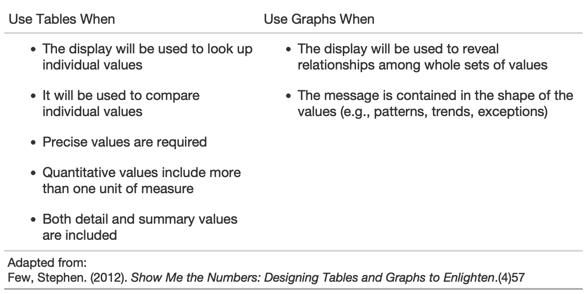
```


---

```{r few-examples, echo = FALSE, eval = FALSE}
tibble(
  `Primary Function` = c("Look-Up", "", "", "Comparison", ""),
  `Relationship Type` = c("Quantitative-to-Categorical", "", "", "Quantitative-to-Quantitative", ""),
  Relationship = c("Between a **single** set of quantitative values and a **single set of categorical items**", 
                   "Between a **single** set of quantitative values and the **intersection of multiple categories**",
                   "Between a **single** set of quantitative values and the **intersection of multiple hierarchical categories**",
                   "Among a **single** set of quantitative values associated with **multiple categorical items**",
                   "Among **distinct** sets of quantitative values associated with a **single categorical item**"),
  Example = glue::glue("https://raw.githubusercontent.com/jthomasmock/radix_themockup/master/static/few{c(1:5)}.png")
  ) %>% 
    gt() %>% 
  fmt_markdown(vars(Relationship)) %>% 
  cols_width(
    vars(`Primary Function`) ~ px(150),
    2 ~ px(150),
    vars(Relationship) ~ 300,
    4 ~ 300
  ) %>% 
  text_transform(
    locations = cells_body(vars(Example)),
    fn = function(x){
      web_image(
        url = x,
        height = px(150)
      )
    }
  ) %>% 
  tab_options(
    table.border.top.color = "white",
    table.border.top.width = px(3),
    column_labels.font.weight = "bold"
  ) %>% 
  tab_source_note(
    md("Adapted from: Few, Stephen. (2012). *Show Me the Numbers: Designing Tables and Graphs to Enlighten* p. 53-58<br>Table Examples: @thomas_mock")
  ) %>% 
  gtsave("tables/few-table-ex.png")
```

```{r,echo=FALSE, dpi=700, out.width="70%"}
knitr::include_graphics("tables/few-table-ex.png")
```

---

### 10 Guidelines for Better Tables

H/t to [Jon Schwabish](https://twitter.com/jschwabish/status/1290323581881266177?lang=en)!

Adapted to `gt` in my [blogpost](https://themockup.blog/posts/2020-09-04-10-table-rules-in-r/).

.pull-left[
#### 1. Offset the Heads from the Body  
#### 2. Use Subtle Dividers over Heavy Grids  
#### 3. Right-Align Numbers  
#### 4. Left-Align Text  
#### 5. Select Appropriate Precision  
]

.pull-right[
#### 6. Guide your Reader with Space between Rows and Columns  
#### 7. Remove Unit Repetition  
#### 8. Highlight Outliers  
#### 9. Group Similar Data and Increase White Space  
#### 10. Add Visualizations when Appropriate  
]


---

### `#TidyTuesday` data

```{r, cache = TRUE}
library(tidyverse)
library(gt)

url_in <- 'https://raw.githubusercontent.com/rfordatascience/tidytuesday/master/data/2020/2020-09-01/key_crop_yields.csv'

raw_yields <- readr::read_csv(url_in)

yield_data <- raw_yields %>% 
  janitor::clean_names() %>% 
  rename_with(~str_remove(., "_tonnes_per_hectare")) %>% 
  select(entity:beans, -code) %>% 
  pivot_longer(cols = wheat:beans, names_to = "crop", values_to = "yield") %>% 
  rename(Country = entity)

yield_data
```


---

### `#TidyTuesday` data


```{r}
country_sel <- c(
  "China", "India", "United States", 
  "Indonesia", "Mexico", "Pakistan"
  )

yield_data_wide <- raw_yields %>% 
  janitor::clean_names() %>% 
  rename_with(
    ~str_remove(., "_tonnes_per_hectare")
    ) %>% 
  select(entity:beans, -code) %>% 
  pivot_longer(
    cols = wheat:beans, 
    names_to = "crop", 
    values_to = "yield"
    ) %>% 
  rename(Country = entity) %>% 
  filter(
    crop %in% c("potatoes", "maize"), 
    year %in% c(2014:2016),
    Country %in% country_sel
    ) %>% 
  pivot_wider(
    names_from = year, 
    values_from = yield
    )
```


---

### `#TidyTuesday` data

```{r}
yield_data_wide
```

---
class: center, middle, inverse

# Easy enough to *rapidly prototype*

---

### Basic `gt` table

```{r basic-gt, eval = FALSE}
yield_data_wide %>% 
  gt()
```

--

```{r, echo = FALSE, out.width="40%"}
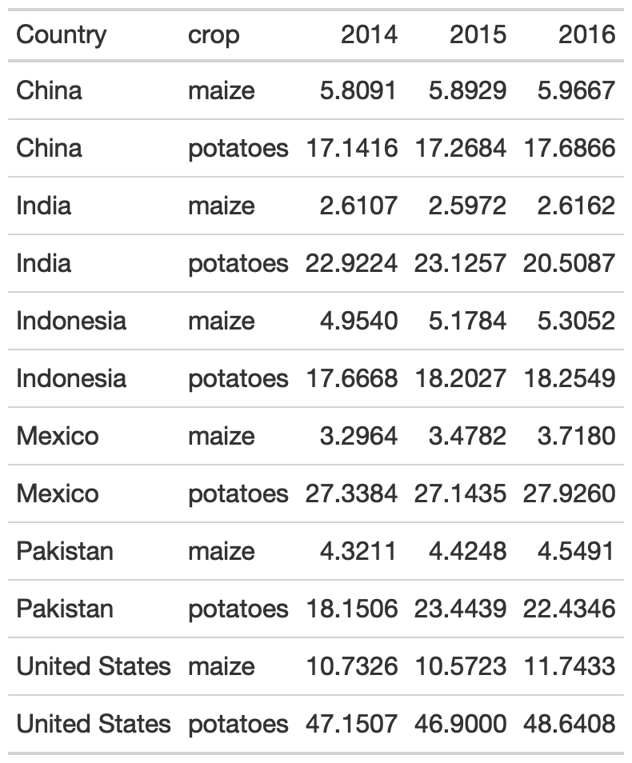
```


---

### Add groups

.pull-left[
```{r, eval = FALSE}
yield_data_wide %>% 
  head() %>% 
  # respects grouping from dplyr
  group_by(Country) %>%  #<<
  gt(rowname_col = "crop") 
```

```{r, echo = FALSE, out.width="65%"}
knitr::include_graphics("tables/group-tab.png")
```


]


--

.pull-right[
```{r, results = FALSE}
yield_data_wide %>% 
  head() %>%
  gt(
    groupname_col = "crop", #<<
    rowname_col = "Country" #<<
  ) 
```

```{r, echo = FALSE, out.width="65%"}
knitr::include_graphics("tables/group-tab.png")
```

]


---


.pull-left[
### Groups

```{r group-sum, eval = FALSE}
yield_data_wide %>% 
  mutate(crop = str_to_title(crop)) %>% 
  group_by(crop) %>% 
  gt(
    rowname_col = "Country"
  ) %>% 
  fmt_number(
    columns = 2:5, # reference cols by pos
    decimals = 2 # decrease decimal places
    ) %>% 
  summary_rows( #<<
    groups = TRUE, #<<
    # reference cols by name
    columns = vars(`2014`, `2015`, `2016`), 
    fns = list(
      # add summary stats
      avg = ~mean(.),  #<<
      sd = ~sd(.) #<<
    )
  )

```

]

--

.pull-right[
```{r, echo = FALSE, eval = TRUE, out.width="60%"}
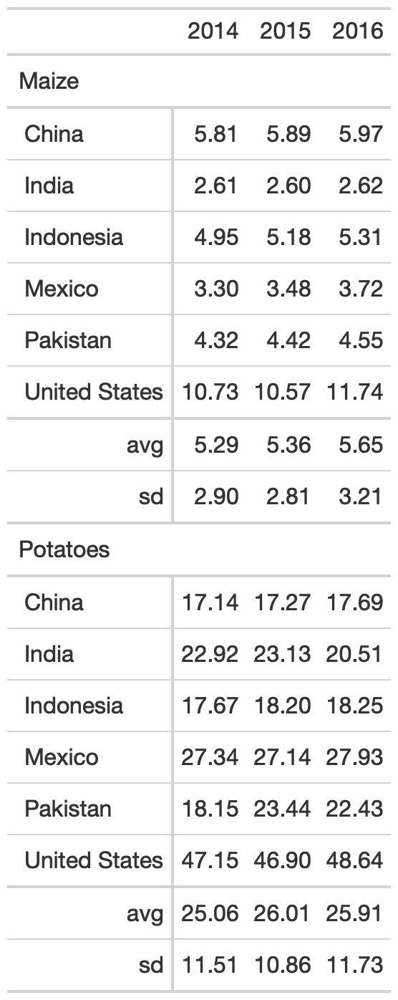
```

]

---

### Add spanners

Table spanners can be added quickly with `tab_spanner()` and again use either position (column number) or + `vars(name)`.

.pull-left[
```{r, eval = FALSE}
yield_data_wide %>% 
  head() %>%
  gt(
    groupname_col = "crop",
    rowname_col = "Country"
  ) %>% 
  tab_spanner( #<<
    label = "Yield in Tonnes/Hectare", #<<
    columns = 2:5 #<<
    ) 
```

]

--

.pull-right[
```{r, echo=FALSE, out.width="70%"}
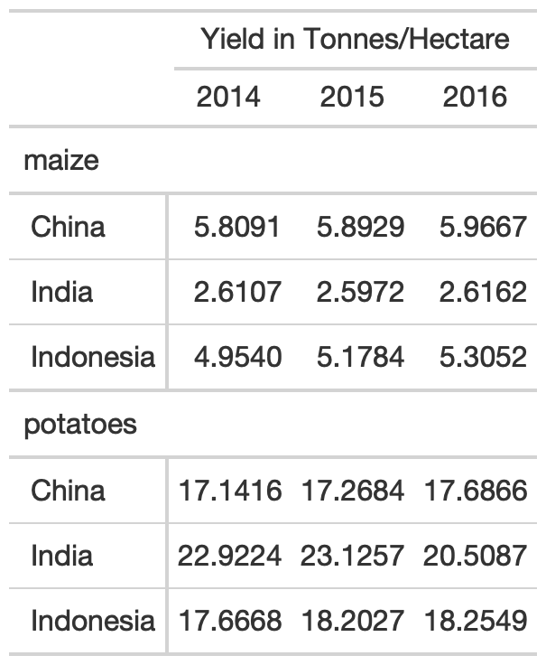
```

]

---

### Add notes and titles

Footnotes can be added with `tab_footnote()`. Note that this is our first use of the `locations` argument. Locations is used with things like `cells_column_labels()` or `cells_body()`, `cells_summary()` to offer very tight control of where to place certain changes. 

.pull-left[
```{r, eval = FALSE}
yield_data_wide %>% 
  head() %>%
  gt(
    groupname_col = "crop",
    rowname_col = "Country"
  ) %>% 
  tab_footnote(
    footnote = "Yield in Tonnes/Hectare", 
    locations = cells_column_labels( #<<
      columns = 1:3
      )
    )
```

]

--

.pull-right[
```{r, echo = FALSE, out.width="65%"}
knitr::include_graphics("tables/footnote-tab.png")
```

]

---

### Add notes and titles

Footnotes can be added with `tab_footnote()`. Note that this is our first use of the `locations` argument. Locations is used with things like `cells_column_labels()` or `cells_body()`, `cells_summary()` to offer very tight control of where to place certain changes. 

.pull-left[
```{r, eval = FALSE}
yield_data_wide %>% 
  head() %>%
  gt(
    groupname_col = "crop",
    rowname_col = "Country"
  ) %>% 
  tab_footnote(
    footnote = "Yield in Tonnes/Hectare", 
    locations = cells_column_labels(
      columns = 1:3 # note
      )
    ) %>% 
  # Adding a `source_note()`
  tab_source_note(
    source_note = "Data: OurWorldInData" #<<
    )
```

]

--

.pull-right[
```{r, out.width="65%", echo = FALSE}
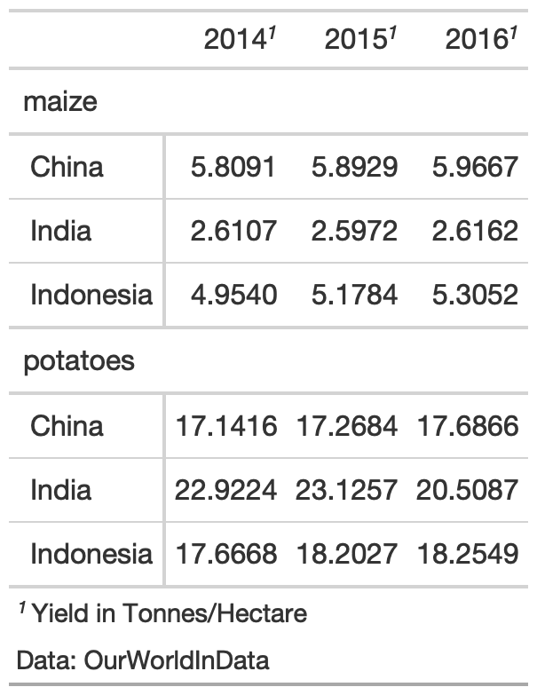
```

]


---

### Add Title/Subtitle

Adding a title or subtitle with `tab_header()` and notice that I used `md()` around the title and `html()` around subtitle to adjust their appearance. 

.pull-left[
```{r, eval = FALSE}
yield_data_wide %>% 
  head() %>%
  gt(
    groupname_col = "crop",
    rowname_col = "Country"
  ) %>%
  tab_header( #<<
    title = md("**Crop Yields between 2014 and 2016**"),
    subtitle = html("<em>Countries limited to Asia</em>")
  )
```

]

--

.pull-right[
```{r, echo = FALSE, out.width="70%"}
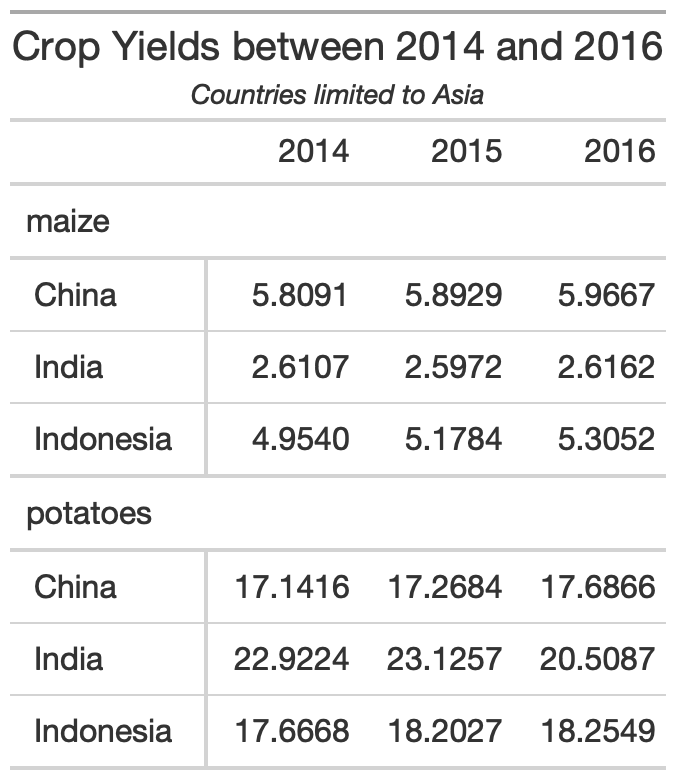
```

]

---

### Adjust appearance

You can customize large chunks of the table appearance all at once via `tab_options()`. The full reference to ALL the options you can customize are in the [`gt` packagedown site](https://gt.rstudio.com/reference/tab_options.html).

.pull-left[
```{r, eval = FALSE}
yield_data_wide %>% 
  head() %>%
  gt(
    groupname_col = "crop",
    rowname_col = "Country"
  ) %>%
  tab_header(
    title = "Crop Yields between 2014 and 2016",
    subtitle = "Countries limited to Asia"
  ) %>% 
  tab_options( #<<
    heading.subtitle.font.size = 12,
    heading.align = "left",
    table.border.top.color = "red",
    column_labels.border.bottom.color = "red",
    column_labels.border.bottom.width= px(3)
  )
```

]

--

.pull-right[
```{r, echo = FALSE, out.width = "70%"}
knitr::include_graphics("tables/theme-tab.png")
```

]

---

### Pseudo-themes

Because `gt` is built up by a series of piped examples, you can also pass along additional changes/customization as a function almost like a `ggplot2` theme!

.pull-left[
```{r, eval = FALSE}
my_theme <- function(data) {
  tab_options(
    data = data,
    heading.subtitle.font.size = 12,
    heading.align = "left",
    table.border.top.color = "red",
    column_labels.border.bottom.color = "red",
    column_labels.border.bottom.width= px(3)
  )
}
yield_data_wide %>% 
  head() %>%
  gt(
    groupname_col = "crop",
    rowname_col = "Country"
  ) %>%
  tab_header(
    title = "Crop Yields between 2014 and 2016",
    subtitle = "Countries limited to Asia"
  ) %>% 
  my_theme() #<<
  
```
]

--

.pull-right[
```{r, echo = FALSE, out.width="70%"}
knitr::include_graphics("tables/theme-tab.png")
```

]

---

### Style specific cells w/ `tab_style()`

.pull-left[
.small[

```{r tab-style, eval = FALSE}
yield_data_wide %>% 
  head() %>%
  gt() %>% 
  tab_style(
    style = list(
      cell_text(weight = "bold")
    ),
    locations = cells_column_labels(everything())
  ) %>% 
  tab_style( #<<
    style = list(
      cell_fill(color = "black", alpha = 0.2), #<<
      cell_borders( #<<
        side = c("left", "right"), 
        color = "black",
        weight = px(2)
        )
      ),
    locations = cells_body(
      columns = vars(crop)
      )
  ) %>% 
  tab_style(
    style = list(
      cell_text(color = "red", style = "italic") #<<
    ),
    locations = cells_body(
      columns = 3:5,
      rows = Country == "China" #<<
    )
  )
```

]

]

--

.pull-right[
```{r, echo = FALSE, out.width="75%"}
knitr::include_graphics("tables/tab-style.png")
```

]

---

### Color Gradient


.pull-left[
```{r color-gradient, eval = FALSE}

my_pal <- scales::col_numeric(
  paletteer::paletteer_d(
    palette = "ggsci::red_material"
    ) %>% as.character(),
  domain = NULL
  )
  
yield_data_wide %>% 
  head() %>%
  gt(
    groupname_col = "crop",
    rowname_col = "Country"
  ) %>% 
  data_color( #<<
    columns = vars(`2014`, `2015`, `2016`),
    colors = my_pal #<<
      )
```

]

--

.pull-right[
```{r, echo = FALSE, out.width="75%"}
knitr::include_graphics("tables/color-gradient.png")
```

]

---
class:inverse, center, middle

# Powerful enough for *final presentation*

---

### Themes

Themes are really just functions with a lot of the `gt` customizations baked in.

* They take raw data or `gt` objects, add styling/themes and then output the themed table  
* They can be reusable OR apply to specific data  

---

### ESPN table

```{r, echo = FALSE, out.width="75%"}
knitr::include_graphics("https://themockup.blog/posts/2020-09-26-functions-and-themes-for-gt-tables/espn-tab.png")
```


---

### ESPN theme


```{r}
gt_theme_espn <- function(data, ...){
  data %>% 
    opt_all_caps()  %>%
    opt_table_font(
      font = list(
        google_font("Lato"),
        default_fonts()
      )
    )  %>% 
    opt_row_striping() %>% 
    tab_options(
      row.striping.background_color = "#fafafa",
      table_body.hlines.color = "#f6f7f7",
      source_notes.font.size = 12,
      table.font.size = 16,
      table.width = px(700),
      heading.align = "left",
      heading.title.font.size = 24,
      table.border.top.color = "transparent",
      table.border.top.width = px(3),
      data_row.padding = px(7),
      ...
    ) 
}
```

---

### ESPN applied

```{r, echo = FALSE, eval = FALSE}
espn_qbr <- espnscrapeR::get_nfl_qbr(2020) %>% 
  select(rk = rank, team = team_abb, name, qbr = qbr_total, paa = pts_added, 
         plays = qb_plays, epa = epa_total, pass, run, sack, pen = penalty, raw = qbr_raw)

cols_qb <- names(espn_qbr)[4:12]

espn_qbr %>% 
  mutate(name = paste0(
    "<span style='font-size:16px; color:royalblue;'>",
    name,
    "</span>",
    " <span style='font-size:12px; color:grey;'>",
    word(team, start = -1), "</span>"),
    name = map(name, ~gt::html(as.character(.x)))
  ) %>%
  select(-team) %>% 
  slice(1:15) %>% 
  gt() %>% 
  tab_header(title = md("**NFL Total QBR - 2020 Season Leaders**")) %>% 
  cols_width(vars(cols_qb) ~ px(75)) %>% 
  gt_theme_espn() %>% 
  cols_align("left", columns = vars(name)) %>% 
  tab_source_note(md("**Data:** ESPN<br>**Table:** @thomas_mock"))
```

```{r,echo=FALSE, out.width="70%"}
knitr::include_graphics("https://themockup.blog/posts/2020-09-26-functions-and-themes-for-gt-tables/espn-themed-gt.png")
```

---

### FiveThirtyEight theme

```{r}
gt_theme_538 <- function(data,...) {
  data %>%
  opt_all_caps()  %>%
  opt_table_font(font = list(google_font("Chivo"),default_fonts())) %>%
    tab_style(style = cell_borders(sides = "bottom", color = "transparent", weight = px(2)),
      locations = cells_body(columns = TRUE,rows = nrow(data$`_data`)))  %>% 
  tab_options(
    column_labels.background.color = "white",
    table.border.top.width = px(3),
    table.border.top.color = "transparent",
    table.border.bottom.color = "transparent",
    table.border.bottom.width = px(3),
    column_labels.border.top.width = px(3),
    column_labels.border.top.color = "transparent",
    column_labels.border.bottom.width = px(3),
    column_labels.border.bottom.color = "black",
    data_row.padding = px(3),
    source_notes.font.size = 12,
    table.font.size = 16,
    heading.align = "left",
    ...
  ) 
}
```


---

### FiveThirtyEight applied

```{r, echo = FALSE,eval = FALSE, out.width="75%"}
tab_538 <- espn_qbr %>% 
  mutate(name = paste0(
    "<span style='font-size:16px; color:royalblue;'>",
    name,
    "</span>",
    " <span style='font-size:12px; color:grey;'>",
    word(team, start = -1), "</span>"),
    name = map(name, ~gt::html(as.character(.x)))
  ) %>%
  select(-team) %>% 
  slice(1:15) %>% 
  gt() %>% 
  tab_header(title = md("**NFL Total QBR - 2020 Season Leaders**")) %>% 
  cols_width(vars(cols_qb) ~ px(75),
             vars(name) ~ px(175)) %>% 
  gt_theme_538() %>% 
  cols_align("left", columns = vars(name)) %>% 
  tab_source_note(md("**Data:** ESPN<br>**Table:** @thomas_mock"))
```

```{r, echo = FALSE, out.width="75%"}
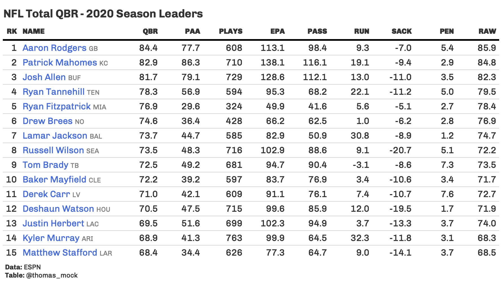
```

---

### PFF Table


```{r, echo=FALSE, out.width="75%"}
knitr::include_graphics("https://themockup.blog/posts/2020-09-26-functions-and-themes-for-gt-tables/pff-example.png")
```

---

### PFF Theme

Not going to show the code, because it really only applies to this table, but you can see it on my [blog](https://themockup.blog/posts/2020-09-26-functions-and-themes-for-gt-tables#pff).

```{r, echo=FALSE, out.width="70%"}
knitr::include_graphics("https://themockup.blog/posts/2020-09-26-functions-and-themes-for-gt-tables/pff-themed-gt.png")
```

```{r, echo = FALSE, eval = FALSE, out.width="55%"}
gt_theme_pff <- function(data, ...) {
  data %>%
    # Add team logos w/ web_image
    text_transform(
      locations = cells_body(
        vars(logo)
      ),
      fn = function(x) {
        web_image(
          url = x,
          height = 25
        )
      }
    ) %>%
    # add spanner for PFF Grade
    tab_spanner(
      label = "PFF GRADE",
      columns = vars(def, rdef, prush, cov)
    ) %>%
    # add spanner for SNAPS
    tab_spanner(
      label = "SNAPS",
      columns = contains("snaps")
    ) %>%
    # Add a "blank" spanner to add white space
    tab_spanner(
      label = "BLANK",
      columns = 1:5
    ) %>%
    # Relabel columns
    cols_label(
      def_snaps = "DEF",
      rdef_snaps = "RDEF",
      prush_snaps = "PRUSH",
      cov_snaps = "COV",
      number = "#",
      logo = ""
    ) %>%
    # if missing, replace NA w/ ---
    fmt_missing(
      columns = everything(),
      missing_text = "---"
    ) %>%
    # add exact color from PFF table to spanners
    tab_style(
      style = list(
        cell_fill(color = "#e4e8ed"),
        cell_text(color = "#878e94"),
        cell_borders(sides = "left", color = "white", weight = px(3))
      ),
      locations = list(
        cells_column_spanners(
          spanners = c("PFF GRADE", "SNAPS")
        )
      )
    ) %>%
    # hide spanner with transparent color
    tab_style(
      style = list(
        cell_fill(color = "transparent"),
        cell_text(color = "transparent")
      ),
      locations = list(
        cells_column_spanners(
          spanners = c("BLANK")
        )
      )
    ) %>%
    # Change font color and weight for numeric col
    tab_style(
      style = list(
        cell_text(color = "#3a3d42", weight = "bold")
      ),
      locations = cells_body(
        columns = 5:9
      )
    ) %>%
    # Add pound sign in front of numbers
    text_transform(
      locations = cells_body(
        columns = vars(number)
      ),
      fn = function(x) {
        paste0("#", x)
      }
    ) %>%
    # Make column labels and spanners all caps
    opt_all_caps() %>%
    # add row striping
    opt_row_striping() %>%
    # change overall table styling for borders and striping
    tab_options(
      column_labels.background.color = "#585d63",
      table_body.hlines.color = "transparent",
      table.border.top.width = px(3),
      table.border.top.color = "transparent",
      table.border.bottom.color = "transparent",
      table.border.bottom.width = px(3),
      column_labels.border.top.width = px(3),
      column_labels.border.top.color = "transparent",
      column_labels.border.bottom.width = px(3),
      column_labels.border.bottom.color = "transparent",
      row.striping.background_color = "#f9f9fb",
      data_row.padding = px(3),
      ...
    ) %>%
    cols_width(
      1 ~ px(75),
      2 ~ px(125),
      3 ~ px(30),
      4 ~ px(40),
      everything() ~ px(60)
    ) %>% 
    # change color of border separating the text from the sourcenote
    tab_style(
      style = cell_borders(
        sides = "bottom", color = "#585d63", weight = px(2)
      ),
      locations = cells_body(
        columns = TRUE,
        rows = nrow(data$`_data`)
      )
    ) %>%
    # change font to Lato throughout (note no need to have Lato locally!)
    opt_table_font(
      font = c(
        google_font(name = "Lato"),
        default_fonts()
      )
    ) %>%
    # add source note
    tab_source_note(
      source_note = md("**Data:** _FAKE DATA_ Pro Football Focus<br>**Table:** @thomas_mock")
    )
}

# Get the team logos
team_df <- espnscrapeR::get_nfl_teams() %>% 
  select(team = team_short_name, logo)

n_play <- 15

# set seed for reproducibility
set.seed(2020)

# generate fake data
fake_df <- tibble(
  rank = c(1:n_play),
  name = paste0("F.Name ", 1:n_play),
  team = c(
    "PIT", "KC", "CLE", "HOU", "BAL", "JAX", "LV", "NO", 
    "LAR", "DET", "MIN", "NYJ", "DAL", "CAR", "DEN"),
  number = sample(50:99, size = n_play),
  def = runif(n_play, min = 50.0, 94.0),
  rdef = runif(n_play, min = 50.0, 94.0),
  prush = runif(n_play, min = 50.0, 94.0),
  cov = runif(n_play, min = 50.0, 94.0),
  def_snaps = sample(85:130, size = n_play),
  rdef_snaps = sample(12:40, size = n_play),
  prush_snaps = NA,
  cov_snaps = sample(0:10, size = n_play, replace = TRUE)
  ) %>% 
  mutate(
    prush_snaps = def_snaps - rdef_snaps - cov_snaps
  ) %>%
  left_join(team_df) %>%
  select(rank:name, logo, everything()) %>% 
  arrange(desc(def)) %>% 
  mutate(rank = row_number())

pff_tab <- fake_df %>% 
  gt() %>% 
  fmt_number(
    columns = 6:9,
    decimals = 1
    ) %>% 
  gt_theme_pff() 
```

---

### Urban Institute

[Source p. 10](https://www.urban.org/sites/default/files/publication/103794/2021-poverty-projections-assessing-four-american-rescue-plan-policies_0_0.pdf)

```{r, echo = FALSE}
urban_gt <- tibble::tribble(
           ~measure, ~before, ~unemp, ~snap, ~recovery, ~child_tax, ~combo,
         "All below 50% SPM" , 4.4 ,4.1 ,4.4 ,3.2, 4.0, 2.9,
   "All below 100% SPM" , 13.7 ,12.6 ,13.6 ,10.2, 12.8, 8.7,
  "All below 200% SPM" , 45.0 ,43.9, 45.0, 40.5,44.3, 38.1,
                               
         "All below 50% SPM" , 5.1 ,4.8 ,5.0 ,3.6, 4.6, 3.2,
  "All below 100% SPM" , 18.1 ,16.0 ,17.9 ,12.9, 16.5, 10.5,
  "All below 200% SPM" , 61.1 ,59.4, 61.0,56.1, 60.3, 52.7,

         "All below 50% SPM" , 3.6 ,3.4 ,3.5 ,2.7, 3.4, 2.5,
        "All below 100% SPM" , 9.6 ,9.0 ,9.6 ,7.2, 9.2, 6.4,
  "All below 200% SPM" , 34.9 ,33.9, 34.8,30.4, 34.2, 28.5,

         "All below 50% SPM" , 5.6 ,5.1 ,5.5 ,3.8, 4.8, 3.2,
  "All below 100% SPM" , 21.9 ,20.2 ,21.6 ,16.2, 19.8, 13.3,
  "All below 200% SPM" , 65.5 ,64.2, 65.5,60.5, 64.6, 57.6
) %>% 
  mutate(group = rep(c("All people", "Black, non-Hispanic", "White, non-Hispanic", "Hispanic"), each = 3)) %>%
  gt(groupname_col = "group", rowname_col = "measure", id = "urban") %>%
  
  cols_label(
    before = "Before new policies (baseline)",
    unemp = "Unemploy Insurance benefits",
    snap = "SNAP benefits",
    recovery = "Recovery rebates",
    child_tax = "Advance portion of child tax credit",
    combo = "Four policies combined"
  ) %>%
  tab_header(
    title = md("**Projected 2021 Annual SPM Poverty Rates by Race and Ethnicity**"),
    subtitle = md("*Percentages*")) %>% 
  opt_table_font(font = list(google_font("Lato"), "Helvetica Neue", "Segoe UI")) %>%
  opt_table_lines("none") %>%
  tab_style(style = cell_text(weight = "bold"), locations = cells_row_groups()) %>%
  tab_style(
    list(
      cell_borders(sides = "bottom", weight = px(2), color = "black")
    ),
    locations = list(
      cells_column_labels(everything()),
      cells_stubhead(),
      cells_body(rows = 12),
      cells_stub(rows = 12)
    )
  ) %>% 
  cols_width(
    vars(before, unemp, snap, recovery, child_tax, combo) ~ px(105), 
    vars(measure) ~ px(175)) %>% 
  gt::tab_options(
    data_row.padding = px(1),
    heading.align = "left",
    heading.subtitle.font.size = px(20),
    column_labels.font.weight = "bold"
    ) %>% 
  tab_source_note(
    md("**Source:** Urban Institute projections as of March 2021, using the Analysis of Transfers, Taxes, & Income Security (ATTIS) model.")
  ) %>% 
  tab_source_note(
    md("**Note:** Poverty is measured with the Supplemental Poverty Measure (SPM); we generally follow US Census Bureau methods for
applying the SPM to American Community Survey data but use benefits and taxes simulated by ATTIS. Non-Hispanic people
who do not identify as either white or Black or who identify with multiple races are included in the total but not shown
separately in this table. The baseline reflects expected 2021 policies as of January 2021, including the additional unemployment
insurance benefits and SNAP policies enacted in December 2020.")
  ) %>% 
  opt_css(
    "
    #urban .gt_col_heading {
      text-align: center !important;
      padding-left: 20px;
    }
    "
  )
# urban_gt  
# urban_gt %>% gtsave("urban-tab.png")
```

```{r, echo = FALSE, out.width="75%"}
knitr::include_graphics("images/urban/urban-screen.png")
```


---

### Urban

```{r, echo = FALSE, out.width="75%"}
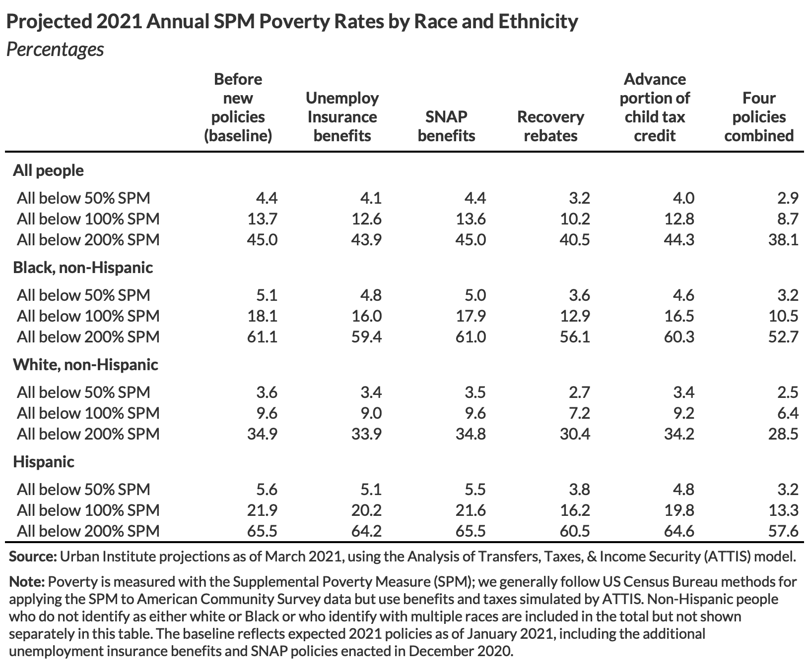
```

---
class:inverse, center, middle

# Advanced Features

---

### Bar plot

```{r, eval=FALSE}
bar_chart <- function(label, height = "16px", fill = "#00bfc4", background = "white") {
  bar <- glue::glue("<div style='background:{fill};width:{label}%;height:{height};'></div>")
  chart <- glue::glue("<div style='flex-grow:1;margin-left:8px;background:{background};'>{bar}</div>")
  glue::glue("<div style='display:flex;align-items:left';>{chart}</div>") %>%
  gt::html()
}

head(mtcars) %>% 
  mutate(
    mpg_val = mpg/max(mpg) * 100,
    mpg_plot = purrr::map(mpg_val, ~bar_chart(label = .x, fill = "#1696d2")),
    mpg_plot2 = purrr::map(mpg_val, ~bar_chart(label = .x, fill = "#fdbf11", background = "#d2d2d2")),
    ) %>% 
  select(cyl, hp, disp, mpg, mpg_plot, mpg_plot2) %>% 
  gt() %>% 
  cols_align(align = "left", columns = vars(mpg_plot)) 
```

---

### Bar plot

```{r, echo = FALSE, out.width="75%"}
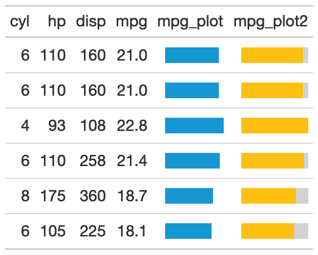
```


---

### Sparklines

```{r}
gt_plot <- function(table_data, column, plot_data, plot_fun, color = "#1696d2",...){
  text_transform(
    table_data,
    # note the use of {{}} here - this is tidy eval
    # that allows you to indicate specific columns
    locations = cells_body(columns = vars({{column}})),
    fn = function(x){
      plot <- purrr::map(
        plot_data, plot_fun, width = 300, height = 70, same_lim = TRUE, 
        col = color, minmax = list(pch = 18, col = "#fdbf11"), ...)
      plot_svg <- purrr::map(plot, "svg_text")
      purrr::map(plot_svg, gt::html)
    }
  )
}
```

```{r,eval=FALSE}
mpg_list <- split(mtcars$mpg, mtcars$cyl)

tibble(cyl = c(4,6,8), boxplot = "") %>% 
  gt() %>% 
  gt_plot(
    column = boxplot,  # column to create plot in 
    plot_data = mpg_list, # external data to reference
    plot_fun = kableExtra::spec_plot,  # which plot fun
    ylim = range(mtcars$mpg), # range applied,
    color = "#1696d2", # change color of line
    cex = 5 # change size of points,
  )
```

---

### Sparklines

```{r, eval = FALSE}
library(kableExtra)
mpg_rng <- range(mtcars$mpg)

tibble(cyl = c(4, 6, 8), boxplot = "", mpg_hist = "", mpg_line1 = "",
       mpg_line2 = "", mpg_points1 = "", mpg_points2 = "", mpg_poly = ""
) %>%
  gt() %>%
  gt_plot(column = boxplot, plot_data = mpg_list, plot_fun = spec_boxplot, lim = mpg_rng) %>%
  gt_plot(column = mpg_hist, plot_data = mpg_list, plot_fun = spec_hist, lim = mpg_rng) %>%
  gt_plot(column = mpg_line1, plot_data = mpg_list, plot_fun = spec_plot, ylim = mpg_rng) %>%
  gt_plot(column = mpg_line2, plot_data = mpg_list, plot_fun = spec_plot) %>%
  gt_plot(column = mpg_points1, plot_data = mpg_list, plot_fun = spec_plot, type = "p", ylim = mpg_rng, cex = 4) %>%
  gt_plot(column = mpg_points2, plot_data = mpg_list, plot_fun = spec_plot, type = "p", cex = 4) %>%
  gt_plot(column = mpg_poly, plot_data = mpg_list, plot_fun = spec_plot, polymin = 5, ylim = mpg_rng)
```

--

```{r, echo = FALSE, out.width="70%"}
knitr::include_graphics("images/urban/urban-spark.png")
```


---

### Heatmap

```{r, eval = FALSE}
dimnames <- list(start(nottem)[1]:end(nottem)[1], month.abb)
temps <- matrix(nottem, ncol = 12, byrow = TRUE, dimnames = dimnames) %>% 
  data.frame() %>% 
  tibble::rownames_to_column() %>% 
  head(10)

temps %>% 
  gt() %>% 
  data_color(
    columns = vars(month.abb),
    colors = scales::col_numeric(
      c("#0a4c6a", "#73bfe2", "#cfe8f3", "#fff2cf", "#fdd870", "#fdbf11", "#ca5800"), 
      domain = range(nottem))
  )
```

---

### Heatmap

```{r, echo=FALSE, out.width="75%"}
knitr::include_graphics("images/urban/urban-heat.png")
```

---

### Icons


```{r,eval = FALSE}
icon_fun <- function(icon, fill, val){
  fontawesome::fa(icon, fill = fill) %>% 
    rep(., val) %>% 
    gt::html()
}

head(mtcars) %>% 
  select(mpg:drat) %>% 
  mutate(cylinder = paste(cyl, "cyl"), .before = cyl) %>% 
  gt() %>% 
  text_transform(
    locations = cells_body(columns = vars(cyl), rows = cyl == 4),
    fn = function(x){icon_fun(icon = "truck-pickup", fill = "black", val = x)}
  ) %>% 
  text_transform(
    locations = cells_body(columns = vars(cyl), rows = cyl == 6),
    fn = function(x){gt::html(rep(fontawesome::fa("truck", fill = "#fdbf11"), 6))}
  ) %>% 
  text_transform(
    locations = cells_body(columns = vars(cyl), rows = cyl == 8),
    fn = function(x){icon_fun(icon = "truck-monster", fill = "#1696d2", val = x)}
  ) %>% 
  cols_align(align = "left", columns = vars(cyl)) %>% 
  cols_width(vars(cyl)~px(170)) %>% 
  tab_source_note(
    source_note = html("</img>")
  )
```

---

### Icons

```{r, echo=FALSE, out.width="75%"}
knitr::include_graphics("images/urban/urban-icons.png")
```


---
class: center, inverse, middle

# When NOT to use `gt`

---

### Data too long


.pull-left[

* *MAYBE* Consider going horizontal  
* Probably better to use interactive table ([`reactable`](https://glin.github.io/reactable/))  
* Possibly better to use a graphic  


]

--

.pull-right[

Avoid the "CVS receipt"!

```{r, echo = FALSE, out.width="20%"}
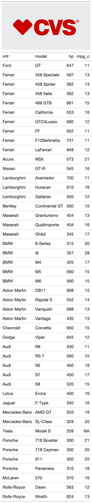
```


]

---

### Complex PDF Tables (or Word)

LaTeX support in `gt` is still in progress, so while it can "just work" in PDF, HTML content is still where it shines

* PDF _can_ work via `webshot`, see `gtsave("TAB-NAME.pdf")`  
* Basic tables in PDF work *ok*, but I'd recommend `kableExtra` or `kable` for now  
* For Word, you can copy paste RTF `gt` tables, but I still think that `flextable` wins the "Office" wars  
* [`pagedown`](https://github.com/rstudio/pagedown) and [`pagedreport`](https://rfortherestofus.com/2021/01/announcing-pagedreport/) are very powerful for HTML -> PDF


---

# Resources

* 7 Different Table Guides on [TheMockUp.blog](https://themockup.blog/#category:tables)  

* [10 Table Rules for `{gt}`](https://themockup.blog/posts/2020-09-04-10-table-rules-in-r/)  

* ALL code for this specific presentation in written form on [my github](https://github.com/jthomasmock/radix_themockup/tree/master/static/slides/intro-tables-urban.Rmd)  

* `{gt}` [documentation](https://gt.rstudio.com/)  

* The `{gt}` [Cookbook](https://themockup.blog/static/gt-cookbook.html) and the [Advanced Cookbook](https://themockup.blog/static/gt-cookbook-advanced.html)  